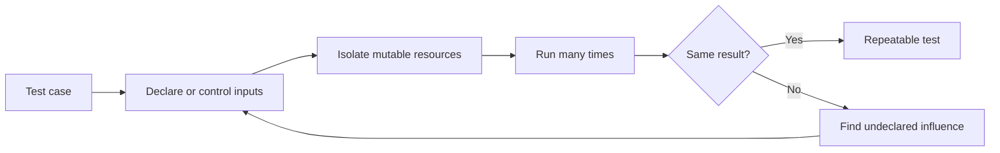

# P027 — Deterministic and Hermetic Tests

## Definition

Make tests repeatable through controlled inputs and isolation from undeclared external influences.
Such influences include time, random values, environment variables, file state, networks, locale,
concurrency, and shared services.

Tests must give the same result for each execution order.

**Aliases:** isolated tests, reproducible tests, hermetic testing.

## Provenance

**Classification:** established principle.

Software test guidance includes determinism and isolation. Large build and test systems use the term
"hermetic." No one source gives this full formulation.

## Decision rule

If an external input can change a result, the test must declare or control that input. The test must
not leak mutable state across executions.

## How to apply

- If a clock, random generator, environment, or external client can change a result, inject that input.
- Use temporary resources for each test and deterministic cleanup.
- Use controlled local substitutes, not live networks. Use live networks only in specified
  integration or acceptance suites.
- Record seeds and schedules for generated or concurrent tests. Preserve each counterexample.
- Run tests individually and in different orders.
- If the test harness can run tests in parallel, use parallel execution.

## Diagram



## Language examples

The two examples inject the same clock value. They do not use the wall clock.

Python:

```python
def expired(expires_at: int, now: int) -> bool:
    return now >= expires_at

def test_expiry_with_controlled_time() -> None:
    assert expired(100, 100)
    assert not expired(101, 100)
```

Rust:

```rust
fn expired(expires_at: u64, now: u64) -> bool {
    now >= expires_at
}

#[test]
fn expiry_with_controlled_time() {
    assert!(expired(100, 100));
    assert!(!expired(101, 100));
}
```

## Boundaries and tensions

Deterministic and hermetic are related but different. If a fixed external service gives the same
input, a nonhermetic test can be deterministic. A hermetic test can use uncontrolled random values.

Full isolation can hide integration failures. Keep specified nonhermetic suites in
controlled environments. Retries can diagnose flaky behavior, but they cannot make an unreliable
test reliable.

## Examples

### Positive application

A cache-expiry test receives a fake clock and a new temporary directory. The test controls clock
changes. Machine time zone and test order cannot change the result.

### Misuse or counterexample

A test uses a public web service and retries until success. Availability, remote data, DNS, and
rate limits control the result.

### Athena or agent workflow

A repository validator test creates an isolated fixture tree and supplies each environment value.
The helper does not use a user checkout or network credentials.

## Related principles

- [P022 — Test Behavior, Not Implementation](p022-test-behavior-not-implementation.md)
- [P025 — Property-Based Testing for Invariants](p025-property-based-testing-for-invariants.md)
- [P028 — Test Failure Paths, Not Just Success Paths](p028-test-failure-paths.md)

## References

### Source information

- [Google Testing Blog, "Hermetic Servers" (2012)](https://testing.googleblog.com/2012/10/hermetic-servers.html)
  gives information about isolation from live network dependencies in end-to-end tests.

### Applicable information

- [Bazel, "Hermeticity"](https://bazel.build/basics/hermeticity)
  gives declared inputs, fixed environment properties, and isolation for deterministic results.
- [Microsoft, ".NET unit testing best practices"](https://learn.microsoft.com/en-us/dotnet/core/testing/unit-testing-best-practices)
  gives isolation and repeatability as core test characteristics.

### More information

- [Google Testing Blog, "Flaky Tests at Google and How We Mitigate Them" (2016)](https://testing.googleblog.com/2016/05/flaky-tests-at-google-and-how-we.html)
  gives causes and operational costs of nondeterministic test results.

[Back to the engineering principles catalog](../README.md#p027)
