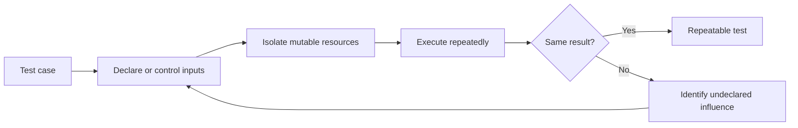

# P027 — Deterministic and Hermetic Tests

## Definition

Make tests repeatable through controlled inputs and isolation from undeclared external influences.
Such influences include time, random values, environment variables, file state, networks, locale,
concurrency, and shared services.

Tests must produce the same result for every execution order.

**Aliases:** isolated tests, reproducible tests, hermetic testing.

## Provenance

**Classification:** established principle.

Determinism and test isolation have long histories. The term "hermetic" became common in large
build and test systems. No single origin defines this combined formulation.

## Decision rule

A test must declare or control every input that can affect its result. The test must neither require
nor leak mutable state across executions.

## How to apply

- Inject clocks, random generators, environment access, and external clients when necessary.
- Use temporary resources for each test and deterministic cleanup.
- Replace live networks with controlled local substitutes outside explicit integration or
  acceptance suites.
- Record seeds and schedules for generated or concurrent tests. Preserve each counterexample.
- Run tests alone, in different orders, and in parallel when the test harness permits it.

## Diagram



## Language examples

The two examples inject the same clock value and avoid wall-clock dependence.

Python:

```python
def expired(expires_at: int, now: int) -> bool:
    return now >= expires_at

def test_expiry_with_controlled_time() -> None:
    assert expired(100, 100)
    assert not expired(101, 100)
```

Rust:

```rust
fn expired(expires_at: u64, now: u64) -> bool {
    now >= expires_at
}

#[test]
fn expiry_with_controlled_time() {
    assert!(expired(100, 100));
    assert!(!expired(101, 100));
}
```

## Boundaries and tensions

Deterministic and hermetic are related but distinct. A test can be deterministic but require a
fixed external service. A hermetic test can still use uncontrolled random values.

Full isolation can conceal real integration failures. Maintain explicit nonhermetic suites in
controlled environments. Retries can diagnose flaky behavior, but they cannot make an unreliable
test valid.

## Examples

### Positive application

A cache-expiry test receives a fake clock and a fresh temporary directory. The test advances time
explicitly. Machine time zone and test order cannot affect the result.

### Misuse or counterexample

A test calls a public web service and retries until success. Availability, remote data, DNS, and
rate limits now control the result.

### Athena or agent workflow

A repository validator test creates an isolated fixture tree and supplies every environment value.
The helper does not use a user checkout or network credentials.

## Related principles

- [P022 — Test Behavior, Not Implementation](p022-test-behavior-not-implementation.md)
- [P025 — Property-Based Testing for Invariants](p025-property-based-testing-for-invariants.md)
- [P028 — Test Failure Paths, Not Just Success Paths](p028-test-failure-paths.md)

## References

### Origin and history

- [Google Testing Blog, "Hermetic Servers" (2012)](https://testing.googleblog.com/2012/10/hermetic-servers.html)
  explains isolation from live network dependencies in end-to-end tests.

### Current guidance

- [Bazel, "Hermeticity"](https://bazel.build/basics/hermeticity)
  documents declared inputs, fixed environment properties, and isolation for deterministic results.
- [Microsoft, ".NET unit testing best practices"](https://learn.microsoft.com/en-us/dotnet/core/testing/unit-testing-best-practices)
  identifies isolation and repeatability as core test characteristics.

### Further reading

- [Google Testing Blog, "Flaky Tests at Google and How We Mitigate Them" (2016)](https://testing.googleblog.com/2016/05/flaky-tests-at-google-and-how-we.html)
  reports causes and operational costs of nondeterministic test results.

[Back to the engineering principles catalog](../README.md#p027)
