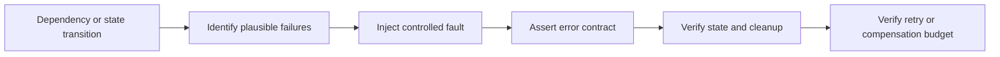

# P028 — Test Failure Paths, Not Just Success Paths

## Definition

Verify system behavior for malformed inputs, failed dependencies, and failed operations. Cover
realistic cancellation, timeout, partial progress, unavailability, retry, cleanup, authorization,
and resource exhaustion.

Verify success behavior as a separate baseline.

**Aliases:** negative testing, robustness testing, error-path testing.

## Provenance

**Classification:** established principle.

Negative tests and robustness tests have many roots in reliability, security, and protocol work.
No single origin covers the full modern set of failure conditions in this principle.

## Decision rule

Identify plausible failures for every material dependency or state transition. Verify the contract
result, preserved invariants, cleanup, and diagnostic evidence.

## How to apply

- Derive failures from contracts and architecture instead of coverage percentages.
- Inject dependency errors, timeouts, cancellations, and partial completion deterministically.
- Assert caller-visible error semantics and the resultant durable state.
- Verify resource release. Keep retries and compensation within their budgets.
- Include authorization denial and malformed untrusted input without unsafe live actions.

## Diagram



## Language examples

The two examples simulate a write failure, preserve the current data, and return the cause.

Python:

```python
from collections.abc import Callable
def replace(current: str, write: Callable[[], str]) -> tuple[str, Exception | None]:
    try:
        return write(), None
    except OSError as cause:
        return current, cause
def test_failure_preserves_current() -> None:
    def fail() -> str:
        raise OSError("disk full")
    value, error = replace("old", fail)
    assert value == "old" and isinstance(error, OSError)
```

Rust:

```rust
fn replace<F>(current: &str, write: F) -> (String, Option<&'static str>)
where F: FnOnce() -> Result<String, &'static str> {
    match write() {
        Ok(value) => (value, None),
        Err(cause) => (current.to_owned(), Some(cause)),
    }
}
#[test]
fn failure_preserves_current() {
    let result = replace("old", || Err("disk full"));
    assert_eq!(result, ("old".to_owned(), Some("disk full")));
}
```

## Boundaries and tensions

Do not cause destructive production failures to prove a test. Use controlled substitutes,
sandboxes, fault injection, or staged environments that match the risk.

Mock failures can differ from real dependency behavior. Add contract or integration evidence when
necessary. Do not expose sensitive internal details in caller-visible errors.

## Examples

### Positive application

A file replacement test injects a write failure after completion of temporary output. It verifies
that the old file remains valid. It also verifies cleanup and cause preservation.

### Misuse or counterexample

A client has many success-path tests but no test for a timeout after a committed write. An automatic
retry can duplicate the operation.

### Athena or agent workflow

A skill test simulates a missing required capability. It verifies a clear, safe failure response.
The skill does not skip work or fabricate success evidence.

## Related principles

- [P022 — Test Behavior, Not Implementation](p022-test-behavior-not-implementation.md)
- [P027 — Deterministic and Hermetic Tests](p027-deterministic-and-hermetic-tests.md)
- [P030 — Handle Errors at the Nearest Responsible Boundary](p030-nearest-responsible-error-boundary.md)

## References

### Origin and history

- [NIST, "An Approach for Analyzing the Robustness of Windows NT Software" (1998)](https://csrc.nist.gov/files/pubs/conference/1998/10/08/proceedings-of-the-21st-nissc-1998/final/docs/paperf8.pdf)
  describes robustness tests with valid inputs, invalid inputs, and exception conditions.

### Current guidance

- [Google Engineering Practices, "What to look for in a code review"](https://google.github.io/eng-practices/review/reviewer/looking-for.html)
  requires useful tests that detect broken behavior.
- [OWASP Web Security Testing Guide, "Testing for Error Handling"](https://owasp.org/www-project-web-security-testing-guide/latest/4-Web_Application_Security_Testing/08-Testing_for_Error_Handling/README)
  provides security tests for improper error responses and stack disclosure.

### Further reading

- [OWASP, "Business Logic Security Cheat Sheet"](https://cheatsheetseries.owasp.org/cheatsheets/Business_Logic_Security_Cheat_Sheet.html)
  adds adversarial cases for invalid order, repeated steps, concurrency, and rule bypass.

[Back to the engineering principles catalog](../README.md#p028)
