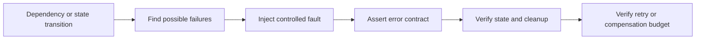

# P028 — Test Failure Paths, Not Just Success Paths

## Definition

Verify system behavior for malformed inputs, failed dependencies, and failed operations. Include
cancellation, timeout, progress before failure, unavailability, retry, cleanup,
authorization, and resource exhaustion.

Verify success behavior with its own baseline.

**Aliases:** negative testing, robustness testing, error-path testing.

## Provenance

**Classification:** established principle.

Sources for negative tests and robustness tests include reliability, security, and protocol work.
No one source gives all failure conditions in this principle.

## Decision rule

Find failures that can occur for each material dependency or state transition. Verify the contract
result, preserved invariants, cleanup, and diagnostic evidence.

## How to apply

- Use contracts and architecture to find failures. Do not use coverage percentages.
- Inject dependency errors, timeouts, and cancellations.
- After an operation makes progress, inject a stop.
- After failure, assert caller-visible error semantics and durable state.
- Verify resource release. Keep retries and compensation in their budgets.
- Include authorization denial and malformed untrusted input without live operations that are not safe.

## Diagram



## Language examples

The two examples simulate a write failure, preserve the previous data, and return the cause.

Python:

```python
from collections.abc import Callable
def replace(current: str, write: Callable[[], str]) -> tuple[str, Exception | None]:
    try:
        return write(), None
    except OSError as cause:
        return current, cause
def test_failure_preserves_current() -> None:
    cause = OSError("disk full")
    def fail() -> str:
        raise cause
    value, error = replace("old", fail)
    assert value == "old" and error is cause
```

Rust:

```rust
fn replace<F>(current: &str, write: F) -> (String, Option<&'static str>)
where F: FnOnce() -> Result<String, &'static str> {
    match write() {
        Ok(value) => (value, None),
        Err(cause) => (current.to_owned(), Some(cause)),
    }
}
#[test]
fn failure_preserves_current() {
    let result = replace("old", || Err("disk full"));
    assert_eq!(result, ("old".to_owned(), Some("disk full")));
}
```

## Boundaries and tensions

Do not cause destructive production failures for test evidence. Use controlled substitutes,
sandboxes, fault injection, or staged environments that the approved risk policy specifies.

Mock failures can be different from dependency behavior in production. When mock behavior changes
the contract, add contract or integration evidence. Do not show sensitive internal details in caller-visible errors.

## Examples

### Positive application

A file replacement test injects a write failure after the write operation creates temporary output. It verifies that
the previous file is correct. It also verifies cleanup and cause preservation.

### Misuse or counterexample

A client has many success-path tests but no test for a timeout after a committed write. An automatic
retry can duplicate the operation.

### Athena or agent workflow

A skill test simulates a missing necessary capability. It verifies a clear, safe failure response.
The test verifies that the skill does not skip work or return success without evidence.

## Related principles

- [P022 — Test Behavior, Not Implementation](p022-test-behavior-not-implementation.md)
- [P027 — Deterministic and Hermetic Tests](p027-deterministic-and-hermetic-tests.md)
- [P030 — Handle Errors at the Nearest Responsible Boundary](p030-nearest-responsible-error-boundary.md)

## References

### Source information

- [NIST, "An Approach for Analyzing the Robustness of Windows NT Software" (1998)](https://csrc.nist.gov/files/pubs/conference/1998/10/08/proceedings-of-the-21st-nissc-1998/final/docs/paperf8.pdf)
  gives robustness tests with accepted inputs, rejected inputs, and exception conditions.

### Applicable information

- [Google Engineering Practices, "What to look for in a code review"](https://google.github.io/eng-practices/review/reviewer/looking-for.html)
  says tests must detect broken behavior.
- [OWASP Web Security Testing Guide, "Testing for Error Handling"](https://owasp.org/www-project-web-security-testing-guide/latest/4-Web_Application_Security_Testing/08-Testing_for_Error_Handling/README)
  gives security tests for incorrect error responses and stack disclosure.

### More information

- [OWASP, "Business Logic Security Cheat Sheet"](https://cheatsheetseries.owasp.org/cheatsheets/Business_Logic_Security_Cheat_Sheet.html)
  adds adversarial cases for incorrect order, steps that occur again, concurrency, and rule bypass.

[Back to the engineering principles catalog](../README.md#p028)
