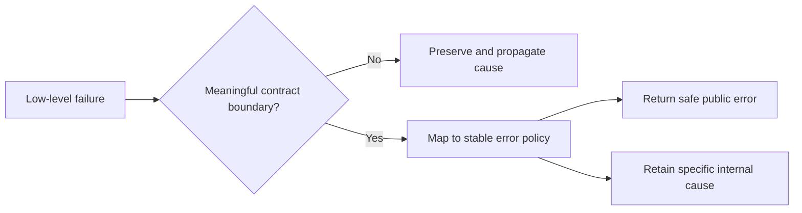

# P029 — Generalize Error Policy; Preserve Specific Cause

## Definition

Use a small, stable error taxonomy at architectural boundaries. Preserve the original cause, stack,
and safe structured context for diagnosis.

A general policy helps callers select an action. A specific cause helps operators diagnose the
failed event.

**Aliases:** error translation with cause preservation, layered error taxonomy.

## Provenance

**Classification:** Athena synthesis.

Exception chains, causal errors, and protocol problem taxonomies have separate established roots.
No historical source defines this exact combined rule.

## Decision rule

Translate a low-level failure only at a meaningful boundary. Map it to stable caller policy, and
attach the original cause with non-sensitive diagnostic context.

## How to apply

- Define a bounded error set that supports caller actions such as invalid, unavailable, or conflict.
- Translate vendor and transport failures at the boundary that owns the public contract.
- Preserve causal links and structured fields for operators.
- Separate retry status and user messages from incidental exception text.
- Remove secrets and internal details from public results. Retain safe internal evidence.

## Diagram



## Language examples

The two examples map a storage timeout to an unavailable error and retain the specific cause.

Python:

```python
class UnavailableError(RuntimeError):
    pass

def load(fetch):
    try:
        return fetch()
    except TimeoutError as cause:
        raise UnavailableError("storage unavailable") from cause
```

Rust:

```rust
#[derive(Debug)]
struct StorageTimeout;

#[derive(Debug)]
struct UnavailableError { message: &'static str, source: StorageTimeout }

fn load(result: Result<String, StorageTimeout>) -> Result<String, UnavailableError> {
    result.map_err(|source| UnavailableError { message: "storage unavailable", source })
}
```

## Boundaries and tensions

One `operation failed` result is too general when callers need different actions. Every dependency
exception is too specific and couples consumers to internal details.

Cause preservation does not authorize disclosure of stacks, paths, queries, credentials, or
personal data. Change stable taxonomies only through deliberate decisions. Do not add one type for
each event.

## Examples

### Positive application

A storage timeout becomes a public `temporarily-unavailable` problem. The response includes a
correlation ID and retry policy. The internal record retains the driver error and operation context.

### Misuse or counterexample

A handler converts every exception to a successful `null` response. This action erases the error
policy and cause. Another handler sends the full database stack to the client.

### Athena or agent workflow

A dependency helper returns one documented unavailable status. Its diagnostic record identifies
the checkout, command, exit status, and causal error. The record excludes secrets.

## Related principles

- [P019 — Explicit Contracts](p019-explicit-contracts.md)
- [P028 — Test Failure Paths, Not Just Success Paths](p028-test-failure-paths.md)
- [P030 — Handle Errors at the Nearest Responsible Boundary](p030-nearest-responsible-error-boundary.md)

## References

### Origin and history

- [PEP 3134, "Exception Chaining and Embedded Tracebacks" (2005)](https://peps.python.org/pep-3134/)
  records explicit causal links and context for a new exception after another exception.

### Current guidance

- [RFC 9457, "Problem Details for HTTP APIs" (2023)](https://www.rfc-editor.org/rfc/rfc9457.html)
  defines stable problem types and event-specific details. It warns against exposure of
  implementation details.
- [Python documentation, "Exception context"](https://docs.python.org/3/library/exceptions.html#exception-context)
  documents implicit and explicit exception chain semantics.

### Further reading

- [OWASP, "Error Handling Cheat Sheet"](https://cheatsheetseries.owasp.org/cheatsheets/Error_Handling_Cheat_Sheet.html)
  distinguishes safe external errors from detailed internal diagnostics for investigation.

[Back to the engineering principles catalog](../README.md#p029)
