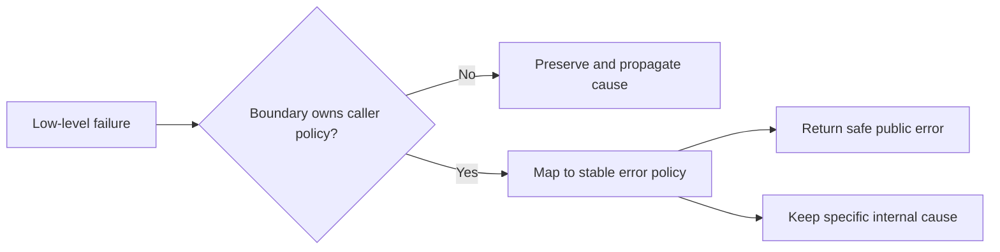

# P029 — Generalize Error Policy; Preserve Specific Cause

## Definition

Use a small taxonomy for stable errors at architectural boundaries. Preserve the initial cause,
stack, and safe structured context for diagnosis.

A general policy helps callers select a response. A specific cause helps operators diagnose the
failed event.

**Aliases:** error translation with cause preservation, layered error taxonomy.

## Provenance

**Classification:** Athena synthesis.

Sources are different for exception chains, causal errors, and protocol problem taxonomies.
No historical source gives this full rule.

## Decision rule

At a boundary that owns caller policy, translate a low-level failure. Map the failure to stable
caller policy. Attach the initial cause with non-sensitive diagnostic context.

## How to apply

- Give a bounded error set that lets callers select responses, for example rejected input, unavailable,
  or conflict.
- Translate vendor and transport failures at the boundary that owns the public contract.
- Preserve causal links and structured fields for operators.
- Keep retry status and user messages different from exception text that can change.
- Remove secrets and internal details from public results. Keep safe internal evidence.

## Diagram



## Language examples

The two examples map a storage timeout to an unavailable error and preserve the specific cause.

Python:

```python
class StorageTimeout(RuntimeError):
    pass

class UnavailableError(RuntimeError):
    pass

def load(fetch):
    try:
        return fetch()
    except StorageTimeout as cause:
        raise UnavailableError("storage unavailable") from cause
```

Rust:

```rust
#[derive(Debug)]
struct StorageTimeout;

#[derive(Debug)]
struct UnavailableError { message: &'static str, source: StorageTimeout }

fn load(result: Result<String, StorageTimeout>) -> Result<String, UnavailableError> {
    result.map_err(|source| UnavailableError { message: "storage unavailable", source })
}
```

## Boundaries and tensions

One `operation failed` result is too general when callers must select different responses. Each
dependency exception is too specific and couples consumers to internal details.

Cause preservation does not authorize disclosure of stacks, paths, queries, credentials, or
personal data. Use approved decisions to change stable taxonomies. Do not add one type for
each event.

## Examples

### Positive application

A storage timeout becomes a public `temporarily-unavailable` problem. The response includes a
correlation ID and retry policy. The internal record preserves the driver error and operation context.

### Misuse or counterexample

A handler converts each exception to a `null` response with success status. This conversion erases the
error policy and cause. A second handler sends the full database stack to the client.

### Athena or agent workflow

A dependency helper returns one specified unavailable status. Its diagnostic record identifies
the checkout, command, exit status, and causal error. The record excludes secrets.

## Related principles

- [P019 — Explicit Contracts](p019-explicit-contracts.md)
- [P028 — Test Failure Paths, Not Just Success Paths](p028-test-failure-paths.md)
- [P030 — Handle Errors at the Nearest Responsible Boundary](p030-nearest-responsible-error-boundary.md)

## References

### Source information

- [PEP 3134, "Exception Chaining and Embedded Tracebacks" (2005)](https://peps.python.org/pep-3134/)
  records explicit causal links and context for a new exception after a second exception.

### Applicable information

- [RFC 9457, "Problem Details for HTTP APIs" (2023)](https://www.rfc-editor.org/rfc/rfc9457.html)
  gives stable problem types and event-specific details. The RFC gives a warning about exposure of
  implementation details.
- [Python documentation, "Exception context"](https://docs.python.org/3/library/exceptions.html#exception-context)
  gives implicit and explicit exception chain semantics.

### More information

- [OWASP, "Error Handling Cheat Sheet"](https://cheatsheetseries.owasp.org/cheatsheets/Error_Handling_Cheat_Sheet.html)
  shows the difference between safe external errors and detailed internal diagnostics for investigation.

[Back to the engineering principles catalog](../README.md#p029)
