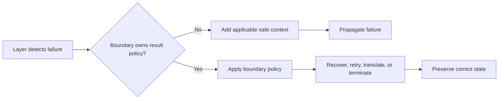

# P030 — Handle Errors at the Nearest Responsible Boundary

## Definition

Handle an error only where policy and context are sufficient for correct recovery, retry,
compensation, translation, or termination. A lower layer frequently detects a failure first.

When the lower layer cannot select the correct result, it must propagate the failure.

**Aliases:** catch where you can handle, responsible error boundary.

## Provenance

**Classification:** practitioner heuristic.

Exception systems use stack-based handler selection. Language communities gave related rules
about error propagation. No one source first gave this formulation.

## Decision rule

At the first boundary that can satisfy the caller's contract and preserve correct state, handle the
failure. If the boundary cannot satisfy the contract or preserve correct state, add applicable safe
context. After the boundary adds the context, propagate the failure.

## How to apply

- Detection, cleanup, translation, recovery, and caller presentation are different operations.
- When a layer owns a recovery or contract decision, the layer can catch the error.
- Use deterministic cleanup constructs. Cleanup does not recover the operation.
- After translation, preserve the cause. Do not record the same failure at each layer.
- Put retries at the boundary that knows idempotency, deadlines, and dependency semantics.

## Diagram



## Language examples

The two examples put retry policy in the caller of a low-level read operation that propagates its
error.

Python:

```python
def read_once(client):
    return client.read()

def read_with_retry(client):
    try:
        return read_once(client)
    except TimeoutError:
        return read_once(client)
```

Rust:

```rust
trait Client { fn read(&mut self) -> Result<String, TimeoutError>; }
struct TimeoutError;
fn read_once(client: &mut impl Client) -> Result<String, TimeoutError> {
    client.read()
}

fn read_with_retry(client: &mut impl Client) -> Result<String, TimeoutError> {
    match read_once(client) {
        Ok(value) => Ok(value),
        Err(_) => read_once(client),
    }
}
```

## Boundaries and tensions

The first `catch` site is not always the responsible boundary. A top-level boundary can convert an
unhandled error to a process exit, protocol response, or job status.

A lower-level operation can do cleanup and preserve the failure. Security policy can make a generic
public result and restricted internal diagnostics necessary.

## Examples

### Positive application

A repository propagates a database timeout. The service knows that the operation is read-only and
has a deadline. It makes one bounded retry.

The API boundary converts an exhausted retry budget to a public error with an unavailable status.

### Misuse or counterexample

A low-level parser catches each exception, records it, and returns an empty object. Callers cannot
tell permitted empty input from corrupt input.

### Athena or agent workflow

A helper returns a typed capability failure. The skill owns fallback policy. It selects the
specified degraded path or a safe stop and returns the result.

## Related principles

- [P028 — Test Failure Paths, Not Just Success Paths](p028-test-failure-paths.md)
- [P029 — Generalize Error Policy; Preserve Specific Cause](p029-generalize-error-policy-preserve-specific-cause.md)
- [P019 — Explicit Contracts](p019-explicit-contracts.md)

## References

### Source information

- [Goodenough, "Exception Handling: Issues and a Proposed Notation" (1975)](https://doi.org/10.1145/361227.361230)
  gives a full treatment from 1975 of exception detection, handler selection, and recovery.

### Applicable information

- [Microsoft, ".NET best practices for exceptions"](https://learn.microsoft.com/en-us/dotnet/standard/exceptions/best-practices-for-exceptions)
  recommends a catch for recovery or cleanup. When code at the boundary cannot recover, the guidance
  recommends propagation.
- [Microsoft, "Exceptions and Exception Handling"](https://learn.microsoft.com/en-us/dotnet/csharp/fundamentals/exceptions/)
  says that a handler rethrows if it cannot keep the application in a known state.

### More information

- [Go Blog, "Error handling and Go"](https://go.dev/blog/error-handling-and-go)
  shows explicit propagation and caller-related context without loss of the failure.

[Back to the engineering principles catalog](../README.md#p030)
