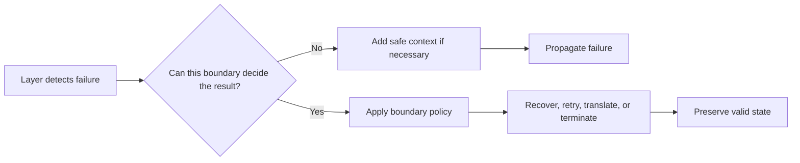

# P030 — Handle Errors at the Nearest Responsible Boundary

## Definition

Handle an error only where sufficient policy and context permit correct recovery, retry,
compensation, translation, or termination. A lower layer often detects a failure first.

The lower layer must propagate the failure when it cannot select the correct result.

**Aliases:** catch where you can handle, responsible error boundary.

## Provenance

**Classification:** practitioner heuristic.

Exception systems formalized stack-based handler selection. Language communities developed similar
advice about error propagation. This exact formulation has no verified single origin.

## Decision rule

Handle a failure at the first boundary that can satisfy the caller's contract and preserve valid
state. Otherwise, add safe context when necessary and propagate the failure.

## How to apply

- Distinguish detection, cleanup, translation, recovery, and final presentation.
- Catch an error only where the layer owns a recovery or contract decision.
- Use deterministic cleanup constructs. Do not claim that cleanup recovered the operation.
- Preserve the cause after translation. Do not record the same failure at every layer.
- Place retries at the boundary that knows idempotency, deadlines, and dependency semantics.

## Diagram



## Language examples

The two examples place retry policy above a low-level read operation that propagates its error.

Python:

```python
def read_once(client):
    return client.read()

def read_with_retry(client):
    try:
        return read_once(client)
    except TimeoutError:
        return read_once(client)
```

Rust:

```rust
trait Client { fn read(&mut self) -> Result<String, TimeoutError>; }
struct TimeoutError;
fn read_once(client: &mut impl Client) -> Result<String, TimeoutError> {
    client.read()
}

fn read_with_retry(client: &mut impl Client) -> Result<String, TimeoutError> {
    match read_once(client) {
        Ok(value) => Ok(value),
        Err(_) => read_once(client),
    }
}
```

## Boundaries and tensions

The nearest syntactic `catch` site is not always responsible. A top-level boundary can convert an
unhandled error to a process exit, protocol response, or job status.

Cleanup can occur below the responsible boundary and preserve the failure. Security policy can
require a generic public result and restricted internal diagnostics.

## Examples

### Positive application

A repository propagates a database timeout. The service knows that the operation is read-only and
has a deadline. It makes one bounded retry.

The API boundary converts exhausted attempts to its public unavailable error response.

### Misuse or counterexample

A low-level parser catches every exception, records it, and returns an empty object. Callers cannot
distinguish valid empty input from corrupt input.

### Athena or agent workflow

A helper reports a typed capability failure. The skill owns fallback policy. It selects either its
documented degraded path or a safe stop and reports the actual result.

## Related principles

- [P028 — Test Failure Paths, Not Just Success Paths](p028-test-failure-paths.md)
- [P029 — Generalize Error Policy; Preserve Specific Cause](p029-generalize-error-policy-preserve-specific-cause.md)
- [P019 — Explicit Contracts](p019-explicit-contracts.md)

## References

### Origin and history

- [Goodenough, "Exception Handling: Issues and a Proposed Notation" (1975)](https://doi.org/10.1145/361227.361230)
  provides an early systematic treatment of exception detection, handler choice, and recovery.

### Current guidance

- [Microsoft, ".NET best practices for exceptions"](https://learn.microsoft.com/en-us/dotnet/standard/exceptions/best-practices-for-exceptions)
  advises a catch for recovery or cleanup and propagation when current code cannot recover.
- [Microsoft, "Exceptions and Exception Handling"](https://learn.microsoft.com/en-us/dotnet/csharp/fundamentals/exceptions/)
  states that a handler rethrows if it cannot leave the application in a known state.

### Further reading

- [Go Blog, "Error handling and Go"](https://go.dev/blog/error-handling-and-go)
  demonstrates explicit propagation and caller-relevant context without loss of the failure.

[Back to the engineering principles catalog](../README.md#p030)
