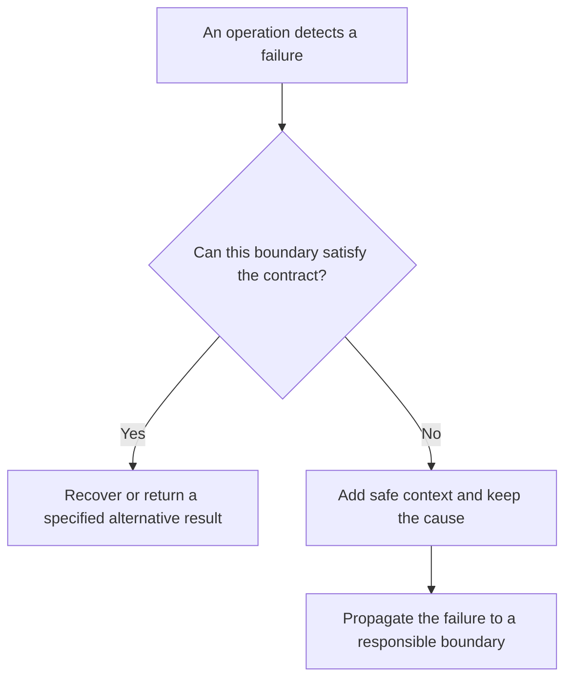

# P031 — Propagate Rather Than Swallow

## Definition

If a layer cannot satisfy all specified postconditions after recovery, it must propagate the
failure to a responsible boundary. The layer can use its specified interface to return, throw, or
signal the failure.

The layer must not give a success result, return an empty value, or continue work after a failure.
The contract must show the difference between success and a failure that the caller must handle.

**Aliases:** error propagation, no silent catch, surface unrecovered failures

## Provenance

**Classification:** established principle.

Authors wrote about structured exception handling for many years. Athena cannot identify one source
for this phrase. Athena uses it as a language-neutral decision rule.

## Decision rule

If this boundary can satisfy its specified postconditions or give a specified alternative
result, handle the failure. If the boundary cannot do this, propagate the failure and keep its cause.

## How to apply

- Give failure behavior in return types, exceptions, result objects, exit statuses, or
  protocol responses.
- When the layer has the necessary policy context, it can retry, compensate, translate, or stop
  after a failure.
- Keep the initial cause during error translation. Add stable context that helps the caller.
- Give fallback values in the interface. When the contract includes an alternative outcome, give
  its fallback as a success result.
- Make sure that dependency failures give a public failure outcome and keep correct state.

## Diagram



## Language examples

Each example adds caller context and keeps a failure outcome.

### Python

```python
def load_record(store, key):
    try:
        return store.read(key)
    except StorageError as error:
        raise RecordLoadError(key) from error
```

### Rust

```rust
fn load_record(store: &Store, key: &str) -> Result<Record, RecordLoadError> {
    store
        .read(key)
        .map_err(|source| RecordLoadError::new(key, source))
}
```

## Boundaries and tensions

A boundary can translate an internal error into a stable taxonomy. It must keep the causal chain.
Use [P032](p032-handle-once-preserve-causality.md) for cause preservation.

[P036](p036-graceful-degradation.md) gives conditions for a safe reduced mode. The mode is
applicable only when the contract includes it as an alternative outcome.

Use [P035](p035-fail-secure-fail-closed.md) for security uncertainty. Do not show secrets or
credentials. If the caller contract does not include internal information, do not show it. Keep
necessary cause data in protected diagnostics.

## Examples

### Positive application

A repository adapter cannot read a necessary record. It attaches the record identifier to the
storage error and returns the error. The service boundary maps the failure to its specified API
error. Protected diagnostics keep the initial cause.

### Misuse or counterexample

A configuration loader catches each parse error and returns an empty configuration. Startup gives
a success result. The service operates with invalid values. Engineers cannot find the initial
failure.

### Athena or agent workflow

If a necessary validation command returns a nonzero status, an Athena workflow records the command
and its results. The workflow does not give a success result because other checks had correct results.

## Related principles

- [P032 — Handle Once; Preserve Causality](p032-handle-once-preserve-causality.md)
- [P033 — State-Safe Failure Semantics](p033-state-safe-failure-semantics.md)
- [P034 — Fail Fast](p034-fail-fast.md)
- [P036 — Graceful Degradation](p036-graceful-degradation.md)

## References

### Source information

- [John B. Goodenough, “Structured Exception Handling” (1975)](https://doi.org/10.1145/512976.512997)
  — a 1975 analysis of exception conditions and control transfer to a handler with the necessary
  context. This source is not the source of Athena's phrase.

### Applicable information

- [The Rust Programming Language: Propagating Errors](https://doc.rust-lang.org/book/ch09-02-recoverable-errors-with-result.html#propagating-errors)
  — official guidance for a callee that returns an error when its caller has the necessary decision
  context.
- [C++ Core Guidelines, Error Handling](https://isocpp.github.io/CppCoreGuidelines/CppCoreGuidelines#S-errors)
  — guidance that recommends a specified error strategy. It recommends no handler in each
  function.

### More information

- [P029 — Generalize Error Policy; Preserve Specific Cause](../README.md#p029) — the catalog rule
  for error translation that keeps diagnostic specificity.

[Back to the engineering principles catalog](../README.md#p031)
