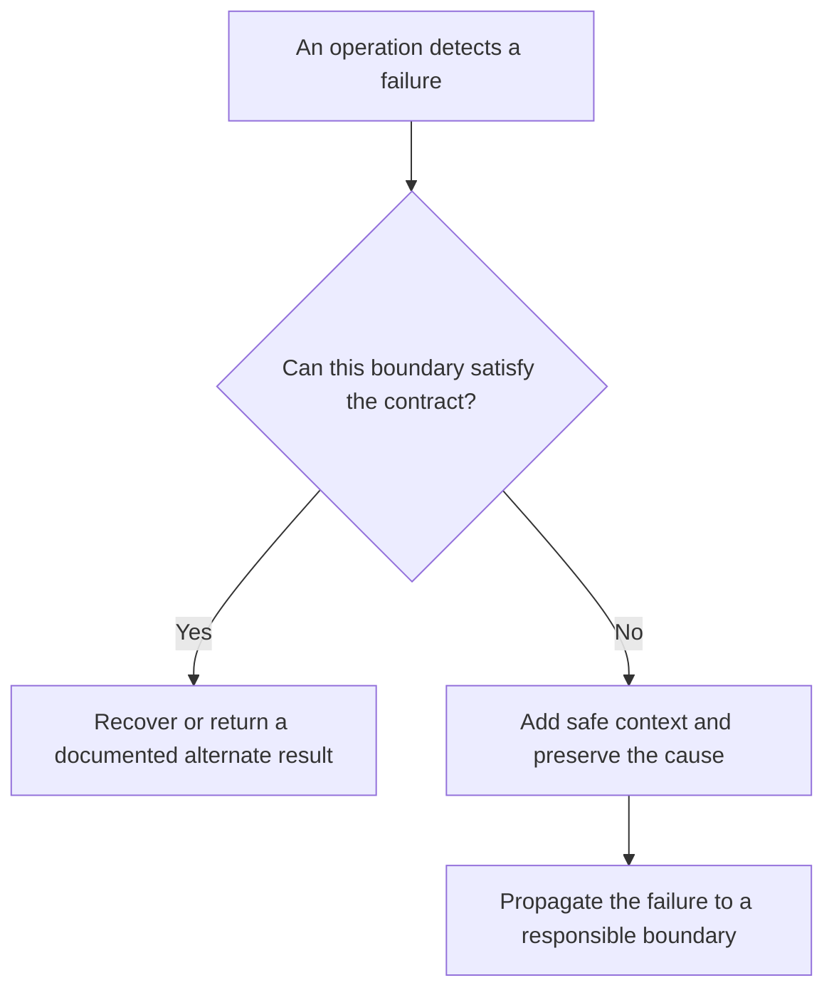

# P031 — Propagate Rather Than Swallow

## Definition

A layer that cannot recover fully and correctly must propagate the failure to a boundary that
can decide the outcome. The layer can return, throw, or signal the failure through its documented
interface.

The layer must not replace a real failure with apparent success, an empty value, or continued work.
The contract must distinguish success from a failure that requires a caller decision.

**Aliases:** error propagation, no silent catch, surface unrecovered failures

## Provenance

**Classification:** established principle.

Published work has described structured exception handling for decades. This exact phrase has no
single verified origin. Athena uses it as a language-neutral decision rule.

## Decision rule

Handle a failure only when the current boundary can restore its promised postconditions or produce
a documented alternate result. Otherwise, preserve and propagate the failure.

## How to apply

- Define failure behavior through return types, exceptions, result objects, exit statuses, or
  protocol responses.
- Handle a failure only when the layer can retry, compensate, translate, or terminate with the
  necessary policy context.
- Preserve the original cause during error translation. Add stable context that helps the caller.
- Define fallback values in the interface. Treat a fallback as success only when the contract
  defines an alternate outcome.
- Verify that dependency failures produce a failed public outcome and preserve valid state.

## Diagram



## Language examples

Each example adds caller-relevant context and preserves a failed outcome.

### Python

```python
def load_record(store, key):
    try:
        return store.read(key)
    except StorageError as error:
        raise RecordLoadError(key) from error
```

### Rust

```rust
fn load_record(store: &Store, key: &str) -> Result<Record, RecordLoadError> {
    store
        .read(key)
        .map_err(|source| RecordLoadError::new(key, source))
}
```

## Boundaries and tensions

Propagation does not require every internal error to escape unchanged. A boundary can translate an
error into a stable taxonomy. It must preserve causality under
[P032](p032-handle-once-preserve-causality.md).

[P036](p036-graceful-degradation.md) permits a documented and safe reduced mode. The reduced mode
is valid only when the contract defines it as an alternate outcome.

Security uncertainty follows [P035](p035-fail-secure-fail-closed.md). Do not expose secrets,
credentials, or unnecessary internal details. Preserve required cause data in protected
diagnostics.

## Examples

### Positive application

A repository adapter cannot read a required record. It attaches the record identifier to the
storage error and returns the error. The service boundary maps the failure to its documented API
error. Protected diagnostics retain the original cause.

### Misuse or counterexample

A configuration loader catches every parse error and returns an empty configuration. Startup
reports success. The service later operates with invalid values, and the original failure is lost.

### Athena or agent workflow

If a required validation command returns a nonzero status, an Athena workflow reports the command
and its evidence. The workflow does not declare completion because earlier checks passed.

## Related principles

- [P032 — Handle Once; Preserve Causality](p032-handle-once-preserve-causality.md)
- [P033 — State-Safe Failure Semantics](p033-state-safe-failure-semantics.md)
- [P034 — Fail Fast](p034-fail-fast.md)
- [P036 — Graceful Degradation](p036-graceful-degradation.md)

## References

### Origin and history

- [John B. Goodenough, “Structured Exception Handling” (1975)](https://doi.org/10.1145/512976.512997)
  — an early primary analysis of exception conditions and control transfer to an appropriate
  handler. Athena does not claim this source as the origin of its phrase.

### Current guidance

- [The Rust Programming Language: Propagating Errors](https://doc.rust-lang.org/book/ch09-02-recoverable-errors-with-result.html#propagating-errors)
  — official guidance for a callee that returns an error when its caller has the required decision
  context.
- [C++ Core Guidelines, Error Handling](https://isocpp.github.io/CppCoreGuidelines/CppCoreGuidelines#S-errors)
  — current guidance that recommends a deliberate error strategy. It advises against a handler in
  every function.

### Further reading

- [P029 — Generalize Error Policy; Preserve Specific Cause](../README.md#p029) — the companion
  catalog rule for error translation that preserves diagnostic specificity.

[Back to the engineering principles catalog](../README.md#p031)
