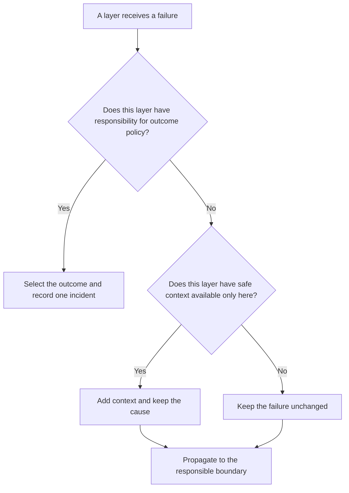

# P032 — Handle Once; Preserve Causality

## Definition

One boundary must have responsibility for the outcome policy for a failure. Other layers can add safe
context or telemetry. They must record only one incident for the failure.

Each error translation must keep the causal chain, stack data, and structured context. These data
help engineers find the initial failure cause.

**Aliases:** single-owner error handling, log-or-propagate, exception chaining

## Provenance

**Classification:** practitioner heuristic.

Many languages include exception chaining. The full “handle once” rule is a cross-language
engineering synthesis. Athena cannot identify one source for this rule.

## Decision rule

For each failure, find the boundary that selects the outcome. Other layers must propagate the
failure. They can add context that is available only at their layer.

## How to apply

- Give ownership of recovery, user output, and error-level records to a clear API, process, job, or
  workflow boundary.
- Use native cause links or structured error wrappers. Do not replace an error with a message that
  has no relation.
- Add an operation, safe identifier, or dependency name only at the layer that knows it.
- Correlate retry telemetry with the last outcome. Do not record each try as a different,
  uncorrelated incident.
- Keep stack and cause fields in structured telemetry. Remove sensitive data from those fields.
- Make sure that each translated error has the stable public category and internal cause.

## Diagram



## Language examples

Each example adds one artifact identifier and keeps the initial storage error as the cause.

### Python

```python
def load_artifact(store, key):
    try:
        return store.read(key)
    except StorageError as error:
        raise ArtifactLoadError(key) from error
```

### Rust

```rust
fn load_artifact(store: &Store, key: &str) -> Result<Artifact, ArtifactLoadError> {
    store.read(key).map_err(|source| ArtifactLoadError {
        key: key.to_owned(),
        source,
    })
}
```

## Boundaries and tensions

“Handle once” lets teams record metrics or low-severity tries at more than one layer. It does not
let them record one failure as more than one incident. A library can record
diagnostic events if its observability contract includes them. Ownership and correlation must
stay clearly specified.

Use this rule with [P031](p031-propagate-rather-than-swallow.md). Propagation keeps the failure available.
Cause preservation gives the responsible boundary sufficient diagnostic data. Security and privacy
controls can prevent public access to some information. These controls must keep the protected internal chain.

## Examples

### Positive application

A storage client returns a timeout with endpoint metadata. The repository wrapper links that cause
to `ArtifactLoadFailed` with an artifact identifier. The request boundary records one correlated
error event and returns the stable public code.

### Misuse or counterexample

Four nested functions each record the same exception at error level. Each function throws a new
exception without its cause. One incident causes four alerts. Engineers cannot get the initial
stack.

### Athena or agent workflow

A delegated reviewer records a tool failure with its command and exit status. The coordinator adds
the inspection phase. It records one failure for the user.

## Related principles

- [P031 — Propagate Rather Than Swallow](p031-propagate-rather-than-swallow.md)
- [P033 — State-Safe Failure Semantics](p033-state-safe-failure-semantics.md)
- [P038 — Bounded Retry](p038-bounded-retry.md)
- [P047 — Observability Is Part of Correctness](p047-observability-is-part-of-correctness.md)

## References

### Source information

- [PEP 3134 — Exception Chaining and Embedded Tracebacks](https://peps.python.org/pep-3134/)
  — records information about automatic and specified cause retention during Python exception
  translation.
- [John B. Goodenough, “Structured Exception Handling” (1975)](https://doi.org/10.1145/512976.512997)
  — a 1975 analysis of structured exception handling. It does not give Athena's specified
  record policy.

### Applicable information

- [OpenTelemetry Semantic Conventions 1.44.0: exceptions in logs](https://opentelemetry.io/docs/specs/semconv/exceptions/exceptions-logs/)
  — applicable conventions for correlated exception records, stack traces, and duplicate prevention
  in instrumentation.
- [C++ Core Guidelines E.17 and E.18](https://isocpp.github.io/CppCoreGuidelines/CppCoreGuidelines#e17-dont-try-to-catch-every-exception-in-every-function)
  — recommends no catch operation in each function and recommends a small number of specified
  handlers.

### More information

- [P029 — Generalize Error Policy; Preserve Specific Cause](../README.md#p029) — shows stable
  boundary taxonomies and internal diagnostics that keep the cause.

[Back to the engineering principles catalog](../README.md#p032)
