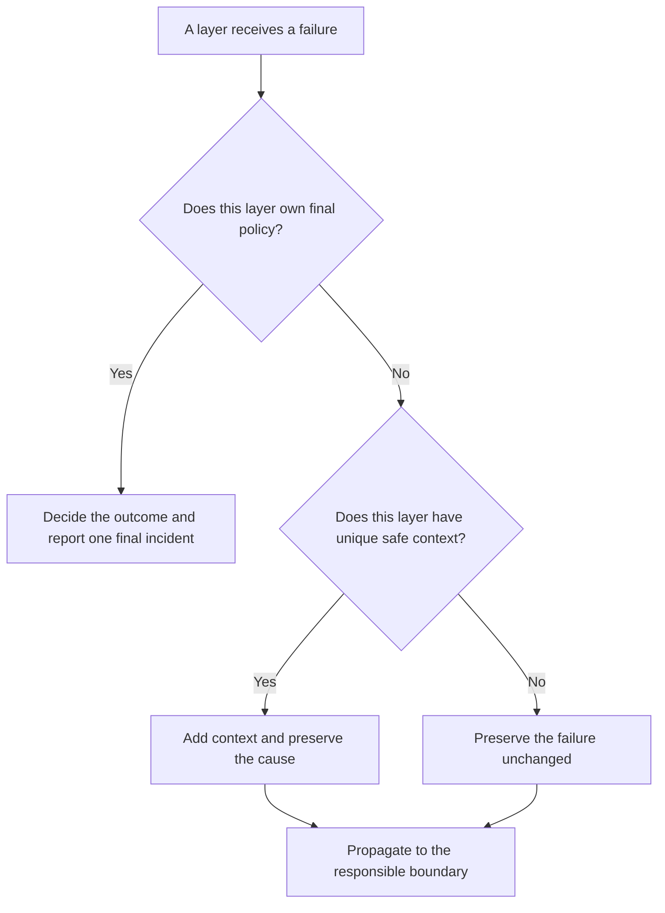

# P032 — Handle Once; Preserve Causality

## Definition

One responsible boundary must own the final policy for a failure. Intermediate layers can add safe
context or telemetry. They must not present the same incident as multiple final failures.

Any error translation must retain the causal chain, stack data, and structured context that help
diagnose the original failure.

**Aliases:** single-owner error handling, log-or-propagate, exception chaining

## Provenance

**Classification:** practitioner heuristic.

Several languages define exception chaining. The combined “handle once” rule is a cross-language
engineering synthesis. No verified source uniquely owns this maxim.

## Decision rule

For each failure, identify the boundary that decides the outcome. Other layers must propagate the
failure. They can add unique context that the responsible boundary cannot reconstruct.

## How to apply

- Assign final recovery, presentation, and error-level records to a clear API, process, job, or
  workflow boundary.
- Use native cause links or structured error wrappers. Do not replace an error with an unrelated
  message.
- Add each operation, safe identifier, or dependency name once at the layer that knows it.
- Correlate retry telemetry with the final outcome. Do not report each attempt as a separate,
  uncorrelated incident.
- Preserve stack and cause fields in structured telemetry. Remove sensitive data from those fields.
- Verify the stable public category and the retained internal cause of each translated error.

## Diagram



## Language examples

Each example adds one artifact identifier and retains the original storage error as the cause.

### Python

```python
def load_artifact(store, key):
    try:
        return store.read(key)
    except StorageError as error:
        raise ArtifactLoadError(key) from error
```

### Rust

```rust
fn load_artifact(store: &Store, key: &str) -> Result<Artifact, ArtifactLoadError> {
    store.read(key).map_err(|source| ArtifactLoadError {
        key: key.to_owned(),
        source,
    })
}
```

## Boundaries and tensions

“Handle once” permits metrics or low-severity attempt records at multiple layers. It prohibits the
presentation of one failure as independent final incidents. A library can record
diagnostic events when its observability contract requires them. Ownership and correlation must
remain explicit.

The rule complements [P031](p031-propagate-rather-than-swallow.md). Propagation preserves failure,
and cause preservation makes the final outcome understandable. Security and privacy controls can
restrict public details. These controls must preserve the protected internal chain.

## Examples

### Positive application

A storage client returns a timeout with endpoint metadata. The repository wrapper links that cause
to `ArtifactLoadFailed` with an artifact identifier. The request boundary records one correlated
error event and returns the stable public code.

### Misuse or counterexample

Four nested functions each record the same exception at error level. Each function throws a new
exception without its cause. One incident produces four alerts, and the original stack disappears.

### Athena or agent workflow

A delegated reviewer reports a tool failure with its command and exit status. The coordinator adds
the affected review phase. It reports one failure to the user.

## Related principles

- [P031 — Propagate Rather Than Swallow](p031-propagate-rather-than-swallow.md)
- [P033 — State-Safe Failure Semantics](p033-state-safe-failure-semantics.md)
- [P038 — Bounded Retry](p038-bounded-retry.md)
- [P047 — Observability Is Part of Correctness](p047-observability-is-part-of-correctness.md)

## References

### Origin and history

- [PEP 3134 — Exception Chaining and Embedded Tracebacks](https://peps.python.org/pep-3134/)
  — records the history and rationale for implicit and explicit cause retention during Python
  exception translation.
- [John B. Goodenough, “Structured Exception Handling” (1975)](https://doi.org/10.1145/512976.512997)
  — an early primary analysis of orderly exception handling. It does not prescribe Athena's exact
  record policy.

### Current guidance

- [OpenTelemetry Semantic Conventions 1.44.0: exceptions in logs](https://opentelemetry.io/docs/specs/semconv/exceptions/exceptions-logs/)
  — current conventions for correlated exception records, stack traces, and duplicate prevention
  in instrumentation.
- [C++ Core Guidelines E.17 and E.18](https://isocpp.github.io/CppCoreGuidelines/CppCoreGuidelines#e17-dont-try-to-catch-every-exception-in-every-function)
  — advises against a catch operation in every function and recommends few explicit handlers.

### Further reading

- [P029 — Generalize Error Policy; Preserve Specific Cause](../README.md#p029) — explains stable
  boundary taxonomies and precise internal diagnostics.

[Back to the engineering principles catalog](../README.md#p032)
