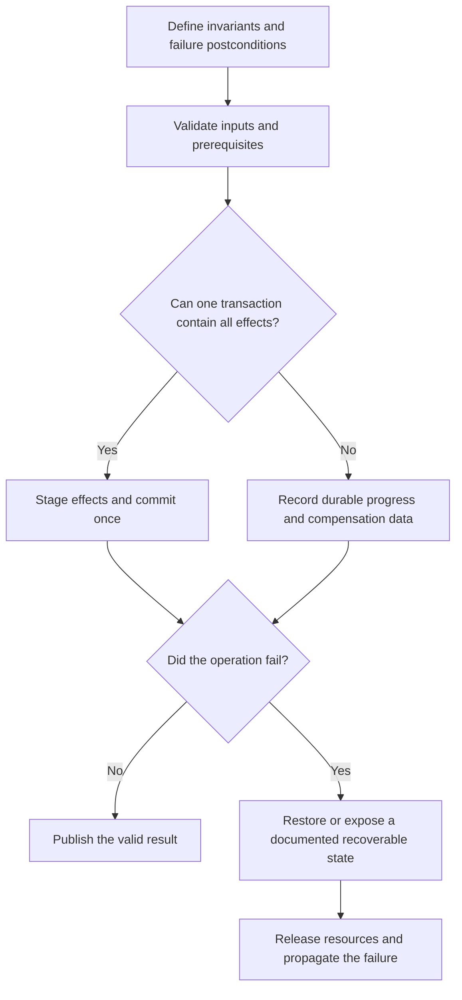

# P033 — State-Safe Failure Semantics

## Definition

After failure, each affected resource and state holder must remain unchanged or enter a documented,
valid, recoverable state. The failure path must preserve invariants and release resources
deterministically. It must prevent later work from use of state with unknown validity.

This postcondition does not promise that every effect can be reversed.

**Aliases:** exception safety, valid-state guarantee

## Provenance

**Classification:** Athena synthesis.

Exception-safety guarantees and transaction theory contain established forms of this idea. The
broader language-neutral rule has no single verified origin.

## Decision rule

Before a new mutation, define the valid states after each possible failure point. If prevention of
a partial effect is impossible, make that effect explicit, durable, detectable, and recoverable.

## How to apply

- Define invariants and failure postconditions before implementation of a multistep mutation.
- Validate inputs and prerequisites before a state change.
- Stage output in temporary state and publish it only after all required work succeeds.
- Use scoped resource ownership to release locks, files, connections, and temporary resources on
  every exit path.
- Use one transaction for changes within one transactional boundary. Otherwise, record durable
  progress and compensation data.
- Inject failures between steps. Verify the resultant state, resource release, and recovery path.

## Diagram



## Language examples

Each example commits the source and target account changes or preserves the prior state.

### Python

```python
def transfer(db, source, target, amount):
    with db.transaction():
        db.debit(source, amount)
        db.credit(target, amount)
```

### Rust

```rust
fn transfer(db: &mut Db, source: Id, target: Id, amount: Money) -> Result<(), Error> {
    let mut transaction = db.transaction()?;
    transaction.debit(source, amount)?;
    transaction.credit(target, amount)?;
    transaction.commit()
}
```

## Boundaries and tensions

Failure atomicity is a stronger related guarantee, not an alias. It requires a failed operation to
leave the original state unchanged. State-safe failure semantics permit a documented, valid,
recoverable state.

[P044](p044-atomicity-where-possible.md) is the preferred mechanism when one transaction can cover
the logical operation. [P045](p045-compensation-where-atomicity-is-impossible.md) applies when
effects span independent systems or include work with a long duration. Compensation can produce a
valid business state without exact restoration of the previous bytes.

[P034](p034-fail-fast.md) stops unsafe continuation. Termination alone is insufficient if it leaks
resources or leaves an ambiguous partial effect. State preservation does not justify failure
suppression under [P031](p031-propagate-rather-than-swallow.md).

## Examples

### Positive application

A file generator writes and validates a temporary file. It flushes the file and uses an atomic
replacement for the destination. If generation fails, it removes the temporary file. The previous
artifact remains intact.

### Misuse or counterexample

A migration updates half of a table, catches a later error, and returns success. No rollback or
durable checkpoint identifies the changed rows.

### Athena or agent workflow

An Athena workflow validates a full proposed issue body before issue creation. If creation
fails, the workflow reports failure. It does not claim success or make unrelated edits.

## Related principles

- [P031 — Propagate Rather Than Swallow](p031-propagate-rather-than-swallow.md)
- [P034 — Fail Fast](p034-fail-fast.md)
- [P044 — Atomicity Where Possible](p044-atomicity-where-possible.md)
- [P045 — Compensation Where Atomicity Is Impossible](p045-compensation-where-atomicity-is-impossible.md)

## References

### Origin and history

- [Härder and Reuter, “Principles of Transaction-Oriented Database Recovery” (1983)](https://doi.org/10.1145/289.291)
  — a foundational analysis of transaction recovery and the ACID terms for all-or-nothing state
  changes.
- [Boost, Exception Safety](https://www.boost.org/doc/user-guide/exception-safety.html) — records
  the basic and strong exception-safety guarantees for valid state and rollback behavior. These
  guarantees are narrower than Athena's system-level rule.

### Current guidance

- [C++ Core Guidelines E.4 and E.6](https://isocpp.github.io/CppCoreGuidelines/CppCoreGuidelines#e4-design-your-error-handling-strategy-around-invariants)
  — current guidance for an error strategy based on invariants. It recommends automatic resource
  management to prevent leaks.
- [Microsoft Azure, Compensating Transaction pattern](https://learn.microsoft.com/en-us/azure/architecture/patterns/compensating-transaction)
  — current guidance for recoverability when a multistep operation cannot be atomic.

### Further reading

- [PostgreSQL 18 transaction tutorial](https://www.postgresql.org/docs/18/tutorial-transactions.html)
  — a concrete explanation of all-or-nothing transaction behavior and rollback.

[Back to the engineering principles catalog](../README.md#p033)
