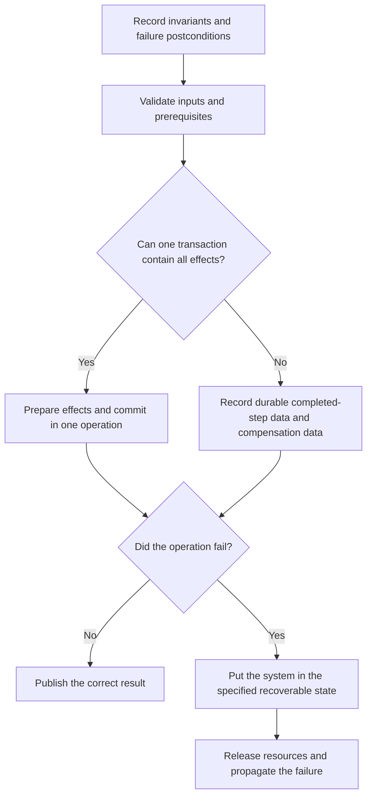

# P033 — State-Safe Failure Semantics

## Definition

After failure, each applicable resource and state holder must stay unchanged or change to a
specified recoverable state. This state must be correct. The failure path must keep invariants and
use a deterministic procedure to release resources. Work after the failure must not read state that can be incorrect.

This postcondition does not include reversal of all effects.

**Aliases:** exception safety, valid-state guarantee

## Provenance

**Classification:** Athena synthesis.

Exception-safety guarantees and transaction theory contain types of this rule. Athena cannot
identify one source for this language-neutral rule.

## Decision rule

Before a new mutation, record the correct states after each possible failure point. If only some
effects can occur, record those effects in durable data. Make sure that the system can find them
and recover from them.

## How to apply

- Before implementation of a multistep mutation, record invariants and failure postconditions.
- Before a state change, validate inputs and prerequisites.
- Put output in temporary state. After all necessary work succeeds, publish it.
- Use scoped resource ownership to release locks, files, connections, and temporary resources on
  each exit path.
- Use one transaction for changes in one transactional boundary. If one transaction cannot contain
  all changes, record durable completed-step data and compensation data.
- In tests, put failures between steps. Make sure that the state, resource release, and recovery path are correct.

## Diagram



## Language examples

Each example commits the source and target account changes or keeps the previous state.

### Python

```python
def transfer(db, source, target, amount):
    with db.transaction():
        db.debit(source, amount)
        db.credit(target, amount)
```

### Rust

```rust
fn transfer(db: &mut Db, source: Id, target: Id, amount: Money) -> Result<(), Error> {
    let mut transaction = db.transaction()?;
    transaction.debit(source, amount)?;
    transaction.credit(target, amount)?;
    transaction.commit()
}
```

## Boundaries and tensions

Failure atomicity is a stronger related guarantee, not an alias. If an operation fails, it must keep
the initial state unchanged for failure atomicity. State-safe failure semantics can have a specified
recoverable state as their result. This state must be correct.

When one transaction can contain the logical operation, use
[P044](p044-atomicity-where-possible.md) first. When effects occur in different systems or include
work with a long time, use [P045](p045-compensation-where-atomicity-is-impossible.md). Compensation
can give a correct business state that does not have all previous bytes.

[P034](p034-fail-fast.md) stops dangerous continuation. Termination does not correct a resource leak
or an effect that is not clear from only some steps. State preservation does not include failure suppression.
Use [P031](p031-propagate-rather-than-swallow.md) to propagate the failure.

## Examples

### Positive application

A file generator writes and validates a temporary file. It flushes the file and uses an atomic
replacement for the destination. If generation fails, it removes the temporary file. The previous
artifact stays unchanged.

### Misuse or counterexample

A migration updates some table rows and catches an error after the update of only some rows. It returns
success. No rollback or durable checkpoint records the changed rows.

### Athena or agent workflow

An Athena workflow validates all of a proposed issue body before issue creation. If creation
fails, the workflow gives a failure result. It does not give a success result or edit paths not in task scope.

## Related principles

- [P031 — Propagate Rather Than Swallow](p031-propagate-rather-than-swallow.md)
- [P034 — Fail Fast](p034-fail-fast.md)
- [P044 — Atomicity Where Possible](p044-atomicity-where-possible.md)
- [P045 — Compensation Where Atomicity Is Impossible](p045-compensation-where-atomicity-is-impossible.md)

## References

### Source information

- [Härder and Reuter, “Principles of Transaction-Oriented Database Recovery” (1983)](https://doi.org/10.1145/289.291)
  — an analysis of transaction recovery and the ACID terms for all-or-nothing state
  changes.
- [Boost, Exception Safety](https://www.boost.org/doc/user-guide/exception-safety.html) — records
  the basic and strong exception-safety guarantees for correct state and rollback behavior. These
  guarantees have a smaller scope. Athena's rule also includes system-level effects.

### Applicable information

- [C++ Core Guidelines E.4 and E.6](https://isocpp.github.io/CppCoreGuidelines/CppCoreGuidelines#e4-design-your-error-handling-strategy-around-invariants)
  — applicable guidance for an error strategy that uses invariants. It recommends automatic resource
  management to prevent leaks.
- [Microsoft Azure, Compensating Transaction pattern](https://learn.microsoft.com/en-us/azure/architecture/patterns/compensating-transaction)
  — applicable guidance for recoverability when a multistep operation cannot use one atomic operation.

### More information

- [PostgreSQL 18 transaction tutorial](https://www.postgresql.org/docs/18/tutorial-transactions.html)
  — information about all-or-nothing transaction behavior and rollback.

[Back to the engineering principles catalog](../README.md#p033)
