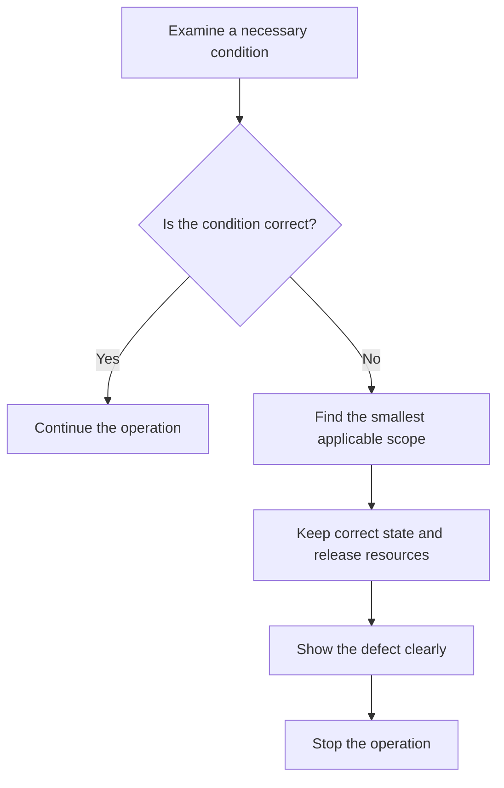

# P034 — Fail Fast

## Definition

When a necessary invariant, configuration, dependency, or precondition is missing or incorrect, stop
the applicable operation near the detection point. Before incorrect state causes corruption, incorrect
output, or a symptom far from the defect, give a clear failure.

**Aliases:** early failure, immediate visible failure, detect invalid state near its source

## Provenance

**Classification:** practitioner heuristic.

Jim Shore gives information about the rule in IEEE Software (2004). That source is not the source
of the phrase or rule.

## Decision rule

If continuation cannot satisfy the correctness and safety contract, fail at the nearest applicable
boundary. That boundary must identify the defect and keep safe state.

## How to apply

- During startup or at the applicable entry boundary, validate necessary configuration and schemas.
- Before the operation uses state, examine invariants. Record the violated condition with safe context.
- Before irreversible work or work with high cost, reject malformed inputs and inputs that cannot be correct.
- Select specified result types and error statuses that identify the defect. Use assertions only for
  programmer invariants. Do not use sentinel defaults. They prevent detection near the source.
- Make sure that termination releases resources. Give one diagnostic that tells the user how to
  correct the defect.
- Do tests of startup, boundary, and invariant failures. Do not limit tests to correct
  execution.

## Diagram



## Language examples

Each example rejects a missing endpoint before client creation.

### Python

```python
def connect(config):
    if not config.endpoint:
        raise ConfigError("endpoint is required")
    return Client(config.endpoint)
```

### Rust

```rust
fn connect(config: &Config) -> Result<Client, ConfigError> {
    let endpoint = config
        .endpoint
        .as_ref()
        .filter(|endpoint| !endpoint.is_empty())
        .ok_or(ConfigError::MissingEndpoint)?;
    Ok(Client::new(endpoint))
}
```

## Boundaries and tensions

This principle gives the conditions and location for a stop.
[P035](p035-fail-secure-fail-closed.md) gives the safe authorization or security state after
uncertainty. [P036](p036-graceful-degradation.md) gives reduced service for a noncritical
capability with a specified safe fallback.

A necessary capability must not become “optional” only to keep a process active.

Use this principle only for the applicable scope. Isolate the operation with
[P042](p042-fault-isolation-bulkheads.md). Use [P033](p033-state-safe-failure-semantics.md) to
keep state. Stop only the scope that cannot operate correctly.

## Examples

### Positive application

Before a service accepts traffic, it validates its necessary signing key. A missing key causes
startup to fail with the configuration field name. Requests do not cause a signature error that
fails to identify the source.

### Misuse or counterexample

A parser replaces a missing necessary identifier with an empty string. A database constraint fails
after many layers. The result does not show the input defect.

### Athena or agent workflow

An Athena skill examines its declared hard dependency before it plans external steps. If the
skill cannot use or get the dependency, it immediately gives a prerequisite-failure result. It does
not give results that it did not receive. It does not give an incorrect success report.

## Related principles

- [P033 — State-Safe Failure Semantics](p033-state-safe-failure-semantics.md)
- [P035 — Fail Secure / Fail Closed](p035-fail-secure-fail-closed.md)
- [P036 — Graceful Degradation](p036-graceful-degradation.md)
- [P042 — Fault Isolation / Bulkheads](p042-fault-isolation-bulkheads.md)

## References

### Source information

- [Jim Shore, “Fail Fast,” IEEE Software (2004)](https://martinfowler.com/ieeeSoftware/failFast.pdf)
  — a 2004 source that shows how failure at the detection point helps diagnostics.

### Applicable information

- [C++ Core Guidelines P.7](https://isocpp.github.io/CppCoreGuidelines/CppCoreGuidelines#p7-catch-run-time-errors-early)
  — applicable language guidance that recommends runtime-error detection near the source.
- [Microsoft Azure, Design for self-healing](https://learn.microsoft.com/en-us/azure/architecture/guide/design-principles/self-healing)
  — applies circuit breakers to remote dependencies with continuous failures.

### More information

- [Microsoft Azure, Circuit Breaker pattern](https://learn.microsoft.com/en-us/azure/architecture/patterns/circuit-breaker)
  — shows how rejection at the caller boundary can prevent damage to the caller and dependency during continuous
  failure.

[Back to the engineering principles catalog](../README.md#p034)
