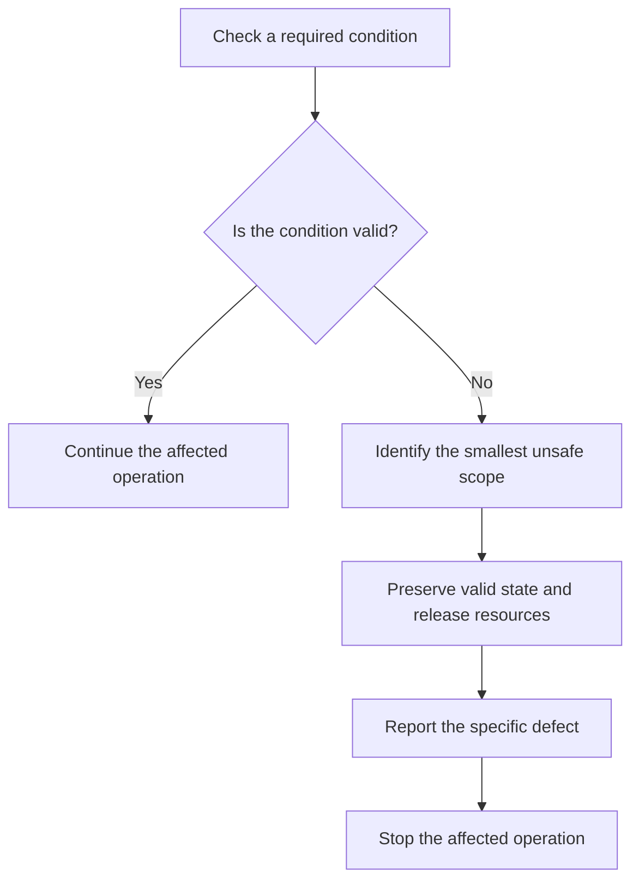

# P034 — Fail Fast

## Definition

When a required invariant, configuration, dependency, or precondition is absent or invalid, stop
the affected operation near the detection point. Report a specific failure before invalid state
causes corruption, false output, or a symptom far from the defect.

**Aliases:** early failure, immediate visible failure, detect invalid state near its source

## Provenance

**Classification:** practitioner heuristic.

Jim Shore's 2004 IEEE Software article is an influential primary explanation. It does not prove
that the phrase or idea originated there.

## Decision rule

If continuation cannot satisfy the correctness and safety contract, fail at the earliest boundary
that can identify the real defect and preserve safe state.

## How to apply

- Validate required configuration and schemas during startup or at the relevant entry boundary.
- Check invariants before state use. Report the violated condition with safe context.
- Reject malformed or impossible inputs before expensive or irreversible work.
- Prefer explicit result types and precise error statuses. Use assertions for true programmer
  invariants. Avoid sentinel defaults that delay discovery.
- Ensure that early termination releases resources and produces one actionable diagnostic.
- Test startup, boundary, and invariant failures. Do not test only successful execution.

## Diagram



## Language examples

Each example rejects an absent endpoint before client creation.

### Python

```python
def connect(config):
    if not config.endpoint:
        raise ConfigError("endpoint is required")
    return Client(config.endpoint)
```

### Rust

```rust
fn connect(config: &Config) -> Result<Client, ConfigError> {
    let endpoint = config
        .endpoint
        .as_ref()
        .ok_or(ConfigError::MissingEndpoint)?;
    Ok(Client::new(endpoint))
}
```

## Boundaries and tensions

Fail fast defines **when and where** to stop. [P035](p035-fail-secure-fail-closed.md) defines the safe
authorization or security state after uncertainty. [P036](p036-graceful-degradation.md) permits
reduced service for a noncritical capability with a documented safe fallback.

A required capability must not become “optional” only to keep a process active.

Fail fast does not require termination of the largest possible scope. Isolate the affected
operation under [P042](p042-fault-isolation-bulkheads.md). Preserve state under
[P033](p033-state-safe-failure-semantics.md). Terminate only the scope that cannot operate
correctly.

## Examples

### Positive application

A service validates its required signing key before it accepts traffic. An absent key causes
startup to fail with the configuration field name. Requests cannot reach a later ambiguous
signature error.

### Misuse or counterexample

A parser replaces an absent required identifier with an empty string. A database constraint fails
several layers later and hides the input defect.

### Athena or agent workflow

An Athena skill checks its declared hard dependency before it plans external actions. If the
dependency is unavailable, the skill reports that prerequisite immediately. It does not invent
results or make a false completion claim.

## Related principles

- [P033 — State-Safe Failure Semantics](p033-state-safe-failure-semantics.md)
- [P035 — Fail Secure / Fail Closed](p035-fail-secure-fail-closed.md)
- [P036 — Graceful Degradation](p036-graceful-degradation.md)
- [P042 — Fault Isolation / Bulkheads](p042-fault-isolation-bulkheads.md)

## References

### Origin and history

- [Jim Shore, “Fail Fast,” IEEE Software (2004)](https://martinfowler.com/ieeeSoftware/failFast.pdf)
  — an influential primary article that defines immediate, visible failure as a diagnostic aid.

### Current guidance

- [C++ Core Guidelines P.7](https://isocpp.github.io/CppCoreGuidelines/CppCoreGuidelines#p7-catch-run-time-errors-early)
  — current language guidance that recommends early detection of runtime errors.
- [Microsoft Azure, Design for self-healing](https://learn.microsoft.com/en-us/azure/architecture/guide/design-principles/self-healing)
  — applies fast failure to persistently unhealthy remote dependencies through circuit breakers.

### Further reading

- [Microsoft Azure, Circuit Breaker pattern](https://learn.microsoft.com/en-us/azure/architecture/patterns/circuit-breaker)
  — shows how early rejection can protect the caller and the dependency during persistent
  failure.

[Back to the engineering principles catalog](../README.md#p034)
