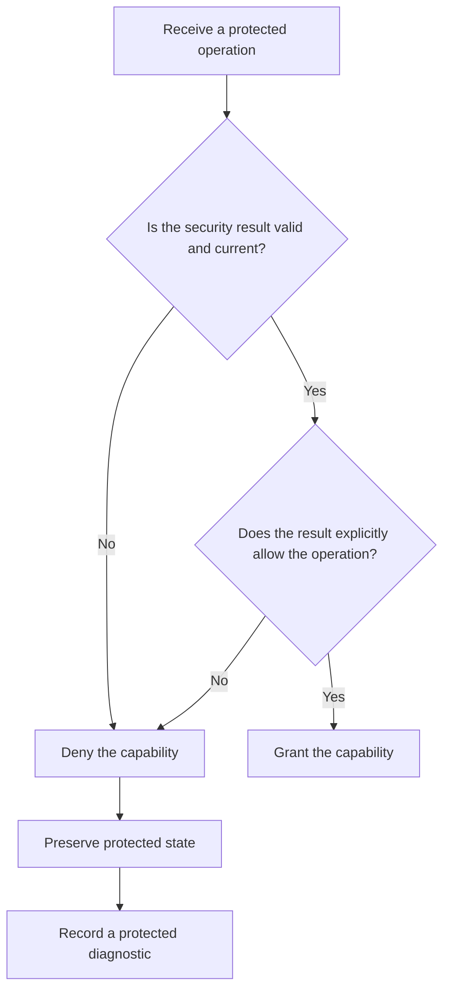

# P035 — Fail Secure / Fail Closed

## Definition

When a security control cannot prove that an operation is allowed, leave the system in its secure
state. Deny the capability, preserve confidentiality and integrity, and report the failure.

Authentication, authorization, validation, and policy evaluation are security controls. An absent
result, timeout, parse error, or exception must not become permission.

**Aliases:** fail-safe defaults, deny by default on security failure

## Provenance

**Classification:** established principle.

Saltzer and Schroeder documented “fail-safe defaults” in 1975. “Fail closed” and “fail secure” are
later common terms. These terms can have different meanings in safety engineering.

## Decision rule

Grant a protected operation only after an explicit and successful authorization result. Treat
absent, invalid, stale, or indeterminate security state as denial. A higher trusted contract can
define a different safe state.

## How to apply

- Initialize each authorization decision as denial. Change it to allow only after every required
  check succeeds.
- Distinguish policy service timeouts and errors from affirmative decisions. They can share the same
  external denial response.
- Preserve a protected resource when request validation or authorization fails.
- Test absent policy, dependency timeout, corrupt credentials, exception paths, and stale state.
- Record protected diagnostics that distinguish denial from infrastructure failure. Do not expose
  secrets or sensitive policy details.
- Restore service deliberately after the security dependency becomes healthy. Do not bypass the
  dependency automatically.

## Diagram



## Language examples

Each example grants deletion only after an explicit allow result.

### Python

```python
def may_delete(policy, actor, record):
    try:
        decision = policy.authorize(actor, "delete", record)
    except PolicyError:
        return False
    return decision is Decision.ALLOW
```

### Rust

```rust
fn may_delete(policy: &Policy, actor: &Actor, record: &Record) -> bool {
    matches!(
        policy.authorize(actor, Action::Delete, record),
        Ok(Decision::Allow)
    )
}
```

## Boundaries and tensions

Fail closed is a security choice, not a general availability rule. For a feature without security
risk, [P036](p036-graceful-degradation.md) can preserve useful service.

A safety-critical system can require a physical safe state other than “deny.” The domain hazard
analysis must define that state.

[P034](p034-fail-fast.md) requires an invalid security state to cause failure near its source. This
principle requires denial of the resultant capability. [P033](p033-state-safe-failure-semantics.md)
still requires resource release and a valid failure state.

## Examples

### Positive application

An authorization service does not respond before the deadline. The API returns an unavailable or
denied outcome and preserves the record. It records a protected correlation identifier for
operators.

### Misuse or counterexample

Code initializes `is_admin` to true. A role query fails, and the error path preserves the value. A
failed security control grants the highest privilege.

### Athena or agent workflow

An agent cannot verify authorization for a destructive command on the exact target. It stops and
requests direction. Uncertainty does not become permission.

## Related principles

- [P033 — State-Safe Failure Semantics](p033-state-safe-failure-semantics.md)
- [P034 — Fail Fast](p034-fail-fast.md)
- [P036 — Graceful Degradation](p036-graceful-degradation.md)
- [P053 — Validate at Trust Boundaries](../README.md#p053)

## References

### Origin and history

- [Saltzer and Schroeder, “The Protection of Information in Computer Systems” (1975)](https://doi.org/10.1109/PROC.1975.9939)
  — the primary source for the fail-safe-defaults principle. It bases access decisions on explicit
  permission instead of exclusion.

### Current guidance

- [OWASP, Fail Securely](https://owasp.org/www-community/Fail_securely) — current application
  guidance that directs security control exceptions to the disallow path.
- [OWASP Developer Guide](https://owasp.org/www-project-developer-guide/assets/exports/OWASP_Developer_Guide.pdf)
  — current secure development guidance that treats secure failure defaults as part of application
  design.

### Further reading

- [NIST SP 800-53 Rev. 5, AC-3 Access Enforcement](https://doi.org/10.6028/NIST.SP.800-53r5)
  — an authoritative control catalog for the enforcement of approved authorizations on system
  access.

[Back to the engineering principles catalog](../README.md#p035)
