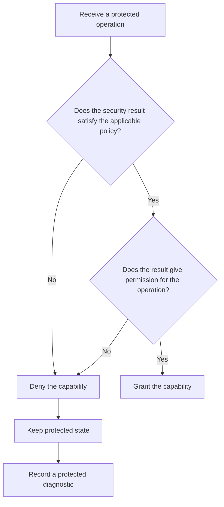

# P035 — Fail Secure / Fail Closed

## Definition

When a security control does not give permission for an operation, keep the system in its safe
state. Deny the capability, keep confidentiality and integrity, and give a failure result.

Authentication, authorization, validation, and policy evaluation are security controls. A missing
result, timeout, parse error, or exception must not become permission.

**Aliases:** fail-safe defaults, deny by default on security failure

## Provenance

**Classification:** established principle.

Saltzer and Schroeder included “fail-safe defaults” in their 1975 paper. Practitioners used “fail closed”
and “fail secure” after 1975. These terms can have different meanings in safety engineering.

## Decision rule

After a clear authorization result gives permission, grant the protected operation. Classify
missing, invalid, stale, or indeterminate security state as denial. A higher trusted contract can
contain a different safe-state requirement.

## How to apply

- Set each authorization decision to denial. After all necessary checks succeed, change the
  decision to permission.
- Policy-service timeouts and errors are not decisions that give permission. They can share the
  same external denial response.
- When request validation or authorization fails, keep the protected resource.
- Do tests with missing policy, dependency timeout, corrupt credentials, exception paths, and stale
  state.
- Record protected diagnostics that show the difference between denial and infrastructure failure. Do not show
  secrets or sensitive policy information.
- After the security dependency operates correctly, make service available again. If a higher
  trusted contract does not give permission, do not operate without the dependency.

## Diagram



## Language examples

After a clear result gives permission, each example grants deletion.

### Python

```python
def may_delete(policy, actor, record):
    try:
        decision = policy.authorize(actor, "delete", record)
    except PolicyError:
        return False
    return decision is Decision.ALLOW
```

### Rust

```rust
fn may_delete(policy: &Policy, actor: &Actor, record: &Record) -> bool {
    matches!(
        policy.authorize(actor, Action::Delete, record),
        Ok(Decision::Allow)
    )
}
```

## Boundaries and tensions

Fail closed is a security rule, not a general availability rule. For a feature without security
risk, [P036](p036-graceful-degradation.md) can keep available service.

A physical safe state other than “deny” can be necessary in a safety-critical system. The domain
hazard analysis must include that state.

With [P034](p034-fail-fast.md), an invalid security state causes failure near its source. This
principle denies that capability. Use [P033](p033-state-safe-failure-semantics.md) for resource
release and the correct failure state.

## Examples

### Positive application

An authorization service does not give a response before the deadline. The API returns an unavailable or
denied outcome and keeps the record. It records a protected correlation identifier for
operators.

### Misuse or counterexample

Code sets `is_admin` to `true`. A role query fails, and the error path keeps the value. A security
control that fails grants the highest privilege.

### Athena or agent workflow

When an agent cannot find authorization for a destructive command on the specified target, it
stops and requests direction. Uncertainty does not become permission.

## Related principles

- [P033 — State-Safe Failure Semantics](p033-state-safe-failure-semantics.md)
- [P034 — Fail Fast](p034-fail-fast.md)
- [P036 — Graceful Degradation](p036-graceful-degradation.md)
- [P053 — Validate at Trust Boundaries](../README.md#p053)

## References

### Source information

- [Saltzer and Schroeder, “The Protection of Information in Computer Systems” (1975)](https://doi.org/10.1109/PROC.1975.9939)
  — the primary source for the fail-safe-defaults principle. It uses clearly given permission for
  access decisions, not exclusion.

### Applicable information

- [OWASP, Fail Securely](https://owasp.org/www-community/Fail_securely) — applicable application
  guidance that puts security control exceptions on the disallow path.
- [OWASP Developer Guide](https://owasp.org/www-project-developer-guide/assets/exports/OWASP_Developer_Guide.pdf)
  — guidance for safe development that includes safe failure defaults in application design.

### More information

- [NIST SP 800-53 Rev. 5, AC-3 Access Enforcement](https://doi.org/10.6028/NIST.SP.800-53r5)
  — an official control catalog for the enforcement of approved authorizations on system
  access.

[Back to the engineering principles catalog](../README.md#p035)
