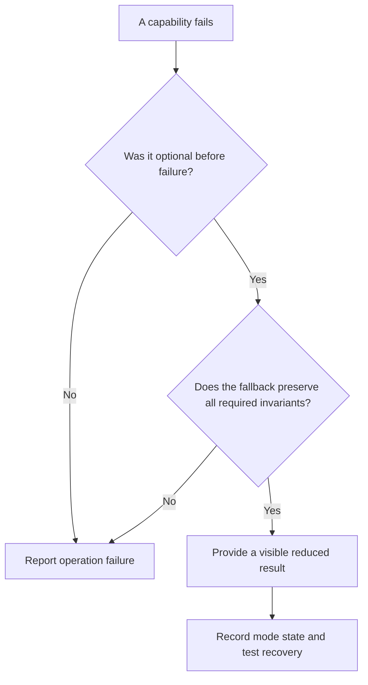

# P036 — Graceful Degradation

## Definition

A system can continue after a noncritical feature or dependency fails. The system must classify that
capability as optional before the failure.

The reduced mode must remain correct, secure, observable, and consistent with the documented
contract. The system must not present omitted required work as a full result.

**Aliases:** degraded mode, partial service, fallback capability

## Provenance

**Classification:** established principle.

Fault-tolerant systems and distributed systems developed this concept. This exact software rule has
no verified single origin.

## Decision rule

Use a reduced mode only for a capability that has a prior optional classification. The tested
fallback must preserve every required invariant. Otherwise, report operation failure clearly.

## How to apply

- Classify each capability before an incident. Use required, optional, safety-critical, or
  security-critical categories.
- Define the reduced output, visible notice, entry trigger, recovery trigger, and maximum duration.
- Select a simple fallback with a bounded cost. For example, omit recommendations but preserve the
  primary transaction.
- Maintain authorization, integrity, and required validation. Never use a fallback to bypass these
  controls.
- Record metrics and structured events at mode entry, at set intervals, and at recovery.
- Test the fallback under realistic dependency failure and overload conditions.

## Diagram



## Language examples

Each example preserves product search and identifies the optional recommendation failure.

### Python

```python
def build_view(products, recommendation_result):
    if recommendation_result.is_error:
        return {"products": products, "recommendations": [], "mode": "degraded"}
    return {
        "products": products,
        "recommendations": recommendation_result.value,
        "mode": "full",
    }
```

### Rust

```rust
fn build_view(products: Vec<Product>, recommendations: Result<Vec<Product>, Error>) -> View {
    match recommendations {
        Ok(items) => View::full(products, items),
        Err(_) => View::degraded(products, Vec::new()),
    }
}
```

## Boundaries and tensions

[P034](p034-fail-fast.md) governs a failed **required** capability or a violated invariant.
[P035](p035-fail-secure-fail-closed.md) governs an uncertain security decision. Do not reclassify a
capability after failure to increase availability.

Graceful degradation also differs from error suppression. The result must show reduced service when
that fact affects meaning, correction, or service level.

Complex fallback paths can add failure modes. Their value must exceed their maintenance and test
cost.

## Examples

### Positive application

A storefront loses its recommendation service. Product search and checkout continue. The site
omits the recommendation panel and records the reduced mode.

### Misuse or counterexample

A payment API times out after a card charge request. It returns “order completed” without proof of
the charge result. This response hides required transaction uncertainty.

### Athena or agent workflow

An Athena skill can continue without optional web research. It uses verified repository evidence
and states the research limit. It must not fabricate citations or omit a required dependency check.

## Related principles

- [P031 — Propagate Rather Than Swallow](p031-propagate-rather-than-swallow.md)
- [P034 — Fail Fast](p034-fail-fast.md)
- [P035 — Fail Secure / Fail Closed](p035-fail-secure-fail-closed.md)
- [P042 — Fault Isolation / Bulkheads](p042-fault-isolation-bulkheads.md)

## References

### Origin and history

- Athena does not assert one primary source for the general software phrase. The concept comes from
  long-established fault-tolerance work, not from one vendor.

### Current guidance

- [Microsoft Azure Well-Architected Framework, self-preservation](https://learn.microsoft.com/en-us/azure/well-architected/reliability/self-preservation)
  — current guidance for the design, activation, communication, and recovery of an explicit reduced
  mode.
- [Google SRE, Addressing Cascading Failures](https://sre.google/sre-book/addressing-cascading-failures/)
  — production guidance for degraded results during overload, with tests and telemetry for the rare
  path.

### Further reading

- [Microsoft Azure, Throttling pattern](https://learn.microsoft.com/en-us/azure/architecture/patterns/throttling)
  — connects degradation with capacity controls, load shedding, and service-level objectives.

[Back to the engineering principles catalog](../README.md#p036)
