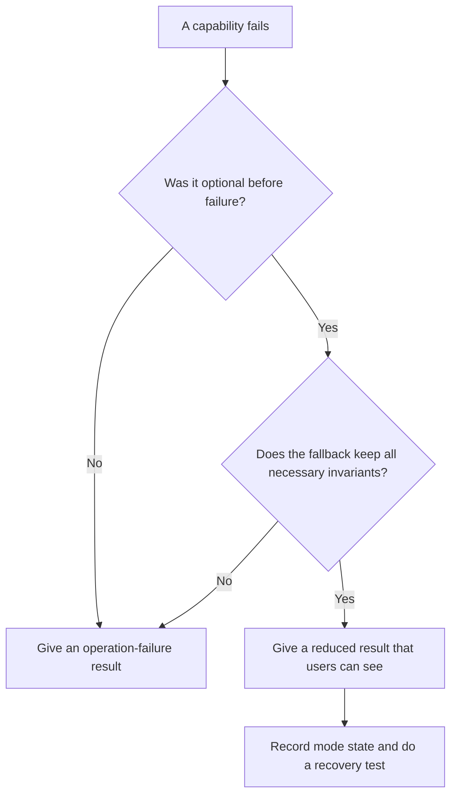

# P036 — Graceful Degradation

## Definition

A system can continue after a noncritical feature or dependency fails. The system must classify that
capability as optional before the failure.

The reduced mode must stay correct and safe. Operators must monitor its status. It must obey the
specified contract.
If the system did not do necessary work, its result must not show that the system did all work.

**Aliases:** degraded mode, partial service, fallback capability

## Provenance

**Classification:** established principle.

Fault-tolerant and distributed systems have used this rule for many years. Athena cannot identify
one source for this software rule.

## Decision rule

If a capability was not in the optional category before failure, do not use a reduced mode. The
tested fallback must keep all necessary invariants. If it does not, give a clear operation-failure result.

## How to apply

- Before an incident, classify each capability. Use required, optional, safety-critical, or
  security-critical categories.
- Give the reduced output, notice, entry condition, recovery condition, and maximum time in the
  contract.
- Select a fallback with a small number of steps and a bounded cost. For example, do not include
  recommendations but keep the primary transaction.
- Keep authorization, integrity, and necessary validation. Do not use a fallback without these
  controls.
- Record metrics and structured events at mode entry, at set intervals, and at recovery.
- Do tests of the fallback during dependency failure and overload conditions.

## Diagram



## Language examples

Each example keeps product search and records the optional recommendation failure.

### Python

```python
def build_view(products, recommendation_result):
    if recommendation_result.is_error:
        return {"products": products, "recommendations": [], "mode": "degraded"}
    return {
        "products": products,
        "recommendations": recommendation_result.value,
        "mode": "full",
    }
```

### Rust

```rust
fn build_view(products: Vec<Product>, recommendations: Result<Vec<Product>, Error>) -> View {
    match recommendations {
        Ok(items) => View::full(products, items),
        Err(_) => View::degraded(products, Vec::new()),
    }
}
```

## Boundaries and tensions

Use [P034](p034-fail-fast.md) for a failed **required** capability or a violated invariant.
Use [P035](p035-fail-secure-fail-closed.md) for an uncertain security decision. After failure,
do not reclassify a capability to increase availability.

Graceful degradation is not error suppression. When that fact changes meaning, correction, or
service level, the result must show reduced service.

Fallback paths can add failure modes. Their value must be more than their maintenance and test
cost.

## Examples

### Positive application

The recommendation service for a storefront fails. Product search and checkout continue. The site
does not include the recommendation panel and records the reduced mode.

### Misuse or counterexample

After a card-charge request, a timeout occurs for a payment API. The charge result is unknown. The
API returns “order completed” and does not show the necessary transaction uncertainty.

### Athena or agent workflow

An Athena skill can continue without optional web research. It uses results from repository checks
and records the research limit. It must not give a citation if it did not examine the source. It
must do each necessary dependency check.

## Related principles

- [P031 — Propagate Rather Than Swallow](p031-propagate-rather-than-swallow.md)
- [P034 — Fail Fast](p034-fail-fast.md)
- [P035 — Fail Secure / Fail Closed](p035-fail-secure-fail-closed.md)
- [P042 — Fault Isolation / Bulkheads](p042-fault-isolation-bulkheads.md)

## References

### Source information

- Athena does not identify one primary source for the general software phrase. Fault-tolerance work,
  not one company, is the source of the rule.

### Applicable information

- [Microsoft Azure Well-Architected Framework, self-preservation](https://learn.microsoft.com/en-us/azure/well-architected/reliability/self-preservation)
  — applicable guidance for the design, activation, communication, and recovery of a clearly specified reduced
  mode.
- [Google SRE, Addressing Cascading Failures](https://sre.google/sre-book/addressing-cascading-failures/)
  — production guidance for degraded results during overload, with tests and telemetry for the
  low-frequency path.

### More information

- [Microsoft Azure, Throttling pattern](https://learn.microsoft.com/en-us/azure/architecture/patterns/throttling)
  — connects degradation with capacity controls, load shedding, and service-level objectives.

[Back to the engineering principles catalog](../README.md#p036)
