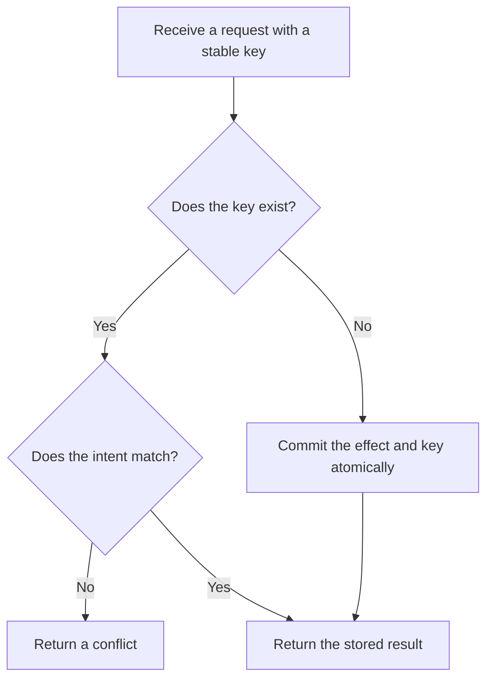

# P037 — Idempotency Before Retry

## Definition

An operation that can run more than once must produce one intended effect for equivalent requests.
An equivalent control can provide this guarantee.

Such controls include an idempotency key, duplicate detection, a conditional write, or
reconciliation. A timeout is an unknown outcome. It does not prove that the first attempt made no
state change.

**Aliases:** retry safety, idempotent operation, duplicate suppression

## Provenance

**Classification:** established principle.

Idempotence originated in mathematics and has a long history in protocol design. Athena makes its
priority before retry explicit. Athena claims no single source for that phrase.

## Decision rule

Permit automatic retry for an operation with side effects only when duplicate execution is safe or
uniquely detectable and recoverable.

## How to apply

- Classify the operation effect. Define semantic equivalence for requests.
- Prefer operations that set a requested state when the domain permits that design.
- Accept an idempotency key for create, charge, send, or publish operations. Bind the key to caller
  identity and normalized intent.
- Store the key and state change in one atomic operation when possible. Store a stable duplicate
  response.
- Define key scope, retention, conflict behavior, and treatment of late or concurrent duplicates.
- If idempotency is impossible, prohibit blind retry. Provide status queries or reconciliation.
- Test duplicate requests, concurrent requests, timeouts, late requests, and key conflicts.

## Diagram



## Language examples

Each example returns one job for each equivalent key and payload pair.

### Python

```python
def create_job(store, key, payload):
    outcome = store.atomic_get_or_create(key, payload)
    if outcome.kind is CreateKind.CONFLICT:
        raise Conflict(key)
    return outcome.job_id
```

### Rust

```rust
fn create_job(store: &Store, key: Key, payload: Payload) -> Result<JobId, Error> {
    match store.atomic_get_or_create(&key, &payload)? {
        CreateResult::Created(job) | CreateResult::Replayed(job) => Ok(job.id),
        CreateResult::Conflict => Err(Error::Conflict(key)),
    }
}
```

## Boundaries and tensions

Idempotency reduces duplicate risk. It does not permit unlimited attempts. Apply
[P038](p038-bounded-retry.md) and [P039](p039-bounded-waiting.md) as separate controls.

A separate idempotency record and state change can produce partial state. Use
[P044](p044-atomicity-where-possible.md) when one transaction can contain the two effects.

Use reconciliation and [P045](p045-compensation-where-atomicity-is-impossible.md) when one
transaction cannot contain the two effects. A reused key with a different intent is a conflict.

## Examples

### Positive application

A job API accepts a client request identifier. The server atomically stores the normalized payload,
job identifier, and response. Equivalent requests return the same job.

A request with the same key and a different payload receives a conflict response.

### Misuse or counterexample

A client retries `charge-card` after every timeout without a request key. The first attempt can
succeed before the timeout. The retry can charge the customer twice.

### Athena or agent workflow

An Athena workflow loses the response from an issue creation request. Before a retry, it searches
for the exact title and marker. It can also use the host idempotency control.

The workflow does not assume that the first request failed.

## Related principles

- [P033 — State-Safe Failure Semantics](p033-state-safe-failure-semantics.md)
- [P038 — Bounded Retry](p038-bounded-retry.md)
- [P039 — Bounded Waiting](p039-bounded-waiting.md)
- [P044 — Atomicity Where Possible](p044-atomicity-where-possible.md)
- [P045 — Compensation Where Atomicity Is Impossible](p045-compensation-where-atomicity-is-impossible.md)

## References

### Origin and history

- [RFC 2068, HTTP/1.1 section 9.1.2 (1997)](https://www.rfc-editor.org/rfc/rfc2068.html#section-9.1.2)
  — an early HTTP standards-track definition of idempotent methods and duplicate request effects.
  Idempotence predates HTTP.

### Current guidance

- [RFC 9110 section 9.2.2, Idempotent Methods](https://www.rfc-editor.org/rfc/rfc9110.html#section-9.2.2)
  — current HTTP semantics for safe automatic request repetition.
- [AWS Builders' Library, Making retries safe with idempotent APIs](https://aws.amazon.com/builders-library/making-retries-safe-with-idempotent-APIs/)
  — practitioner guidance for client request identifiers, semantic equivalence, late requests, and
  atomic idempotency records.

### Further reading

- [Microsoft Azure, Retry pattern](https://learn.microsoft.com/en-us/azure/architecture/patterns/retry)
  — explains why a response can fail after successful work. It also explains why retry policy must
  consider idempotency.

[Back to the engineering principles catalog](../README.md#p037)
