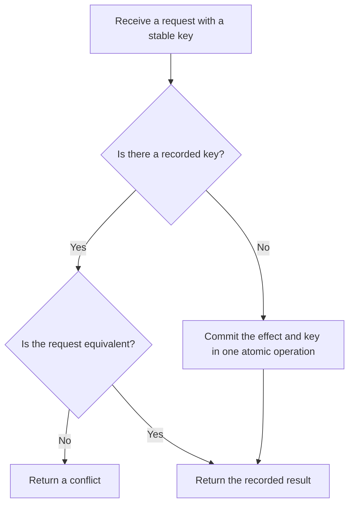

# P037 — Idempotency Before Retry

## Definition

An operation that can occur more than one time must have one intended effect for equivalent
requests. An equivalent control can give this guarantee.

Such controls include an idempotency key, duplicate detection, a conditional write, or
reconciliation. After a timeout, the first try outcome is unknown. The try can change state.

**Aliases:** retry safety, idempotent operation, duplicate suppression

## Provenance

**Classification:** established principle.

Mathematics and protocol design have used idempotence for many years. Athena puts idempotency first.
Retry occurs after idempotency. Athena cannot identify one source for that phrase.

## Decision rule

If an operation has side effects and duplicate execution is safe, automatic retry can occur. A
different request identifier for each logical operation lets the system detect duplicate execution
and recover from it.

## How to apply

- Classify the operation effect. Record semantic equivalence for requests.
- If a requested-state operation satisfies domain rules, select that design.
- Accept an idempotency key for resource writes, charges, message sends, or publications. Connect the key to caller
  identity and normalized request data.
- When possible, record the key and state change in one atomic operation. Record a stable duplicate
  response.
- Record key scope, retention, conflict behavior, and treatment of late or concurrent duplicates.
- If results do not show that the operation is safe, do not retry. Give status queries or
  reconciliation procedures.
- Do tests with duplicate requests, concurrent requests, timeouts, late requests, and key conflicts.

## Diagram



## Language examples

Each example returns one job for each equivalent key and payload pair.

### Python

```python
def create_job(store, key, payload):
    outcome = store.atomic_get_or_create(key, payload)
    if outcome.kind is CreateKind.CONFLICT:
        raise Conflict(key)
    return outcome.job_id
```

### Rust

```rust
fn create_job(store: &Store, key: Key, payload: Payload) -> Result<JobId, Error> {
    match store.atomic_get_or_create(&key, &payload)? {
        CreateResult::Created(job) | CreateResult::Replayed(job) => Ok(job.id),
        CreateResult::Conflict => Err(Error::Conflict(key)),
    }
}
```

## Boundaries and tensions

Idempotency decreases duplicate risk. A finite try count is also necessary. Apply
[P038](p038-bounded-retry.md) and [P039](p039-bounded-waiting.md). These controls have different
functions.

If the idempotency record and state change use different transactions, the state change can occur
only in part. If one transaction can contain the two effects, use [P044](p044-atomicity-where-possible.md).

If one transaction cannot contain the two effects, use reconciliation and
[P045](p045-compensation-where-atomicity-is-impossible.md). A key with a nonequivalent request is a conflict.

## Examples

### Positive application

A job API accepts a client request identifier. The server uses one atomic operation to record the
normalized payload, job identifier, and response. Equivalent requests return the same job.

A request with the same key and a different payload receives a conflict response.

### Misuse or counterexample

A client retries `charge-card` after each timeout without a request key. The first try can
succeed before the timeout. The retry can charge the customer two times.

### Athena or agent workflow

An Athena workflow does not receive the response from an issue creation request. Before a retry, it
examines issues for the specified title and marker. It can also use the host idempotency control.

The workflow has no results that show that the first request failed.

## Related principles

- [P033 — State-Safe Failure Semantics](p033-state-safe-failure-semantics.md)
- [P038 — Bounded Retry](p038-bounded-retry.md)
- [P039 — Bounded Waiting](p039-bounded-waiting.md)
- [P044 — Atomicity Where Possible](p044-atomicity-where-possible.md)
- [P045 — Compensation Where Atomicity Is Impossible](p045-compensation-where-atomicity-is-impossible.md)

## References

### Source information

- [RFC 2068, HTTP/1.1 section 9.1.2 (1997)](https://www.rfc-editor.org/rfc/rfc2068.html#section-9.1.2)
  — a 1997 HTTP standards-track definition of idempotent methods and duplicate request effects.
  HTTP is not the source of idempotence.

### Applicable information

- [RFC 9110 section 9.2.2, Idempotent Methods](https://www.rfc-editor.org/rfc/rfc9110.html#section-9.2.2)
  — applicable HTTP semantics for requests that the client automatically sends again.
- [AWS Builders' Library, Making retries safe with idempotent APIs](https://aws.amazon.com/builders-library/making-retries-safe-with-idempotent-APIs/)
  — practitioner guidance for client request identifiers, semantic equivalence, late requests, and
  atomic idempotency records.

### More information

- [Microsoft Azure, Retry pattern](https://learn.microsoft.com/en-us/azure/architecture/patterns/retry)
  — shows why a response can fail after work succeeds. It also shows why retry policy must
  include idempotency.

[Back to the engineering principles catalog](../README.md#p037)
