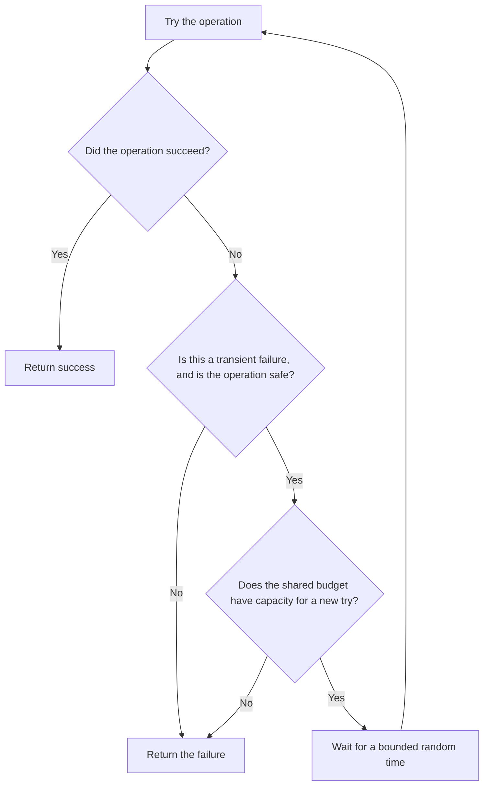

# P038 — Bounded Retry

## Definition

Retry only a transient failure from a category in the dependency contract. If a specified try
limit, elapsed-time limit, or shared deadline expires, stop.

When callers can retry at the same time, put time between tries and wait for a random time. Obey
server guidance that controls retry. A retry policy must not cause an unlimited wait or load amplification.

**Aliases:** retry budget, limited retry, backoff and jitter

## Provenance

**Classification:** established principle.

Network and production systems have used finite retry and random backoff for many years. Athena
cannot identify one source for this rule.

## Decision rule

If the contract classifies the result as a transient failure and the operation is safe, retry. The caller
budget must also have capacity for a new try. If not, return the failure.

## How to apply

- Use the dependency contract to select retryable error categories. Do not use a catch-all error
  category.
- Give one layer ownership of one total retry budget for nested calls.
- Use a finite try count or deadline. When many callers can retry at the same time, use an
  exponential wait and random variation.
- Before the caller deadline, obey protocol signals such as `Retry-After`.
- Apply [P037](p037-idempotency-before-retry.md) to operations with side effects.
- After cancellation, permanent failure, or budget exhaustion, stop. If the next try cannot complete
  in the remaining time, stop.
- Record try count and last outcome as correlated telemetry. Do tests of the policy during
  overload.

## Diagram



## Language examples

Each example limits a transient read failure to three tries.

### Python

```python
def fetch(client):
    for attempt in range(3):
        result = client.fetch()
        if result.ok or not result.transient:
            return result
        if attempt < 2:
            sleep(jitter(2**attempt))
    return result
```

### Rust

```rust
fn fetch(client: &Client) -> Result<Data, Error> {
    for attempt in 0..3 {
        match client.fetch() {
            Err(error) if error.is_transient() && attempt < 2 => delay(jitter(2_u64.pow(attempt))),
            result => return result,
        }
    }
    unreachable!()
}
```

## Boundaries and tensions

A circuit breaker from [P043](p043-circuit-breakers.md) prevents more calls during continuous
dependency failure. Use retry for an isolated transient failure. A clear sequence and one budget are necessary for
the combination.

Retries at each stack layer increase the number of tries and violate the single-owner error policy. The first
retry can occur immediately and correct a connection race. If more retries occur immediately, they
can add load at the same time.

Retry wait must obey [P039](p039-bounded-waiting.md). A retry queue stays subject to
[P040](p040-bounded-resources.md).

## Examples

### Positive application

An idempotent read receives a specified transient status. The client makes at most three tries
before the request deadline. It uses a random exponential wait and obeys `Retry-After`.

The client returns the last failure after budget exhaustion.

### Misuse or counterexample

An SDK retries five times. Its service wrapper retries each SDK call five times. A job worker also
retries without a limit. One request causes a retry storm.

### Athena or agent workflow

A coordinator retries a transient transport failure from a subagent only while its iteration
budget and time budget permit the retry. It immediately gives a validation-failure or
permission-denial result.

## Related principles

- [P037 — Idempotency Before Retry](p037-idempotency-before-retry.md)
- [P039 — Bounded Waiting](p039-bounded-waiting.md)
- [P040 — Bounded Resources](p040-bounded-resources.md)
- [P043 — Circuit Breakers](p043-circuit-breakers.md)

## References

### Source information

- [Marc Brooker, “Exponential Backoff and Jitter” (2015)](https://aws.amazon.com/blogs/architecture/exponential-backoff-and-jitter/)
  — practitioner analysis of contention from retries at the same time and random retry wait. Athena
  is not the source of retry limits.

### Applicable information

- [AWS Builders' Library, Timeouts, retries, and backoff with jitter](https://aws.amazon.com/builders-library/timeouts-retries-and-backoff-with-jitter/)
  — production guidance for timeouts, retry multiplication, token budgets, wait, and random
  variation.
- [Microsoft Azure Well-Architected Framework, transient faults](https://learn.microsoft.com/en-us/azure/well-architected/design-guides/handle-transient-faults)
  — applicable guidance that gives finite retries and random exponential wait.

### More information

- [Google SRE, Addressing Cascading Failures](https://sre.google/sre-book/addressing-cascading-failures/)
  — shows how retries increase overload and cause cascade failure.

[Back to the engineering principles catalog](../README.md#p038)
