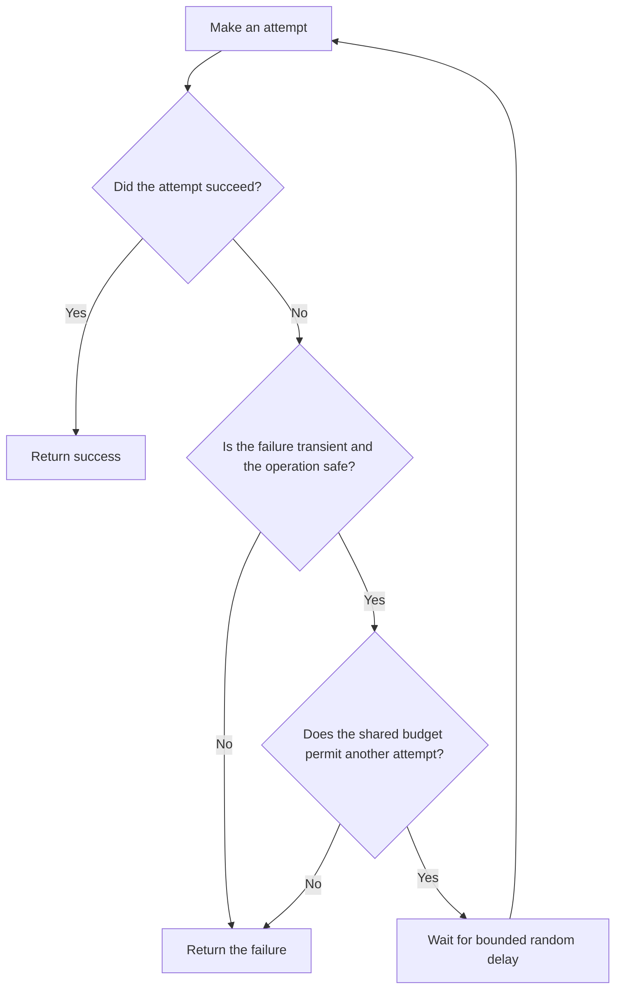

# P038 — Bounded Retry

## Definition

Retry only a failure that the dependency contract classifies as transient. Stop when an explicit
attempt limit, elapsed-time limit, or shared deadline expires.

Space attempts and add random delay when callers can synchronize. Follow authoritative server
guidance. A retry policy must not cause unlimited delay or load amplification.

**Aliases:** retry budget, limited retry, backoff and jitter

## Provenance

**Classification:** established principle.

Finite retry and random backoff developed across network and production systems. Athena does not
assert one origin for this combined rule.

## Decision rule

Retry only when another attempt is safe and likely to succeed within the caller budget. Otherwise,
return the failure.

## How to apply

- Derive retryable error categories from the dependency contract. Do not use a broad catch-all.
- Give one layer ownership of one total retry budget across nested calls.
- Use a finite attempt count or deadline. Use exponential delay and random variation when many
  callers can synchronize.
- Obey protocol signals such as `Retry-After` within the caller deadline.
- Require [P037](p037-idempotency-before-retry.md) for operations with side effects.
- Stop after cancellation, permanent failure, budget exhaustion, or insufficient residual time.
- Record attempt count and final outcome as correlated telemetry. Test the policy under overload.

## Diagram



## Language examples

Each example permits at most three attempts for a transient read failure.

### Python

```python
def fetch(client):
    for attempt in range(3):
        result = client.fetch()
        if result.ok or not result.transient:
            return result
        if attempt < 2:
            sleep(jitter(2**attempt))
    return result
```

### Rust

```rust
fn fetch(client: &Client) -> Result<Data, Error> {
    for attempt in 0..3 {
        match client.fetch() {
            Err(error) if error.is_transient() && attempt < 2 => delay(jitter(attempt)),
            result => return result,
        }
    }
    unreachable!()
}
```

## Boundaries and tensions

A circuit breaker under [P043](p043-circuit-breakers.md) protects against persistent dependency
failure. Retry addresses isolated transient failure. Their combination needs a clear order and one
budget.

Retries at every stack layer multiply attempts and violate the single-owner error policy. One
immediate retry can correct a rare connection race. Repeated immediate retries create synchronized
load.

Retry delay must remain within [P039](p039-bounded-waiting.md). A retry queue remains subject to
[P040](p040-bounded-resources.md).

## Examples

### Positive application

An idempotent read receives a documented transient status. The client makes at most three attempts
within the request deadline. It uses random exponential delay and obeys `Retry-After`.

The client returns the final failure after budget exhaustion.

### Misuse or counterexample

An SDK retries five times. Its service wrapper retries each SDK call five times. A job worker also
retries without a limit. One request causes a retry storm.

### Athena or agent workflow

A coordinator retries a transient subagent transport failure only within its iteration and time
budget. It reports a validation failure or permission denial immediately.

## Related principles

- [P037 — Idempotency Before Retry](p037-idempotency-before-retry.md)
- [P039 — Bounded Waiting](p039-bounded-waiting.md)
- [P040 — Bounded Resources](p040-bounded-resources.md)
- [P043 — Circuit Breakers](p043-circuit-breakers.md)

## References

### Origin and history

- [Marc Brooker, “Exponential Backoff and Jitter” (2015)](https://aws.amazon.com/blogs/architecture/exponential-backoff-and-jitter/)
  — influential practitioner analysis of synchronized contention and random retry delay. Athena
  does not claim it as the origin of retry limits.

### Current guidance

- [AWS Builders' Library, Timeouts, retries, and backoff with jitter](https://aws.amazon.com/builders-library/timeouts-retries-and-backoff-with-jitter/)
  — production guidance for timeouts, retry multiplication, token budgets, delay, and random
  variation.
- [Microsoft Azure Well-Architected Framework, transient faults](https://learn.microsoft.com/en-us/azure/well-architected/design-guides/handle-transient-faults)
  — current guidance that requires finite retries and random exponential delay.

### Further reading

- [Google SRE, Addressing Cascading Failures](https://sre.google/sre-book/addressing-cascading-failures/)
  — explains how retries amplify overload and contribute to cascade failure.

[Back to the engineering principles catalog](../README.md#p038)
