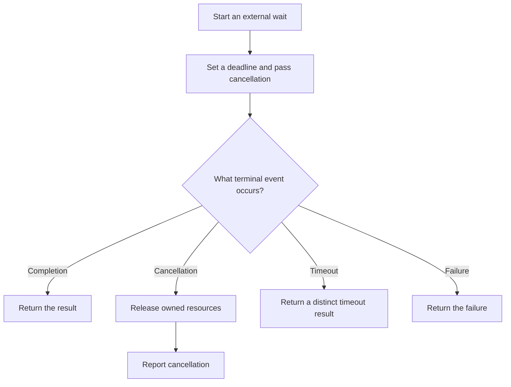

# P039 — Bounded Waiting

## Definition

Every wait for an external operation, lock, queue, process, asynchronous result, or delegated task
must have termination behavior appropriate to its risk.

Use a deadline, timeout, cancellation signal, or other proven bound. The caller must distinguish
completion, cancellation, timeout, and failure.

**Aliases:** deadlines, timeouts, finite blocking, wait budget

## Provenance

**Classification:** established principle.

Concurrent systems and distributed systems have long used timeouts and deadlines. This broad rule
has no verified single origin.

## Decision rule

When completion depends on another actor or contested resource, define the maximum wait. Define the
safe outcome after budget expiration.

## How to apply

- Prefer one end-to-end deadline that all downstream calls inherit. Do not use unrelated per-hop
  timeouts.
- Derive budgets from service objectives, measured latency, operation value, and cleanup cost.
- Pass cancellation and residual time to child operations.
- Stop or detach work after timeout only under an ownership contract. A timeout does not prove that
  remote effects stopped.
- Release locks, slots, and temporary resources on every terminal path.
- Test deadline expiration, cancellation races, slow dependencies, and completion near each side
  of the boundary.

## Diagram



## Language examples

Each example limits the wait and returns a distinct timeout result.

### Python

```python
def await_result(future):
    try:
        return Completed(future.result(timeout=2.0))
    except CancelledError:
        return Cancelled()
    except TimeoutError:
        return TimedOut()
    except OperationError as error:
        return Failed(error)
```

### Rust

```rust
fn await_result(rx: Receiver<Result<Value, Error>>) -> Outcome {
    match rx.recv_timeout(Duration::from_secs(2)) {
        Ok(Ok(value)) => Outcome::Completed(value),
        Ok(Err(error)) => Outcome::Failed(error),
        Err(RecvTimeoutError::Timeout) => Outcome::TimedOut,
        Err(RecvTimeoutError::Disconnected) => Outcome::Cancelled,
    }
}
```

## Boundaries and tensions

A timeout bounds the caller wait. It does not always bound callee execution. Work with side effects
can require [P037](p037-idempotency-before-retry.md), status reconciliation, or compensation before
a retry.

Very short timeouts cause avoidable failure. Absent timeouts permit resource leaks and failure
cascades. Use evidence to set the budget.

Combine the budget with [P040](p040-bounded-resources.md). Many finite waits must not exhaust the
system.

## Examples

### Positive application

A request has a two-second deadline. Each downstream call receives the residual budget. Each call
stops owned child work after cancellation and returns a distinct deadline result.

### Misuse or counterexample

A worker calls an external process without a timeout. The stalled process holds a concurrency slot
without a limit. The finite queue cannot make progress.

### Athena or agent workflow

A coordinator gives delegated research a stated deadline and checks the result status. After a
timeout, it reports incomplete evidence. It then terminates or releases the task under the host
contract.

It does not wait without a limit or invent a result.

## Related principles

- [P037 — Idempotency Before Retry](p037-idempotency-before-retry.md)
- [P038 — Bounded Retry](p038-bounded-retry.md)
- [P040 — Bounded Resources](p040-bounded-resources.md)
- [P043 — Circuit Breakers](p043-circuit-breakers.md)

## References

### Origin and history

- Athena does not assert one origin. Deadline and timeout controls predate current RPC systems and
  occur throughout literature about operating systems, concurrency, and networks.

### Current guidance

- [gRPC, Deadlines](https://grpc.io/docs/guides/deadlines/) — official guidance for realistic
  deadlines, deadline propagation, and server work termination after expiration.
- [gRPC, Cancellation](https://grpc.io/docs/guides/cancellation/) — official guidance for a lost
  interest signal and cancellation propagation through an RPC call graph.

### Further reading

- [Google SRE, Addressing Cascading Failures](https://sre.google/sre-book/addressing-cascading-failures/)
  — connects expired client deadlines with wasted server work, resource exhaustion, and failure
  cascades.

[Back to the engineering principles catalog](../README.md#p039)
