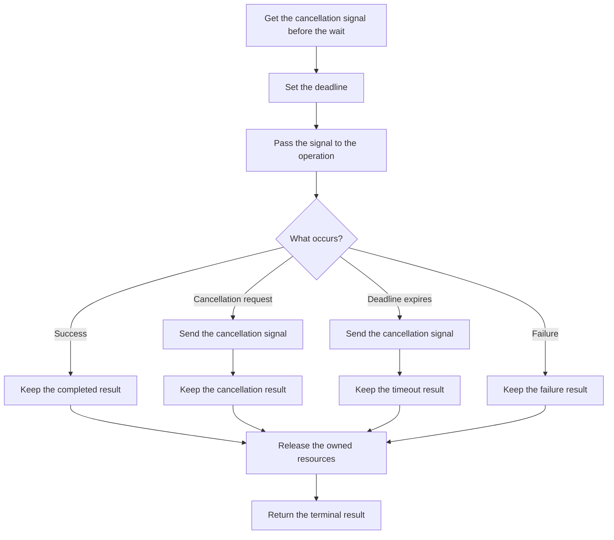

# P039 — Bounded Waiting

## Definition

Each external wait must have termination behavior that satisfies its risk policy. This rule is for
operations, locks, queues, processes, asynchronous results, and delegated tasks.

Use a deadline, timeout, cancellation signal, or other bound from measurements. The caller must
show the difference between success, cancellation, timeout, and failure.

**Aliases:** deadlines, timeouts, finite blocking, wait budget

## Provenance

**Classification:** established principle.

Concurrent systems and distributed systems used timeouts and deadlines for many years. Athena
cannot identify one source for this rule.

## Decision rule

When a different actor controls the operation end or different actors use a resource, set the
maximum wait.
Specify the safe outcome for budget expiration.

## How to apply

- Use one end-to-end deadline that all downstream calls inherit. Do not use a different timeout
  construction for each hop.
- Select budgets from service objectives, measured latency, operation value, and cleanup cost.
- Send cancellation and remaining time to child operations.
- After timeout, if an ownership contract gives permission, stop work or let it continue
  independently. A timeout does not show that remote effects stopped.
- Release locks, slots, and temporary resources on each terminal path.
- Do tests of deadline expiration, cancellation races, slow dependencies, and success near each
  side of the boundary.

## Diagram



## Language examples

Each example uses a specified cancellation contract, limits the wait, and returns a different
result for each terminal result.

### Python

```python
def await_result(future):
    try:
        return Completed(future.result(timeout=2.0))
    except CancelledError:
        return Cancelled()
    except TimeoutError:
        return TimedOut()
    except OperationError as error:
        return Failed(error)
```

### Rust

```rust
fn await_result(rx: Receiver<WorkerEvent>) -> Outcome {
    match rx.recv_timeout(Duration::from_secs(2)) {
        Ok(WorkerEvent::Completed(value)) => Outcome::Completed(value),
        Ok(WorkerEvent::Cancelled) => Outcome::Cancelled,
        Ok(WorkerEvent::Failed(error)) => Outcome::Failed(error),
        Err(RecvTimeoutError::Timeout) => Outcome::TimedOut,
        Err(RecvTimeoutError::Disconnected) => Outcome::Unavailable,
    }
}
```

## Boundaries and tensions

A timeout limits the caller wait. Callee execution can continue without a bound. Before a retry of
work with side effects, use [P037](p037-idempotency-before-retry.md), status reconciliation, or
compensation.

Very short timeouts cause failure that is not necessary. Systems without timeouts can cause resource leaks and
failure cascades. Use measurements to set the budget.

Use the budget with [P040](p040-bounded-resources.md). Many finite waits must not use all system
capacity.

## Examples

### Positive application

A request has a two-second deadline. Each downstream call receives the remaining budget. After
cancellation, each call stops owned child work and returns a different deadline result.

### Misuse or counterexample

A worker calls an external process without a timeout. The stalled process holds a concurrency slot
without a limit. The finite queue cannot continue.

### Athena or agent workflow

A coordinator gives delegated research a specified deadline and examines the result status. After a
timeout, it records the missing results. It obeys the host contract for task termination or
release.

It does not wait without a limit or give a result that it did not receive.

## Related principles

- [P037 — Idempotency Before Retry](p037-idempotency-before-retry.md)
- [P038 — Bounded Retry](p038-bounded-retry.md)
- [P040 — Bounded Resources](p040-bounded-resources.md)
- [P043 — Circuit Breakers](p043-circuit-breakers.md)

## References

### Source information

- Athena does not identify one source. Deadline and timeout controls were in use before RPC
  systems and occur in literature about operating systems, concurrency, and networks.

### Applicable information

- [gRPC, Deadlines](https://grpc.io/docs/guides/deadlines/) — official guidance for deadline
  selection, deadline propagation, and server work termination after expiration.
- [gRPC, Cancellation](https://grpc.io/docs/guides/cancellation/) — official guidance for a client
  that sends cancellation when it no longer wants an RPC result. It gives guidance for cancellation
  propagation. Some language handlers must implement this propagation.

### More information

- [Google SRE, Addressing Cascading Failures](https://sre.google/sre-book/addressing-cascading-failures/)
  — gives information about expired client deadlines, server work that cannot give a result to the
  client, resource exhaustion, and failure cascades.

[Back to the engineering principles catalog](../README.md#p039)
