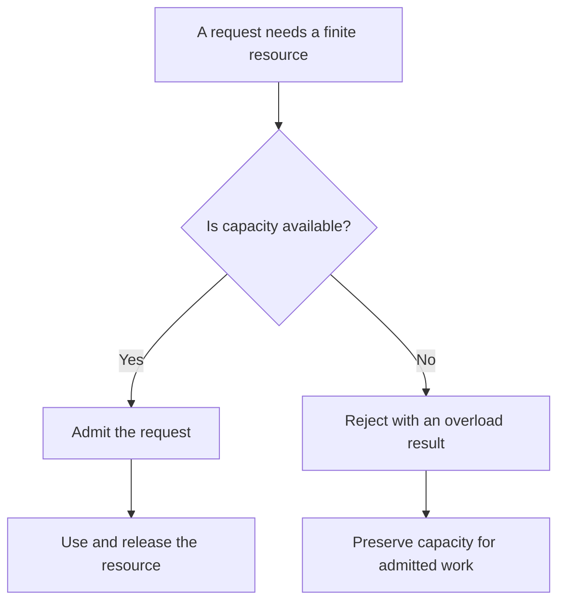

# P040 — Bounded Resources

## Definition

Every resource with variable demand must have a deliberate limit or a proven physical bound.
Examples are queues, buffers, concurrency, recursion, batches, memory, disk, incomplete work, agent
iterations, tokens, and tool calls.

The system must provide controlled behavior at the bound.

**Aliases:** resource limits, finite capacity, quotas

## Provenance

**Classification:** established principle.

Resource limits are fundamental to operating systems, queueing theory, and secure design. Athena does
not assert one origin for this language-neutral rule.

## Decision rule

For each repeated or accumulated work unit, identify the capacity owner. Set an evidence-based
limit. Define admission, rejection, cleanup, and recovery behavior at that limit.

## How to apply

- Make a resource inventory for each request, tenant, process, and dependency.
- Limit item count and item cost when items can differ greatly in size or complexity.
- Prefer platform quotas, finite executors, and finite queues to custom counters.
- Reserve capacity or use separate pools for critical work. Low-value demand must not consume all
  capacity.
- Make rejection cheaper than admitted work. Provide a clear overload signal.
- Monitor saturation, rejected work, queue age, and time at the limit. Revise limits after workload
  changes.
- Test the system at and above each important limit. Verify cleanup and recovery.

## Diagram



## Language examples

Each example caps queue capacity and rejects work that exceeds the limit.

### Python

```python
queue = Queue(maxsize=100)

def submit(task):
    try:
        queue.put_nowait(task)
        return Accepted()
    except Full:
        return Overloaded()
```

### Rust

```rust
fn task_queue() -> (SyncSender<Task>, Receiver<Task>) {
    sync_channel(100)
}

fn submit(tx: &SyncSender<Task>, task: Task) -> Outcome {
    match tx.try_send(task) {
        Ok(()) => Outcome::Accepted,
        Err(TrySendError::Full(_)) => Outcome::Overloaded,
        Err(TrySendError::Disconnected(_)) => Outcome::Unavailable,
    }
}
```

## Boundaries and tensions

A large finite number is not useful when it exceeds available capacity. A small limit can harm
correctness or availability when it excludes valid bursts.

Use measurements and service objectives to select limits. Do not use arbitrary constants.

[P041](p041-backpressure-and-load-shedding.md) defines the demand response at capacity.
[P042](p042-fault-isolation-bulkheads.md) prevents one consumer from exhaustion of unrelated
capacity. [P039](p039-bounded-waiting.md) limits resource retention time. Bounded Resources limits
resource count and capacity.

## Examples

### Positive application

A worker pool limits active tasks and queue depth. At capacity, it rejects new work with a retryable
overload response. It records queue age and reserves capacity for health operations.

### Misuse or counterexample

An API stores every request in an unlimited memory queue during a downstream outage. Memory use
increases until the process stops. The process then loses the full backlog.

### Athena or agent workflow

A swarm workflow sets limits on concurrent specialists, iterations, tool calls, and tokens. At a
limit, it returns a truthful partial result or failure. It does not create more work.

## Related principles

- [P039 — Bounded Waiting](p039-bounded-waiting.md)
- [P041 — Backpressure and Load Shedding](p041-backpressure-and-load-shedding.md)
- [P042 — Fault Isolation / Bulkheads](p042-fault-isolation-bulkheads.md)
- [P043 — Circuit Breakers](p043-circuit-breakers.md)

## References

### Origin and history

- Athena does not assert one primary origin. Operating systems and network services have long used
  quotas and capacity limits. Athena applies the practice to software and agent resources.

### Current guidance

- [CWE List 4.20, CWE-770: Allocation of Resources Without Limits or Throttling](https://cwe.mitre.org/data/definitions/770.html)
  — current weakness definition, consequences, and controls for unlimited resource allocation.
- [Google SRE, Addressing Cascading Failures](https://sre.google/sre-book/addressing-cascading-failures/)
  — production guidance for queue, memory, thread, CPU, and file-descriptor exhaustion.

### Further reading

- [Microsoft Azure, Throttling pattern](https://learn.microsoft.com/en-us/azure/architecture/patterns/throttling)
  — guidance for limits that match the first saturated resource and for admission control.

[Back to the engineering principles catalog](../README.md#p040)
