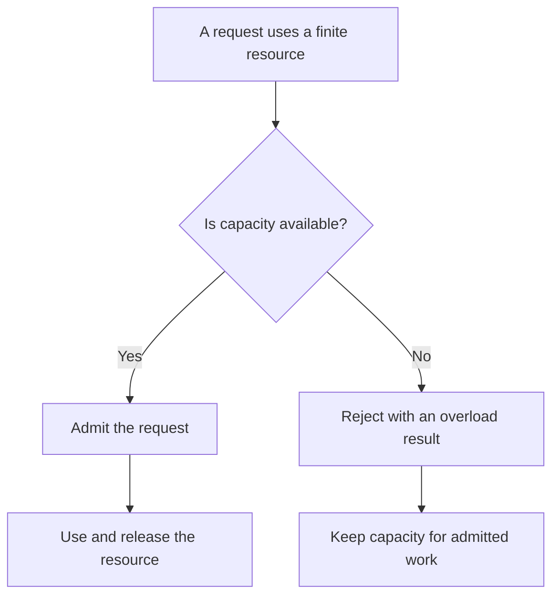

# P040 — Bounded Resources

## Definition

Each resource with changing demand must have a specified limit or a physical bound from measurements.
Examples are queues, buffers, concurrency, recursion, batches, memory, disk, work that the system did not complete, agent
iterations, tokens, and tool calls.

The system must give a controlled response at the bound.

**Aliases:** resource limits, finite capacity, quotas

## Provenance

**Classification:** established principle.

Operating systems, queueing theory, and safe design use resource limits. Athena does not identify
one source for this language-neutral rule.

## Decision rule

For each work unit that can occur more than one time, find the capacity owner. Set a limit from
measurements. Set admission, rejection, cleanup, and recovery behavior at that limit.

## How to apply

- Make a resource inventory for each request, tenant, process, and dependency.
- If item costs have large differences, limit the item count and total item cost.
- Use platform quotas, finite executors, and finite queues. If the platform has no applicable
  control, use a custom counter.
- Reserve capacity or use different pools for very important work. Low-value demand must not use all
  capacity.
- Make rejection cost less than admitted work. Give a clear overload signal.
- Monitor saturation, rejected work, queue age, and time at the limit. After workload changes,
  change limits.
- Do tests of the system at each important limit and at values more than that limit. Make sure that
  the system releases all temporary resources and operates correctly after the limit condition.

## Diagram



## Language examples

The examples limit queue capacity and reject new work at capacity.

### Python

```python
queue = Queue(maxsize=100)

def submit(task):
    try:
        queue.put_nowait(task)
        return Accepted()
    except Full:
        return Overloaded()
```

### Rust

```rust
fn task_queue() -> (SyncSender<Task>, Receiver<Task>) {
    sync_channel(100)
}

fn submit(tx: &SyncSender<Task>, task: Task) -> Outcome {
    match tx.try_send(task) {
        Ok(()) => Outcome::Accepted,
        Err(TrySendError::Full(_)) => Outcome::Overloaded,
        Err(TrySendError::Disconnected(_)) => Outcome::Unavailable,
    }
}
```

## Boundaries and tensions

A large finite limit does not help if available capacity is less than the limit. A small limit can
cause incorrect results or low availability when it does not admit bursts that satisfy the contract.

Use measurements and service objectives to select limits. Do not use constants without measurements.

[P041](p041-backpressure-and-load-shedding.md) gives the demand response at capacity.
[P042](p042-fault-isolation-bulkheads.md) prevents one consumer from exhaustion of capacity for a
different consumer. [P039](p039-bounded-waiting.md) limits resource retention time. Bounded
Resources limits resource count and capacity.

## Examples

### Positive application

A worker pool limits active tasks and queue depth. At capacity, it rejects new work with a retryable
overload response. It records queue age and reserves capacity for health operations.

### Misuse or counterexample

An API keeps each request in an unlimited memory queue during a downstream outage. The API uses more
memory until the process stops. The process then has no backlog data.

### Athena or agent workflow

A swarm workflow sets limits on concurrent specialists, iterations, tool calls, and tokens. At a
limit, it returns an accurate result for completed work or a failure. It does not make more work.

## Related principles

- [P039 — Bounded Waiting](p039-bounded-waiting.md)
- [P041 — Backpressure and Load Shedding](p041-backpressure-and-load-shedding.md)
- [P042 — Fault Isolation / Bulkheads](p042-fault-isolation-bulkheads.md)
- [P043 — Circuit Breakers](p043-circuit-breakers.md)

## References

### Source information

- Athena does not identify one primary source. Operating systems and network services used quotas
  and capacity limits for many years. Athena applies the practice to software and agent resources.

### Applicable information

- [CWE List 4.20, CWE-770: Allocation of Resources Without Limits or Throttling](https://cwe.mitre.org/data/definitions/770.html)
  — applicable weakness definition, effects, and controls for unlimited resource allocation.
- [Google SRE, Addressing Cascading Failures](https://sre.google/sre-book/addressing-cascading-failures/)
  — production guidance for queue, memory, thread, CPU, and file-descriptor exhaustion.

### More information

- [Microsoft Azure, Throttling pattern](https://learn.microsoft.com/en-us/azure/architecture/patterns/throttling)
  — guidance for limits for the first saturated resource and for admission control.

[Back to the engineering principles catalog](../README.md#p040)
