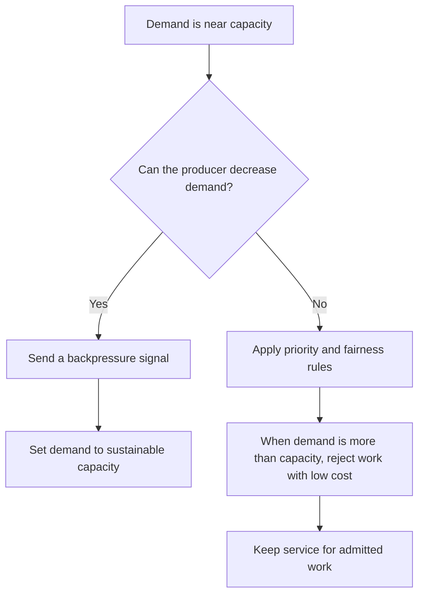

# P041 — Backpressure and Load Shedding

## Definition

When demand is near capacity or is more than capacity, prevent system overload with a clear control response.
**Backpressure** tells producers to decrease rate or concurrency.

**Load shedding** rejects or removes selected work to decrease admitted work. The
two controls prevent unlimited queues and resource exhaustion during overload.

**Aliases:** flow control, overload signaling, admission shedding

## Provenance

**Classification:** established principle.

Flow-control and data-stream systems give specified meanings to backpressure. Practitioners use
load shedding in overload control. Athena uses these tools but does not give them the same
meaning.

## Decision rule

Before saturation, limit upstream demand to sustainable capacity. If demand is more than capacity,
reject work with low cost and a clear result. Do not accept unlimited work because there is a queue.

## How to apply

- Find the bottleneck. Examples are concurrency, queue depth, CPU, memory, and downstream
  quota.
- Give standard overload signals. Examples are demand pause, finite credits, HTTP 429 or 503,
  and safe retry guidance.
- Send downstream backpressure to producers. After a backpressure signal, do not retry with no wait.
- Before overload stops the system, reject work. When requests have different value or cost, apply
  specified priority and fairness rules.
- Make rejection cost less than admitted work. If input parsing has a high cost, admit or reject
  the request before parsing.
- Monitor saturation, rejection rate, principals that receive rejections, tail latency, and recovery.
- Do tests of continuous overload, bursts, callers with retry policies, and recovery after load
  decreases.

## Diagram



## Language examples

Each example rejects work when demand is more than capacity. It gives a retry signal before slot
exhaustion.

### Python

```python
def admit(request, slots):
    if not slots.acquire(blocking=False):
        return Response(status=503, headers={"Retry-After": "1"})
    try:
        return serve(request)
    finally:
        slots.release()
```

### Rust

```rust
fn admit(request: Request, slots: &Semaphore) -> Response {
    let Ok(_permit) = slots.try_acquire() else {
        return Response::retry_after(503, 1);
    };
    serve(request)
}
```

## Boundaries and tensions

A buffer can absorb a short demand mismatch. If the buffer has no limit or producers receive no
capacity signal, it gives no backpressure. Apply [P040](p040-bounded-resources.md) to all queues.

If callers apply [P038](p038-bounded-retry.md), a retry response can help. If callers do not apply
it, rejection can cause a retry storm.

Load shedding is a control that rejects selected work. [P036](p036-graceful-degradation.md) gives a
reduced but correct result. A system can use the two controls together.

The two controls cannot operate without security controls or change a necessary correctness
contract without a report.

## Examples

### Positive application

A service is near its active request limit. It returns HTTP 503 with finite retry guidance for new
refresh requests with low priority. It keeps reserved capacity for very important writes.

After latency becomes stable, the service makes admission available again in steps.

### Misuse or counterexample

A consumer acknowledges messages immediately and keeps them in an unlimited local list. The
producer receives no pressure signal. The process uses more memory until it stops.

### Athena or agent workflow

A coordinator at its concurrency limit keeps only a finite task queue. It defers or rejects
low-priority tasks and tells the user about the constraint. It does not use all host or token capacity.

## Related principles

- [P036 — Graceful Degradation](p036-graceful-degradation.md)
- [P038 — Bounded Retry](p038-bounded-retry.md)
- [P040 — Bounded Resources](p040-bounded-resources.md)
- [P042 — Fault Isolation / Bulkheads](p042-fault-isolation-bulkheads.md)

## References

### Source information

- [Reactive Manifesto 2.0 (2014)](https://www.reactivemanifesto.org/) — practitioner statement that
  connects message-based flow control, queue observation, and backpressure. It is
  not the source of flow control.

### Applicable information

- [Reactive Streams 1.0.4](https://www.reactive-streams.org/) — specification and compatibility
  kit for asynchronous stream operations with nonblocking backpressure.
- [Google SRE, Addressing Cascading Failures](https://sre.google/sre-book/addressing-cascading-failures/)
  — production guidance for load shedding, overload signals, finite queues, and reduced results.

### More information

- [Microsoft Azure, Throttling pattern](https://learn.microsoft.com/en-us/azure/architecture/patterns/throttling)
  — guidance for load shedding before saturation, caller signals, fairness, and backpressure in a
  call chain.

[Back to the engineering principles catalog](../README.md#p041)
