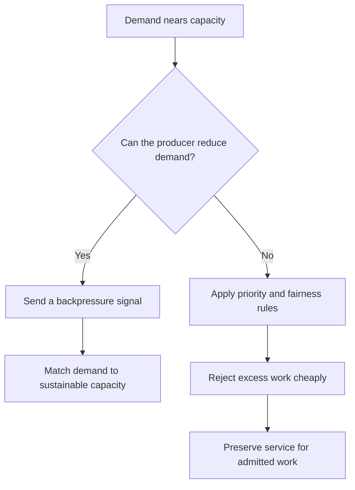

# P041 — Backpressure and Load Shedding

## Definition

When demand nears or exceeds capacity, protect the system with an explicit control response.
**Backpressure** tells producers to reduce rate or concurrency.

**Load shedding** rejects, drops, or reduces selected work that the system cannot admit safely. The two
controls prevent unlimited queues and resource exhaustion during overload.

**Aliases:** flow control, overload signaling, admission shedding

## Provenance

**Classification:** established principle.

Backpressure has established meanings in flow-control and data-stream systems. Load shedding has
established use in overload control. Athena combines these complementary tools but keeps their
meanings distinct.

## Decision rule

Before saturation, make upstream demand conform to sustainable capacity. Otherwise, reject work
cheaply and predictably. Never accept unlimited work because a queue exists.

## How to apply

- Identify the actual bottleneck. Examples are concurrency, queue depth, CPU, memory, and downstream
  quota.
- Provide standard overload signals. Examples are demand pause, finite credits, HTTP 429 or 503,
  and safe retry guidance.
- Send downstream backpressure to producers. Do not hide it with immediate retries.
- Reject work before collapse. Apply explicit priority and fairness rules when requests differ in
  value or cost.
- Keep rejection cheaper than accepted work. Avoid expensive parse work before admission when safe.
- Monitor saturation, rejection rate, affected principals, tail latency, and recovery.
- Test steady overload, bursts, callers with retry policies, and recovery after load decreases.

## Diagram



## Language examples

Each example rejects excess work before slot exhaustion and provides a retry signal.

### Python

```python
def admit(request, slots):
    if not slots.acquire(blocking=False):
        return Response(status=503, headers={"Retry-After": "1"})
    try:
        return serve(request)
    finally:
        slots.release()
```

### Rust

```rust
fn admit(request: Request, slots: &Semaphore) -> Response {
    let Ok(_permit) = slots.try_acquire() else {
        return Response::retry_after(503, 1);
    };
    serve(request)
}
```

## Boundaries and tensions

A buffer can absorb a short demand mismatch. It does not provide backpressure unless it has a limit
and producers receive a capacity signal. Apply [P040](p040-bounded-resources.md) to every queue.

A retry response helps only when callers apply [P038](p038-bounded-retry.md). Otherwise, rejection
can cause a retry storm.

Load shedding intentionally refuses some work. [P036](p036-graceful-degradation.md) provides a
reduced but valid result. A system can combine the two controls.

Neither control can bypass security or silently change a required correctness contract.

## Examples

### Positive application

A service nears its active request limit. It returns HTTP 503 with finite retry guidance for new
low-priority refresh requests. It preserves reserved capacity for critical writes.

The service restores admission in stages after latency becomes stable.

### Misuse or counterexample

A consumer acknowledges messages immediately and stores them in an unlimited local list. The
producer receives no pressure signal. Memory use increases until the process stops.

### Athena or agent workflow

A coordinator at its concurrency limit keeps only a finite task queue. It defers or rejects
low-priority tasks and reports the constraint. It does not exhaust host or token capacity.

## Related principles

- [P036 — Graceful Degradation](p036-graceful-degradation.md)
- [P038 — Bounded Retry](p038-bounded-retry.md)
- [P040 — Bounded Resources](p040-bounded-resources.md)
- [P042 — Fault Isolation / Bulkheads](p042-fault-isolation-bulkheads.md)

## References

### Origin and history

- [Reactive Manifesto 2.0 (2014)](https://www.reactivemanifesto.org/) — influential practitioner
  statement that connects message-based flow control, queue observation, and backpressure. It is
  not the origin of flow control.

### Current guidance

- [Reactive Streams 1.0.4](https://www.reactive-streams.org/) — specification and compatibility
  kit for asynchronous stream operations with nonblocking backpressure.
- [Google SRE, Addressing Cascading Failures](https://sre.google/sre-book/addressing-cascading-failures/)
  — production guidance for load shedding, overload signals, finite queues, and reduced results.

### Further reading

- [Microsoft Azure, Throttling pattern](https://learn.microsoft.com/en-us/azure/architecture/patterns/throttling)
  — current guidance for early load shedding, caller signals, fairness, and backpressure across a
  call chain.

[Back to the engineering principles catalog](../README.md#p041)
