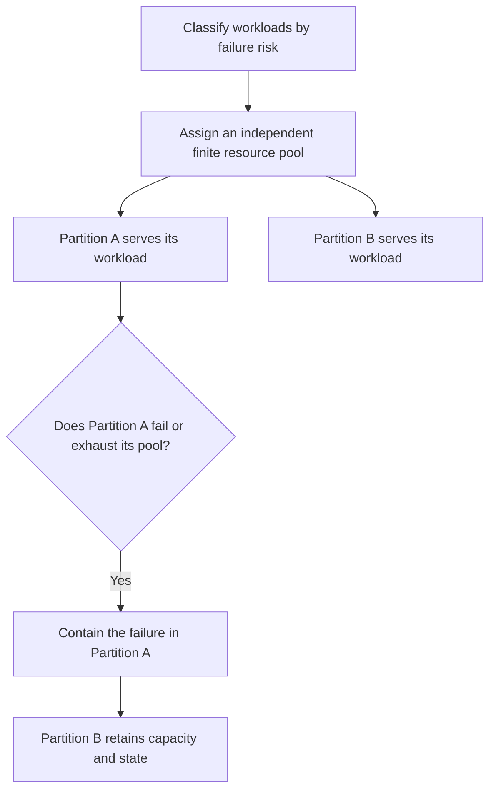

# P042 — Fault Isolation / Bulkheads

## Definition

Partition workloads, dependencies, tenants, and resource pools. Failure or exhaustion in one
partition must not consume capacity or corrupt state that another partition requires.

Isolation converts a system-wide failure into a finite local failure.

**Aliases:** bulkhead pattern, failure domains, cell-based isolation, blast-radius containment

## Provenance

**Classification:** established principle.

The name uses a nautical analogy. Michael Nygard's *Release It!* popularized the bulkhead pattern
in modern software. Fault isolation predates this pattern name.

## Decision rule

Before components share resources, compare their failure risks, criticality, owners, and consumers.
Use independent capacity and state boundaries if shared failure can violate an objective.

## How to apply

- Define failure domains from business criticality and actual dependency paths. Do not use only
  deployment topology.
- Use separate concurrency pools, queues, connection pools, quotas, processes, accounts, regions,
  or credentials if shared exhaustion can violate objectives.
- Reserve sufficient capacity for health, recovery, and critical traffic in each relevant
  partition.
- Protect the data plane from control-plane failure. Prevent one tenant from excess use of shared
  capacity.
- Monitor each partition independently. Retain an aggregate view of system health.
- Test exhaustion and failure within one partition. Verify that unrelated partitions continue.

## Diagram



## Language examples

Each example uses a distinct concurrency pool for each dependency.

### Python

```python
pools = {"search": Semaphore(8), "billing": Semaphore(2)}

def call(name, request):
    pool = pools[name]
    if not pool.acquire(blocking=False):
        return IsolatedOverload(name)
    try:
        return clients[name].send(request)
    finally:
        pool.release()
```

### Rust

```rust
fn call(kind: Kind, services: &Services, request: Request) -> Result<Response, Error> {
    let partition = match kind {
        Kind::Search => &services.search,
        Kind::Billing => &services.billing,
    };
    let permit = partition.pool.try_acquire().map_err(|_| Error::IsolatedOverload)?;
    let result = partition.client.send(request);
    drop(permit);
    result
}
```

## Boundaries and tensions

Isolation costs capacity, operational complexity, and sometimes use efficiency. Create a partition
only for a concrete failure mode or service objective.

A logical label is not a bulkhead when all partitions share one unlimited queue, connection pool,
or credential.

[P040](p040-bounded-resources.md) bounds each pool, [P041](p041-backpressure-and-load-shedding.md)
controls admission at capacity, and [P043](p043-circuit-breakers.md) stops calls to a failed
dependency. These controls reinforce one another. They do not replace one another.

## Examples

### Positive application

Calls to three downstream services use separate connection pools and concurrency pools. One service
stalls and exhausts only its pool. Health checks and calls to other services remain available.

### Misuse or counterexample

Nominally independent tenants share one executor and an unlimited queue. One tenant submits
expensive work and consumes all capacity. The labels provide no fault isolation.

### Athena or agent workflow

Independent subagents receive finite task scopes and separate write targets. One failed specialist
does not consume every delegation slot or corrupt another specialist result.

## Related principles

- [P036 — Graceful Degradation](p036-graceful-degradation.md)
- [P040 — Bounded Resources](p040-bounded-resources.md)
- [P041 — Backpressure and Load Shedding](p041-backpressure-and-load-shedding.md)
- [P043 — Circuit Breakers](p043-circuit-breakers.md)

## References

### Origin and history

- [Michael T. Nygard, *Release It!*, second edition](https://pragprog.com/titles/mnee2/release-it-second-edition/)
  — influential source that popularized bulkheads and other stability patterns in software. The
  physical bulkhead analogy predates computers.

### Current guidance

- [Microsoft Azure, Bulkhead pattern](https://learn.microsoft.com/en-us/azure/architecture/patterns/bulkhead)
  — current guidance for separate service instances and resource pools that isolate failure
  cascades.

### Further reading

- [Microsoft Azure Well-Architected reliability patterns](https://learn.microsoft.com/en-us/azure/well-architected/reliability/design-patterns)
  — presents bulkheads, throttles, retries, and circuit breakers as complementary reliability
  controls.

[Back to the engineering principles catalog](../README.md#p042)
