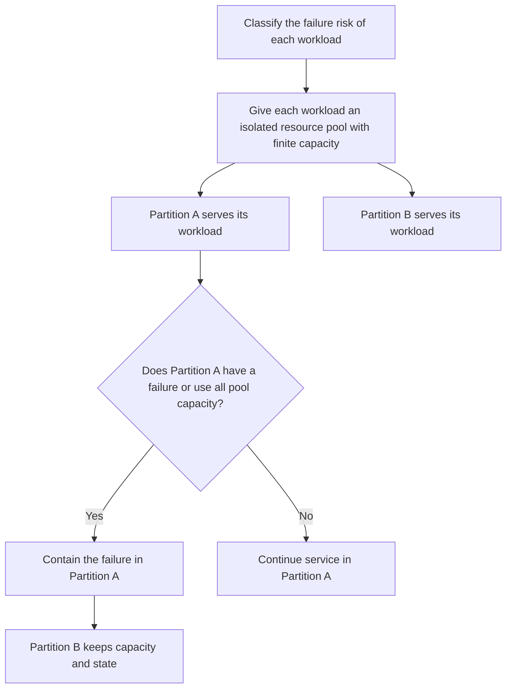

# P042 — Fault Isolation / Bulkheads

## Definition

Partition workloads, dependencies, tenants, and resource pools. Failure or exhaustion in one
partition must not use capacity or corrupt state for a different partition.

Isolation limits a system-wide failure to a finite local failure.

**Aliases:** bulkhead pattern, failure domains, cell-based isolation, blast-radius containment

## Provenance

**Classification:** established principle.

Ship design is the source of the name. Michael Nygard's *Release It!* made the bulkhead pattern
known to many software engineers. Fault isolation was available before this pattern name.

## Decision rule

Before components share resources, compare their failure risks, criticality, owners, and consumers.
If shared failure can violate an objective, use isolated capacity and state boundaries.

## How to apply

- Set failure domains from business criticality and dependency paths. Do not use only
  deployment topology.
- If shared exhaustion can violate objectives, use different concurrency pools, queues, connection
  pools, quotas, processes, accounts, regions, or credentials.
- Reserve sufficient capacity for health, recovery, and very important traffic in each applicable
  partition.
- Isolate the data plane from control-plane failure. Do not let one tenant use all shared
  capacity.
- Monitor each partition independently. Keep an aggregate view of system health.
- Do tests of exhaustion and failure in one partition. Make sure that different partitions continue.

## Diagram



## Language examples

Each example uses a different concurrency pool for each dependency.

### Python

```python
pools = {"search": Semaphore(8), "billing": Semaphore(2)}

def call(name, request):
    pool = pools[name]
    if not pool.acquire(blocking=False):
        return IsolatedOverload(name)
    try:
        return clients[name].send(request)
    finally:
        pool.release()
```

### Rust

```rust
fn call(kind: Kind, services: &Services, request: Request) -> Result<Response, Error> {
    let partition = match kind {
        Kind::Search => &services.search,
        Kind::Billing => &services.billing,
    };
    let permit = partition.pool.try_acquire().map_err(|_| Error::IsolatedOverload)?;
    let result = partition.client.send(request);
    drop(permit);
    result
}
```

## Boundaries and tensions

Isolation decreases available capacity and adds work to system operation. It can also decrease efficiency. If there is
no specified failure mode or service objective, do not make a partition.

A logical label is not a bulkhead when all partitions share one unlimited queue, connection pool,
or credential.

[P040](p040-bounded-resources.md) sets a limit for each pool. [P041](p041-backpressure-and-load-shedding.md)
controls admission at capacity, and [P043](p043-circuit-breakers.md) stops calls to a dependency that failed.
Use these controls together. They do not replace each other.

## Examples

### Positive application

Calls to three downstream services use different connection pools and concurrency pools. One service
stalls and uses all capacity in its pool. Health checks and calls to other services stay available.

### Misuse or counterexample

Tenants have different labels but share one executor and an unlimited queue. One tenant sends
work with high cost and uses all capacity. The labels give no fault isolation.

### Athena or agent workflow

Different subagents receive finite task scopes and different write targets. One specialist that fails
does not use all delegation slots or corrupt a different specialist result.

## Related principles

- [P036 — Graceful Degradation](p036-graceful-degradation.md)
- [P040 — Bounded Resources](p040-bounded-resources.md)
- [P041 — Backpressure and Load Shedding](p041-backpressure-and-load-shedding.md)
- [P043 — Circuit Breakers](p043-circuit-breakers.md)

## References

### Source information

- [Michael T. Nygard, *Release It!*, second edition](https://pragprog.com/titles/mnee2/release-it-second-edition/)
  — a source that made bulkheads and other stability patterns known to many software engineers. Physical
  bulkheads are older than computers.

### Applicable information

- [Microsoft Azure, Bulkhead pattern](https://learn.microsoft.com/en-us/azure/architecture/patterns/bulkhead)
  — applicable guidance for different service instances and resource pools that isolate failure
  cascades.

### More information

- [Microsoft Azure Well-Architected reliability patterns](https://learn.microsoft.com/en-us/azure/well-architected/reliability/design-patterns)
  — includes bulkheads, throttles, retries, and circuit breakers as related reliability
  controls.

[Back to the engineering principles catalog](../README.md#p042)
