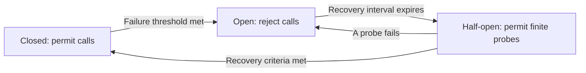

# P043 — Circuit Breakers

## Definition

A circuit breaker observes calls to a dependency. After evidence of persistent failure, it opens
and rejects new calls without contact with that dependency.

After a controlled recovery interval, it admits a finite probe set in a half-open state. It closes
only after the dependency meets the recovery criteria.

**Aliases:** dependency circuit breaker, open/half-open/closed breaker

## Provenance

**Classification:** established principle.

Michael Nygard popularized the software pattern in *Release It!*. The electrical circuit-breaker
metaphor and related failure controls are older.

## Decision rule

Stop calls temporarily when repeated calls can waste resources, overload an unhealthy dependency,
or spread failure. Test recovery with a finite probe set.

## How to apply

- Place the breaker at a failure-prone dependency boundary. Do not place it around local business
  logic without that risk.
- Derive failure signals, observation window, threshold, open duration, and recovery criteria from
  the dependency contract and observed behavior.
- Give breaker state the correct scope. A global breaker can disable healthy partitions. A
  per-request breaker has no useful history.
- Return a distinct immediate failure or a documented fallback while the breaker is open.
- Permit only a finite probe set while the breaker is half-open. Prevent a recovery surge.
- Record state transitions, rejected calls, probe results, and dependency identity.
- Test state oscillation, slow calls, partial recovery, and interactions with retries.

## Diagram



## Language examples

Each example counts dependency failures, counts successful dependency calls, and ignores permanent
request errors before permit completion.

### Python

```python
def call(breaker, client):
    if (permit := breaker.try_acquire()) is None:
        return Unavailable()
    result = client.request()
    if result.ok:
        outcome = BreakerOutcome.SUCCESS
    elif result.is_dependency_failure:
        outcome = BreakerOutcome.FAILURE
    else:
        outcome = BreakerOutcome.IGNORED
    permit.complete(outcome)
    return result
```

### Rust

```rust
fn call(breaker: &Breaker, client: &Client) -> Result<Response, Error> {
    let permit = breaker.try_acquire().ok_or(Error::Unavailable)?;
    let result = client.request();
    let outcome = match &result {
        Ok(_) => BreakerOutcome::Success,
        Err(error) if error.is_dependency_failure() => BreakerOutcome::Failure,
        Err(_) => BreakerOutcome::Ignored,
    };
    permit.complete(outcome);
    result
}
```

## Boundaries and tensions

A breaker is not a retry policy. [P038](p038-bounded-retry.md) addresses isolated transient errors.
The breaker protects against persistent failure. A timeout under
[P039](p039-bounded-waiting.md) still limits each permitted call.

An aggressive threshold can cause avoidable unavailability after a small fault. A slow threshold
can permit a failure cascade.

[P042](p042-fault-isolation-bulkheads.md) limits the effect before the breaker opens.
[P036](p036-graceful-degradation.md) governs each fallback response.

## Examples

### Positive application

A client records timeouts within an observation window. At its tested threshold, the
dependency-specific breaker opens. It rejects calls for a finite interval.

The breaker then permits a few probes before it restores traffic in stages.

### Misuse or counterexample

One validation error opens an application-wide breaker for every tenant and endpoint. The error is
a permanent request defect, not a dependency failure. The breaker disables healthy traffic.

### Athena or agent workflow

A dependency tool returns confirmed service failures. After a finite threshold, an Athena workflow
stops calls to that tool and reports the unavailable capability.

It does not consume more tool calls or claim success for an absent result.

## Related principles

- [P036 — Graceful Degradation](p036-graceful-degradation.md)
- [P038 — Bounded Retry](p038-bounded-retry.md)
- [P039 — Bounded Waiting](p039-bounded-waiting.md)
- [P042 — Fault Isolation / Bulkheads](p042-fault-isolation-bulkheads.md)

## References

### Origin and history

- [Michael T. Nygard, *Release It!*, second edition](https://pragprog.com/titles/mnee2/release-it-second-edition/)
  — influential source that popularized the circuit-breaker pattern in production software.
- [Martin Fowler, “Circuit Breaker” (2014)](https://martinfowler.com/bliki/CircuitBreaker.html)
  — practitioner explanation that credits Nygard and shows the state model.

### Current guidance

- [Microsoft Azure, Circuit Breaker pattern](https://learn.microsoft.com/en-us/azure/architecture/patterns/circuit-breaker)
  — current guidance for thresholds, open and half-open states, recovery probes, and retry
  interaction.

### Further reading

- [Google SRE, Addressing Cascading Failures](https://sre.google/sre-book/addressing-cascading-failures/)
  — operational context for the failure spread from persistent calls, timeouts, and retries.

[Back to the engineering principles catalog](../README.md#p043)
