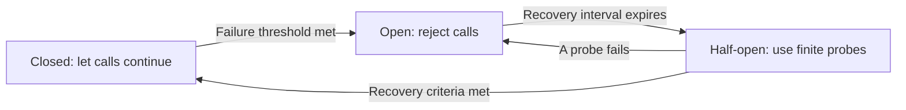

# P043 — Circuit Breakers

## Definition

A circuit breaker monitors calls to a dependency. After measurements show continuous failure, it opens
and rejects new calls without contact with that dependency.

After a controlled recovery interval, it admits a finite probe set in a half-open state. A failed
probe opens the breaker again. The breaker closes only after sufficient probes succeed.

**Aliases:** dependency circuit breaker, open/half-open/closed breaker

## Provenance

**Classification:** established principle.

Michael Nygard made the software pattern known to many engineers in *Release It!*. The electrical
circuit breaker is the source of the software-pattern name. Related failure controls were available
before the software pattern.

## Decision rule

If calls use resources without a caller result or overload a dependency, stop calls for a finite
interval. If calls can cause system failure, use the same control. Do a recovery test with
a finite probe set.

## How to apply

- Put the breaker at a failure-prone dependency boundary. If local business logic does not have
  that failure risk, do not put the breaker at its boundary.
- Use the dependency contract and measurements to select failure signals, observation
  window, threshold, open time, and recovery criteria.
- Give breaker state the correct scope. A global breaker can disable available partitions. A
  breaker for one request does not have sufficient data from previous calls.
- While the breaker is open, immediately return a clear failure or a specified fallback.
- While the breaker is in the half-open state, use only a finite probe set. Prevent a recovery surge.
- Record state transitions, rejected calls, probe results, and dependency identity.
- Do tests of state oscillation, slow calls, recovery of only some calls, and interactions with retries.

## Diagram



## Language examples

Each example records dependency failures and calls that succeed, but does not include permanent
request errors in breaker state.

### Python

```python
def call(breaker, client):
    if (permit := breaker.try_acquire()) is None:
        return Unavailable()
    result = client.request()
    if result.ok:
        outcome = BreakerOutcome.SUCCESS
    elif result.is_dependency_failure:
        outcome = BreakerOutcome.FAILURE
    else:
        outcome = BreakerOutcome.IGNORED
    permit.complete(outcome)
    return result
```

### Rust

```rust
fn call(breaker: &Breaker, client: &Client) -> Result<Response, Error> {
    let permit = breaker.try_acquire().ok_or(Error::Unavailable)?;
    let result = client.request();
    let outcome = match &result {
        Ok(_) => BreakerOutcome::Success,
        Err(error) if error.is_dependency_failure() => BreakerOutcome::Failure,
        Err(_) => BreakerOutcome::Ignored,
    };
    permit.complete(outcome);
    result
}
```

## Boundaries and tensions

A breaker is not a retry policy. Use [P038](p038-bounded-retry.md) for isolated transient errors.
The breaker prevents more calls during continuous failure. A timeout from
[P039](p039-bounded-waiting.md) limits the time for each call after breaker approval.

If a small number of failures opens a breaker, the breaker can cause unavailability that is not necessary. If
too many failures occur before it opens, it can cause a failure cascade.

[P042](p042-fault-isolation-bulkheads.md) limits the effect before the breaker opens.
Use [P036](p036-graceful-degradation.md) for each fallback response.

## Examples

### Positive application

A client records timeouts in an observation window. At its tested threshold, the
dependency-specific breaker opens. It rejects calls for a finite interval.

Before the breaker makes traffic available again, it uses a small number of probes.

### Misuse or counterexample

One validation error opens an application-wide breaker for all tenants and endpoints. The error is
a permanent request defect, not a dependency failure. The breaker disables available traffic.

### Athena or agent workflow

A dependency tool returns measured service-failure results. After a finite threshold, an Athena workflow
stops calls to that tool and gives an unavailable-capability result.

It does not use more tool calls or give a success result for a missing result.

## Related principles

- [P036 — Graceful Degradation](p036-graceful-degradation.md)
- [P038 — Bounded Retry](p038-bounded-retry.md)
- [P039 — Bounded Waiting](p039-bounded-waiting.md)
- [P042 — Fault Isolation / Bulkheads](p042-fault-isolation-bulkheads.md)

## References

### Source information

- [Michael T. Nygard, *Release It!*, second edition](https://pragprog.com/titles/mnee2/release-it-second-edition/)
  — a source that made the circuit-breaker pattern known to many production-software engineers.
- [Martin Fowler, “Circuit Breaker” (2014)](https://martinfowler.com/bliki/CircuitBreaker.html)
  — practitioner information that identifies Nygard as the source and shows the state model.

### Applicable information

- [Microsoft Azure, Circuit Breaker pattern](https://learn.microsoft.com/en-us/azure/architecture/patterns/circuit-breaker)
  — applicable guidance for thresholds, open and half-open states, recovery probes, and retry
  interaction.

### More information

- [Google SRE, Addressing Cascading Failures](https://sre.google/sre-book/addressing-cascading-failures/)
  — context for how continuous calls, timeouts, and retries propagate failure.

[Back to the engineering principles catalog](../README.md#p043)
