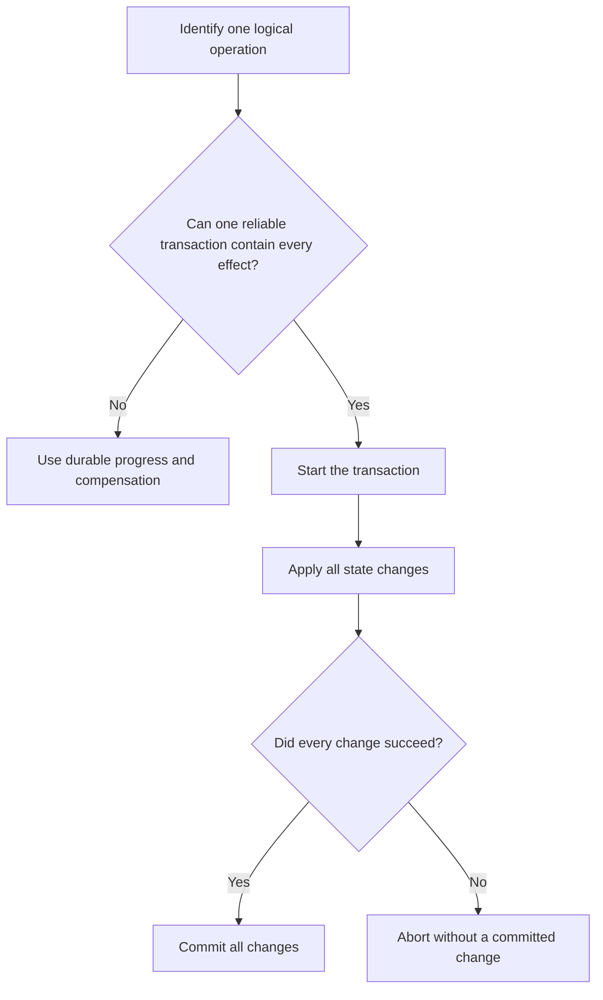

# P044 — Atomicity Where Possible

## Definition

When several state changes form one logical operation and share a reliable transaction boundary,
make the result all-or-none. Either all changes commit, or no change commits.

If concurrent observers must not see intermediate state, select a suitable isolation level or
atomic publication control separately.

**Aliases:** all-or-nothing update, transactional commit, failure atomicity

## Provenance

**Classification:** established principle.

Atomic transactions predate the ACID acronym. Sources commonly associate the ACID terms with the
1983 paper by Härder and Reuter. That paper did not originate every atomic update form.

## Decision rule

Use one supported transaction boundary if partial completion can violate an invariant and that
boundary can contain all effects. Prefer it to custom reversal or compensation.

Specify isolation or atomic publication separately if partial visibility can violate an
invariant.

## How to apply

- Identify the logical operation, affected state, invariants, and observers.
- Use documented transaction controls from the data store, file system, message broker, or platform.
  Require an all-or-none commit.
- Select an isolation level or atomic publication control that meets the visibility contract.
- Limit transaction scope and duration. Do not make network calls or wait for users while the
  transaction holds resources.
- Validate prerequisites before the transaction. Defer irreversible external effects until after
  reversible preparation.
- Treat a lost commit acknowledgment as an unknown outcome that can require a status query.
- Test failures before commit, during commit, and after loss of the commit acknowledgment. Test the
  required isolation under concurrent observation.

## Diagram



## Language examples

Each example commits the order, items, and inventory reservation as one transaction.

### Python

```python
def place_order(db, order, items):
    with db.transaction() as tx:
        tx.insert_order(order)
        tx.insert_items(order.id, items)
        tx.reserve_inventory(items)
```

### Rust

```rust
fn place_order(db: &mut Database, order: &Order, items: &[Item]) -> Result<(), Error> {
    let mut tx = db.transaction()?;
    tx.insert_order(order)?;
    tx.insert_items(order.id, items)?;
    tx.reserve_inventory(items)?;
    tx.commit()
}
```

## Boundaries and tensions

Atomicity has a defined scope. A database transaction does not automatically include an email,
remote API, file system, or second data store.

Do not describe a local transaction as end-to-end atomic when effects exist outside its boundary.

When one reliable boundary cannot contain the workflow, apply
[P045](p045-compensation-where-atomicity-is-impossible.md) and durable progress. Do not invent a
fragile distributed transaction.

[P033](p033-state-safe-failure-semantics.md) remains the broader failure requirement. Atomicity does
not guarantee isolation, durability, or business validity. Specify these guarantees separately.

## Examples

### Positive application

A database transaction inserts an order and its line items. It also updates the inventory
reservation. All changes commit together, or no change commits.

Readers that require a stable multi-object view use a suitable isolation level.

### Misuse or counterexample

Code commits an order and then publishes an event. It describes the pair as “atomic.” A failure
between those steps leaves committed state without its required event.

### Athena or agent workflow

An Athena workflow assembles and validates a document before target replacement. It keeps related
repository edits in one coherent patch. It reports failed validation before external publication.

## Related principles

- [P033 — State-Safe Failure Semantics](p033-state-safe-failure-semantics.md)
- [P037 — Idempotency Before Retry](p037-idempotency-before-retry.md)
- [P045 — Compensation Where Atomicity Is Impossible](p045-compensation-where-atomicity-is-impossible.md)
- [P083 — Irreversible Actions Last](../README.md#p083)

## References

### Origin and history

- [Härder and Reuter, “Principles of Transaction-Oriented Database Recovery” (1983)](https://doi.org/10.1145/289.291)
  — primary source for the ACID terms and transaction recovery framework.

### Current guidance

- [PostgreSQL 18, Transactions](https://www.postgresql.org/docs/18/tutorial-transactions.html)
  — current database documentation with examples of all-or-none updates, visibility, commit, and
  reversal.

### Further reading

- [AWS Builders' Library, Making retries safe with idempotent APIs](https://aws.amazon.com/builders-library/making-retries-safe-with-idempotent-APIs/)
  — explains why an idempotency token and its related state change can require one atomic operation.

[Back to the engineering principles catalog](../README.md#p044)
