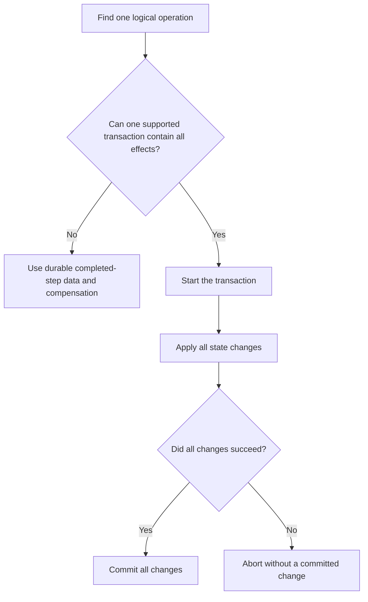

# P044 — Atomicity Where Possible

## Definition

When state changes are one logical operation and share a supported transaction boundary, make the
result all-or-none. All changes commit, or no change commits.

If concurrent observers must not see state between steps, select the isolation level or atomic
publication control independently.

**Aliases:** all-or-nothing update, transactional commit, failure atomicity

## Provenance

**Classification:** established principle.

Engineers used atomic transactions before the ACID acronym. Sources connect the ACID terms to a
1983 paper. Härder and Reuter wrote that paper. It is not the source of all atomic-update types.

## Decision rule

If only some effects can commit and violate an invariant, use one supported transaction boundary
for all effects.
If the boundary cannot contain all effects, use custom reversal or compensation.

If visibility of only some effects can violate an invariant, select isolation or atomic publication
independently.

## How to apply

- Find the logical operation, applicable state, invariants, and observers.
- Use supported transaction controls from the data store, file system, message broker, or platform.
  Use an all-or-none commit.
- Select an isolation level or atomic publication control that satisfies the visibility contract.
- Limit transaction scope and time. While the transaction holds resources, do not make network
  calls or wait for users.
- Before the transaction, validate prerequisites. After reversible work, start irreversible
  external effects.
- If the system does not receive the commit acknowledgment, use a status query to resolve the unknown outcome.
- Do tests of failures before commit, during commit, and after loss of the commit acknowledgment.
  Do an isolation test with concurrent observation.

## Diagram



## Language examples

Each example commits the order, items, and inventory reservation as one transaction.

### Python

```python
def place_order(db, order, items):
    with db.transaction() as tx:
        tx.insert_order(order)
        tx.insert_items(order.id, items)
        tx.reserve_inventory(items)
```

### Rust

```rust
fn place_order(db: &mut Database, order: &Order, items: &[Item]) -> Result<(), Error> {
    let mut tx = db.transaction()?;
    tx.insert_order(order)?;
    tx.insert_items(order.id, items)?;
    tx.reserve_inventory(items)?;
    tx.commit()
}
```

## Boundaries and tensions

Atomicity has a specified scope. A database transaction does not include an email,
remote API, file system, or second data store.

If its effects are not in its boundary, do not identify a local transaction as an end-to-end atomic operation.

When one supported boundary cannot contain the workflow, apply
[P045](p045-compensation-where-atomicity-is-impossible.md) and durable completed-step data. Do not make a
distributed transaction without platform support.

[P033](p033-state-safe-failure-semantics.md) gives the failure requirement for all operations.
Atomicity does not guarantee isolation, durability, or business correctness. Record these guarantees
independently.

## Examples

### Positive application

A database transaction inserts an order and its line items. It also updates the inventory
reservation. All changes commit together, or no change commits.

Readers with a contract for a stable multi-object view use an isolation level that supplies this view.

### Misuse or counterexample

Code commits an order and then publishes an event. It identifies the pair as one atomic operation. A failure
between those steps causes committed state without its necessary event.

### Athena or agent workflow

An Athena workflow assembles and validates a document before target replacement. It keeps all
related repository edits in one patch. It records validation failure before external publication.

## Related principles

- [P033 — State-Safe Failure Semantics](p033-state-safe-failure-semantics.md)
- [P037 — Idempotency Before Retry](p037-idempotency-before-retry.md)
- [P045 — Compensation Where Atomicity Is Impossible](p045-compensation-where-atomicity-is-impossible.md)
- [P083 — Irreversible Actions Last](../README.md#p083)

## References

### Source information

- [Härder and Reuter, “Principles of Transaction-Oriented Database Recovery” (1983)](https://doi.org/10.1145/289.291)
  — a source for the ACID terms and transaction recovery framework.

### Applicable information

- [PostgreSQL 18, Transactions](https://www.postgresql.org/docs/18/tutorial-transactions.html)
  — database documentation with examples of all-or-none updates, visibility, commit, and
  reversal.

### More information

- [AWS Builders' Library, Making retries safe with idempotent APIs](https://aws.amazon.com/builders-library/making-retries-safe-with-idempotent-APIs/)
  — shows when an idempotency token and its related state change must use one atomic operation.

[Back to the engineering principles catalog](../README.md#p044)
