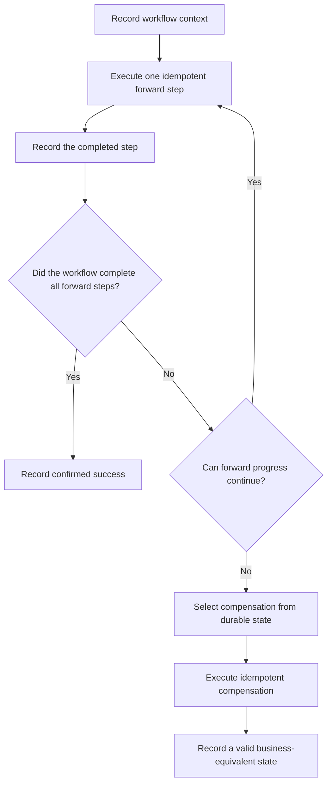

# P045 — Compensation Where Atomicity Is Impossible

## Definition

When a logical operation spans independent systems or exceeds safe transaction duration, record
each completed step and its recovery meaning.

If forward progress cannot continue, use domain-specific compensation to reach a documented valid
state. Make forward steps and compensation steps idempotent and resumable. Identify irreversible
effects.

**Aliases:** compensating transaction, saga recovery, semantic undo

## Provenance

**Classification:** established principle.

Garcia-Molina and Salem introduced sagas for long-duration transactions in 1987. Compensation also
occurs in broader workflow practice. Not every compensation workflow is a formal saga.

## Decision rule

Use a real atomic boundary when it safely contains the operation. Otherwise, define durable forward,
compensation, reconciliation, and manual recovery paths before the first side effect.

## How to apply

- Model the workflow as named steps with durable status, correlation, and ownership.
- Define the success evidence, idempotency key, compensation action, and retry policy for each step.
- Record sufficient context before or with each effect. This context must support recovery after a
  process failure or lost response.
- Order compensation according to business invariants. Reverse order is common but not universal.
- Make each compensation action resumable, observable, and safe after repetition.
- Mark each point of no return. Place irreversible actions after validation and reversible work.
- Escalate ambiguous or failed compensation. Include exact state and a supported manual procedure.

## Diagram



## Language examples

Each example returns confirmed, failed, canceled, or recovery-required outcomes under the same
failure policy.

### Python

```python
def book_trip(workflow) -> Outcome:
    flight = workflow.step("flight", reserve_flight, cancel_flight)
    if flight.is_error:
        return Outcome.failed(flight.error)
    hotel = workflow.step("hotel", reserve_hotel, cancel_hotel)
    if hotel.is_error:
        if workflow.compensate().is_error:
            return Outcome.recovery_required(hotel.error)
        return Outcome.canceled(hotel.error)
    return Outcome.confirmed()
```

### Rust

```rust
fn book_trip(workflow: &mut Workflow) -> Outcome {
    if let Err(error) = workflow.step("flight", reserve_flight, cancel_flight) {
        return Outcome::failed(error);
    }
    if let Err(error) = workflow.step("hotel", reserve_hotel, cancel_hotel) {
        if workflow.compensate().is_err() {
            return Outcome::recovery_required(error);
        }
        return Outcome::canceled(error);
    }
    Outcome::confirmed()
}
```

## Boundaries and tensions

Compensation is not an exact state reversal. Concurrent work can make the original state invalid.
The correct result is a defined business-equivalent state.

For example, a refund does not erase the historical charge.

Do not use compensation when [P044](p044-atomicity-where-possible.md) provides a simpler reliable
transaction. Do not claim atomicity across independent effects.

Each retry must satisfy [P037](p037-idempotency-before-retry.md). Each intermediate workflow state
must satisfy [P033](p033-state-safe-failure-semantics.md).

## Examples

### Positive application

A travel workflow records flight and hotel reservations as separate durable steps. The hotel
reservation fails, and no approved alternative exists.

The workflow sends idempotent cancellation commands for completed reservations. It records each
compensation result for later resumption.

### Misuse or counterexample

A workflow calls three services. After the third call fails, it sends best-effort “undo” calls from
memory. A process failure loses the completed-step record.

Repeated undo calls can create new side effects.

### Athena or agent workflow

Before a multistep public workflow, Athena records reversible actions and actions that require
explicit approval. If a later action fails, Athena reports completed effects.

It uses only predefined authorized compensation. It does not improvise destructive cleanup.

## Related principles

- [P033 — State-Safe Failure Semantics](p033-state-safe-failure-semantics.md)
- [P037 — Idempotency Before Retry](p037-idempotency-before-retry.md)
- [P044 — Atomicity Where Possible](p044-atomicity-where-possible.md)
- [P046 — Resumability](p046-resumability.md)

## References

### Origin and history

- [Garcia-Molina and Salem, “Sagas” (1987)](https://doi.org/10.1145/38714.38742)
  — primary paper that defines a long-duration transaction as a sequence. Compensation transactions
  correct partial execution.

### Current guidance

- [Microsoft Azure, Compensating Transaction pattern](https://learn.microsoft.com/en-us/azure/architecture/patterns/compensating-transaction)
  — current guidance for durable progress, application-specific reversal, idempotent compensation,
  concurrency, and points of no return.
- [AWS Prescriptive Guidance, Saga patterns](https://docs.aws.amazon.com/prescriptive-guidance/latest/cloud-design-patterns/saga-patterns.html)
  — current guidance for forward recovery, reverse recovery, choreography, and orchestration.

### Further reading

- [Microsoft Azure, Design for self-healing](https://learn.microsoft.com/en-us/azure/architecture/guide/design-principles/self-healing)
  — connects compensation with checkpoints, recovery, and resumable long-duration work.

[Back to the engineering principles catalog](../README.md#p045)
