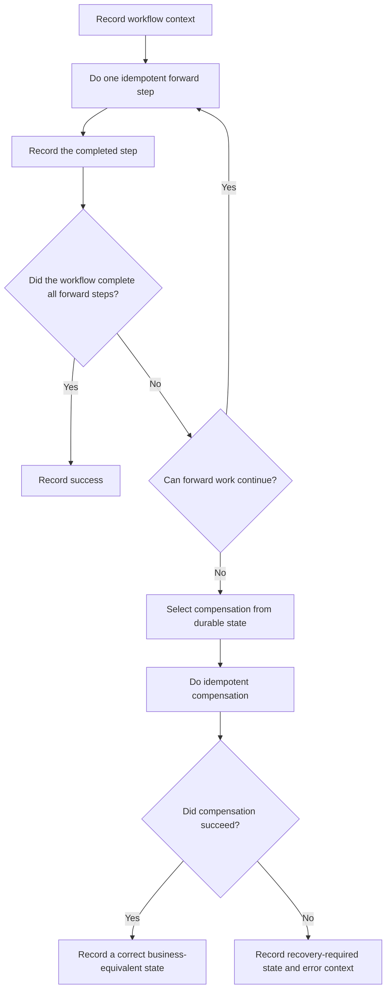

# P045 — Compensation Where Atomicity Is Impossible

## Definition

If an operation uses different systems or cannot complete in one safe transaction, record each
completed step. Record its recovery data.

If forward work cannot continue, use domain-specific compensation until the system has a
specified correct state. Use idempotent forward steps. Each compensation step must be a safe step,
a resumable step, and an idempotent step. Find irreversible effects.

**Aliases:** compensating transaction, saga recovery, semantic undo

## Provenance

**Classification:** established principle.

Garcia-Molina and Salem wrote the 1987 paper that gives the saga model for long-duration
transactions. Compensation also occurs in other workflow practices. Not all compensation workflows are formal sagas.

## Decision rule

When a supported atomic boundary safely contains the operation, use it. If no boundary can contain
the operation, use durable forward, compensation, reconciliation, and manual recovery paths.
Before the first side effect, record these paths.

## How to apply

- Model the workflow as named steps with durable status, correlation, and ownership.
- Record the success criteria, idempotency key, compensation step, and retry policy for each step.
- Before or with each effect, record sufficient context. This context must contain data for recovery
  after a process failure or a response that the system did not receive.
- Use business invariants to set the compensation sequence. Many workflows use the opposite
  sequence. Some workflows use a different sequence.
- When the system does compensation again, use a safe compensation step that is also a resumable
  step. Record an observable result.
- Find each irreversible point. After validation and reversible work, do irreversible steps.
- Escalate compensation that is not clear or that fails. Include state information and a supported
  manual procedure.

## Diagram



## Language examples

The examples use equivalent confirmation, failure, cancellation, and recovery-required outcomes.

### Python

```python
def book_trip(workflow) -> Outcome:
    flight = workflow.step("flight", reserve_flight, cancel_flight)
    if flight.is_error:
        return Outcome.failed(flight.error)
    hotel = workflow.step("hotel", reserve_hotel, cancel_hotel)
    if not hotel.is_error:
        return Outcome.confirmed()
    compensation = workflow.compensate()
    if compensation.is_error:
        context = workflow.recovery_context()
        return Outcome.recovery_required(hotel.error, compensation.error, context)
    return Outcome.canceled(hotel.error)
```

### Rust

```rust
fn book_trip(workflow: &mut Workflow) -> Outcome {
    let flight = workflow.step("flight", reserve_flight, cancel_flight);
    if let Err(error) = flight {
        return Outcome::failed(error);
    }
    let hotel = workflow.step("hotel", reserve_hotel, cancel_hotel);
    let Err(original) = hotel else { return Outcome::confirmed() };
    match workflow.compensate() {
        Ok(()) => Outcome::canceled(original),
        Err(error) => Outcome::recovery_required(original, error, workflow.recovery_context()),
    }
}
```

## Boundaries and tensions

After compensation, the state can be different from the previous state. Concurrent work can cause
an incorrect state before compensation. The correct result is a specified business-equivalent state.

For example, a refund does not remove the historical charge from records.

When [P044](p044-atomicity-where-possible.md) gives a supported transaction with less complexity,
do not use compensation. If effects operate independently, do not identify them as one atomic operation.

Each retry must satisfy [P037](p037-idempotency-before-retry.md). Each between-step workflow state
must satisfy [P033](p033-state-safe-failure-semantics.md).

## Examples

### Positive application

A travel workflow records flight and hotel reservations as two durable steps. The hotel
reservation fails, and there is no approved alternative.

The workflow sends idempotent cancellation commands for completed reservations. It records each
compensation result for resumption.

### Misuse or counterexample

A workflow calls three services. After the third call fails, it sends non-durable “undo” calls from
memory. After a process failure, the workflow has no completed-step record.

More than one compensation call can cause new side effects.

### Athena or agent workflow

Before a multistep public workflow, Athena records reversible steps and steps with specified
approval requirements. If a step fails after approved effects occur, Athena records completed effects.

It uses only approved compensation that it specified before failure. It does not add a destructive
cleanup step during the failure.

## Related principles

- [P033 — State-Safe Failure Semantics](p033-state-safe-failure-semantics.md)
- [P037 — Idempotency Before Retry](p037-idempotency-before-retry.md)
- [P044 — Atomicity Where Possible](p044-atomicity-where-possible.md)
- [P046 — Resumability](p046-resumability.md)

## References

### Source information

- [Garcia-Molina and Salem, “Sagas” (1987)](https://doi.org/10.1145/38714.38742)
  — a paper that models a long-duration transaction as a sequence. Compensation transactions
  repair execution of only some steps.

### Applicable information

- [Microsoft Azure, Compensating Transaction pattern](https://learn.microsoft.com/en-us/azure/architecture/patterns/compensating-transaction)
  — applicable guidance for durable completed-step data, application-specific reversal, idempotent
  compensation, concurrency, and irreversible points.
- [AWS Prescriptive Guidance, Saga patterns](https://docs.aws.amazon.com/prescriptive-guidance/latest/cloud-design-patterns/saga-patterns.html)
  — applicable guidance for forward recovery, recovery in the opposite sequence, choreography,
  and orchestration.

### More information

- [Microsoft Azure, Design for self-healing](https://learn.microsoft.com/en-us/azure/architecture/guide/design-principles/self-healing)
  — connects compensation with checkpoints, recovery, and resumable long-duration work.

[Back to the engineering principles catalog](../README.md#p045)
