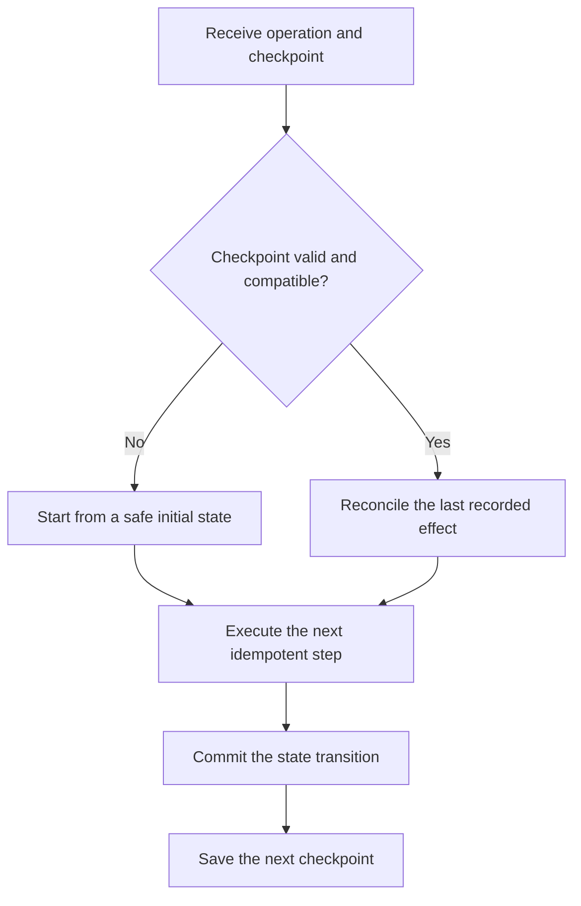

# P046 — Resumability

## Definition

Resumability lets an interrupted long operation continue from durable, verified progress. The saved
state identifies committed work, uncommitted work, and work with an uncertain result.

**Aliases:** checkpoint/restart, durable progress, restartable workflow.

## Provenance

**Classification:** established principle.

Checkpoint and restart methods predate modern workflow engines. Later systems extended these methods
from process state to durable application milestones and operation resources. No single source
defines the full principle.

## Decision rule

Persist progress at valid recovery boundaries when interruption is plausible and restart is costly
or unsafe. Accept a resume token only when it identifies compatible state. Prevent repeat effects
for completed work.

## How to apply

- Give the operation a stable identity. Define terminal, retryable, and indeterminate states.
- Save a checkpoint only after the related state transition has a durable commit.
- Store version, input, and owner data that can identify stale or incompatible checkpoints.
- Make each resumed step idempotent. Otherwise, deduplicate it or reconcile it with authoritative state.
- Report progress and failures. Define checkpoint retention and removal rules.
- Test interruption before, during, and after each external effect.

## Diagram



## Language examples

The two examples verify a checkpoint, apply each batch once, and save only committed progress.

### Python

```python
def resume(checkpoint, batches):
    start = verify(checkpoint)
    for batch in batches[start:]:
        apply_once(batch.id, batch.items)
        save_checkpoint(batch.id + 1)
```

### Rust

```rust
fn resume(checkpoint: &Checkpoint, batches: &[Batch]) -> Result<(), Error> {
    let start = verify(checkpoint)?;
    for batch in &batches[start..] {
        apply_once(batch.id, &batch.items)?;
        save_checkpoint(batch.id + 1)?;
    }
    Ok(())
}
```

## Boundaries and tensions

Resumability is not blind retry. A checkpoint can preserve corrupt or obsolete state. Validate its
integrity and compatibility before use.

A restart can suit a short, low-cost operation without side effects. Prefer an atomic transaction
when one boundary can contain the operation. Distributed work can require compensation.

A resumed operation must use current authority. It must not reuse expired credentials or approvals.

## Examples

### Positive

A migration records the last committed batch, schema version, input digest, and operation ID. After
an interruption, it verifies those fields and reconciles the last batch. It then continues with the
next batch.

### Misuse

A worker stores only `step = 4`. It stops after a payment but before the next checkpoint. A restart
sends the payment again because the checkpoint omits the uncertain effect.

### Athena and agent workflows

A coordinator records completed task IDs, accepted artifact hashes, and outstanding dependencies.
After a host interruption, it validates the checkout again. It resumes only unfinished tasks.

## Related principles

- [P044 — Atomicity Where Possible](./p044-atomicity-where-possible.md)
- [P045 — Compensation Where Atomicity Is Impossible](./p045-compensation-where-atomicity-is-impossible.md)
- [P047 — Observability Is Part of Correctness](./p047-observability-is-part-of-correctness.md)
- [P053 — Validate at Trust Boundaries](./p053-validate-at-trust-boundaries.md)

## References

### Origin and history

- [USENIX: *Libckpt: Transparent Checkpointing under UNIX* (1995)](https://www.usenix.org/conference/usenix-1995-technical-conference/libckpt-transparent-checkpointing-under-unix)
  documents checkpoint and restart methods for interrupted long computations.

### Current guidance

- [Google AIP-151: Long-running operations](https://google.aip.dev/151) defines a durable operation
  resource that lets clients track progress and retrieve a result.
- [AWS Step Functions redrive guidance](https://docs.aws.amazon.com/step-functions/latest/dg/redrive-executions.html)
  describes restart from failed workflow steps and retention of successful results.

### Further reading

- [USENIX: *Transparent Checkpoint-Restart of Multiple Processes*](https://www.usenix.org/legacy/event/usenix07/tech/full_papers/laadan/laadan_html/paper.html)
  explains consistency requirements for checkpoints across cooperative processes and shared state.

[Back to the principles catalog](../README.md#p046)
