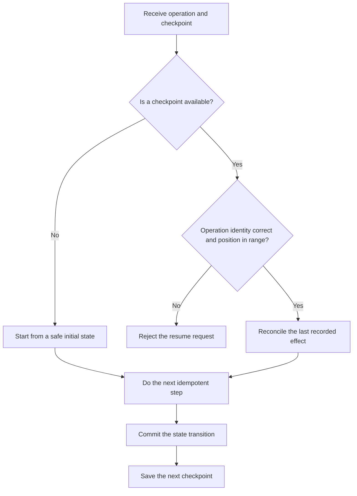

# P046 — Resumability

## Definition

Resumability lets an interrupted long operation continue from durable, verified progress. The saved
checkpoint records committed work, uncommitted work, and work with an uncertain result.

**Aliases:** checkpoint/restart, durable progress, restartable workflow.

## Provenance

**Classification:** established principle.

Engineers applied checkpoint and restart methods before workflow engines. Subsequent systems applied
these methods to durable application milestones and operation resources, not only process state.
No one source gives the full principle.

## Decision rule

If an interruption can occur, examine restart cost and safety. If restart has high cost or is not
safe, record progress at correct recovery boundaries. If token data does not agree with the operation
identity or position is not in range, reject the resume token. If token data agrees with the
operation identity and position is in range, accept the token. Do not let completed work cause
effects again.

## How to apply

- Give the operation a stable identity. Classify terminal, retryable, and indeterminate states.
- After the related state transition has a durable commit, save a checkpoint.
- Record version, input, and owner data that shows stale or incompatible checkpoints.
- Each resumed step must be idempotent. If a step is not idempotent, deduplicate it or reconcile it
  with authoritative state.
- Give progress and failure reports. Record checkpoint retention and removal rules.
- Do tests before, during, and after each external effect.

## Diagram



## Language examples

The two examples bind checkpoints to operation, input, owner, and schema identity, apply each batch
one time, and save only committed progress.

### Python

```python
def resume(checkpoint: Checkpoint | None, batches, operation):
    identity = (operation.id, operation.input_digest, operation.owner_id, operation.schema_version)
    start = verify_checkpoint(checkpoint, identity, len(batches))
    for position, batch in enumerate(batches[start:], start=start):
        apply_once(batch.id, batch.items)
        save_checkpoint(identity, position + 1)
```

### Rust

```rust
fn resume(checkpoint: Option<&Checkpoint>, batches: &[Batch], operation: &Operation) -> Result<(), Error> {
    let identity = ResumeIdentity::new(
        &operation.id, &operation.input_digest, &operation.owner_id, operation.schema_version);
    let start = verify_checkpoint(checkpoint, &identity, batches.len())?;
    for (offset, batch) in batches[start..].iter().enumerate() {
        apply_once(batch.id, &batch.items)?;
        save_checkpoint(&identity, start + offset + 1)?;
    }
    Ok(())
}
```

## Boundaries and tensions

Resumability is not an automatic retry without a check. A checkpoint can keep corrupt or obsolete
state. Before the system accepts a checkpoint, validate checkpoint integrity and compatibility.

A restart can be correct for a short, low-cost operation without side effects. If one boundary can
contain the operation, use an atomic transaction. Distributed work can make compensation necessary.

A resumed operation must use authority that applies at resume time. It must not use expired
credentials or approvals again.

## Examples

### Positive

A migration records the committed position, schema version, input digest, and operation ID. After
an interruption, it verifies those fields and reconciles the batch at the saved position. It then
continues at the saved position.

### Misuse

A worker stores only `step = 4`. It stops after a payment but before the next checkpoint. A restart
sends the payment again because the checkpoint does not record the uncertain effect.

### Athena and agent workflows

A coordinator records completed task IDs, accepted artifact hashes, and dependencies that are not
satisfied. After a host interruption, it validates the checkout again. It resumes only tasks that
are not completed.

## Related principles

- [P044 — Atomicity Where Possible](./p044-atomicity-where-possible.md)
- [P045 — Compensation Where Atomicity Is Impossible](./p045-compensation-where-atomicity-is-impossible.md)
- [P047 — Observability Is Part of Correctness](./p047-observability-is-part-of-correctness.md)
- [P053 — Validate at Trust Boundaries](./p053-validate-at-trust-boundaries.md)

## References

### Source information

- [USENIX: *Libckpt: Transparent Checkpointing under UNIX* (1995)](https://www.usenix.org/conference/usenix-1995-technical-conference/libckpt-transparent-checkpointing-under-unix)
  gives information about checkpoint and restart methods for interrupted long computations.

### Applicable information

- [Google AIP-151: Long-running operations](https://google.aip.dev/151) gives a durable operation
  resource that lets clients monitor progress and retrieve a result.
- [AWS Step Functions redrive guidance](https://docs.aws.amazon.com/step-functions/latest/dg/redrive-executions.html)
  gives information about restart from workflow steps with failures and retention of results.

### More information

- [USENIX: *Transparent Checkpoint-Restart of Multiple Processes*](https://www.usenix.org/legacy/event/usenix07/tech/full_papers/laadan/laadan_html/paper.html)
  gives consistency requirements for checkpoints across cooperative processes and shared state.

[Back to the principles catalog](../README.md#p046)
