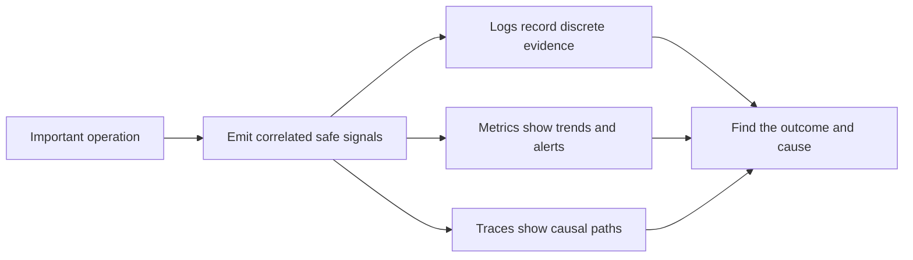

# P047 — Observability Is Part of Correctness

## Definition

Observability lets operators use structured logs, metrics, and traces to find system state and
operation outcomes. When operators must find failure, find completed work and work not completed,
and restore service safely, observability is part of correctness.

**Aliases:** operational diagnosability, production visibility, telemetry-by-design.

## Provenance

**Classification:** Athena synthesis.

Observability practice is evidence for this synthesis. Distributed tracing and
production monitoring have long histories. No one source gives this Athena rule.

## Decision rule

For important behavior, emit sufficient correlated and non-sensitive evidence that shows the event,
location, time, operation, and cause. If operators cannot find an important failure in the specified
response period, the operational contract does not have sufficient information.

## How to apply

- Select signals from user outcomes and operational questions. Do not select signals only
  because data is available.
- Correlate work across boundaries with stable request, trace, or operation identifiers.
- Record structured status, reason, duration, and dependency context at the responsible boundary.
- Use metrics for trends and alerting, traces for causal paths, and logs for discrete evidence.
- Before production starts, set data retention, sampling, cardinality, access, and redaction
  policies.
- Do telemetry tests for important success, failure, cancellation, completed work, and work not
  completed.

## Diagram



## Language examples

The two examples correlate a request with a metric and a structured outcome event.

### Python

```python
def transfer(request_id, amount):
    started = clock.now()
    result = ledger.try_transfer(amount)
    metrics.observe("transfer_ms", clock.now() - started)
    log.info("transfer_complete", request_id=request_id, status=result.status)
    return result
```

### Rust

```rust
fn transfer(request_id: &str, amount: Money) -> Result<Receipt, Error> {
    let started = clock::now();
    let result = ledger::try_transfer(amount);
    let status = match &result {
        Ok(_) => "ok",
        Err(_) => "error",
    };
    metrics::observe("transfer_ms", clock::now() - started);
    log::info("transfer_complete", request_id, status);
    result
}
```

## Boundaries and tensions

Telemetry cannot correct incorrect behavior. High signal volume is not observability. A large signal
volume or high cardinality can prevent incident detection and can consume all resources.

Logs are a data store and an attack surface. Do not emit secrets for diagnosis. Use safe identifiers
that do not contain raw customer content. Samples must keep evidence for important security and
failure events.

## Examples

### Positive

A request through services carries one trace ID. Each boundary records a structured outcome and
latency. Dashboards report errors that users see. Traces show the dependency with the failure.

### Misuse

A service writes free-form debug messages that contain access tokens. It has no request correlation,
outcome metric, or alert. The messages are not safe and cannot give a clear diagnosis.

### Athena and agent workflows

A delegated task reports its task ID, bounded outcome, validation evidence, and specified failure
reason.
The report does not contain credentials or file content that does not apply. The coordinator can
find a completed task, a timed-out task, or a task that stopped before all work ended.

## Related principles

- [P046 — Resumability](./p046-resumability.md)
- [P053 — Validate at Trust Boundaries](./p053-validate-at-trust-boundaries.md)
- [P056 — Secrets Stay Out of Code and Context](./p056-secrets-stay-out-of-code-and-context.md)

## References

### Source information

- [Google Research: *Dapper, a Large-Scale Distributed Systems Tracing Infrastructure*](https://research.google/pubs/dapper-a-large-scale-distributed-systems-tracing-infrastructure/)
  gives an important production trace design and its diagnostic goals.

### Applicable information

- [OpenTelemetry observability primer](https://opentelemetry.io/docs/concepts/observability-primer/)
  gives information about logs, metrics, traces, correlation, and service reliability.
- [OpenTelemetry Specification 1.60.0](https://opentelemetry.io/docs/specs/otel/) gives
  vendor-neutral telemetry and instrumentation contracts.

### More information

- [OWASP Logging Cheat Sheet](https://cheatsheetseries.owasp.org/cheatsheets/Logging_Cheat_Sheet.html)
  gives information about event design, sanitization, sensitive data exclusion, and log protection.

[Back to the principles catalog](../README.md#p047)
