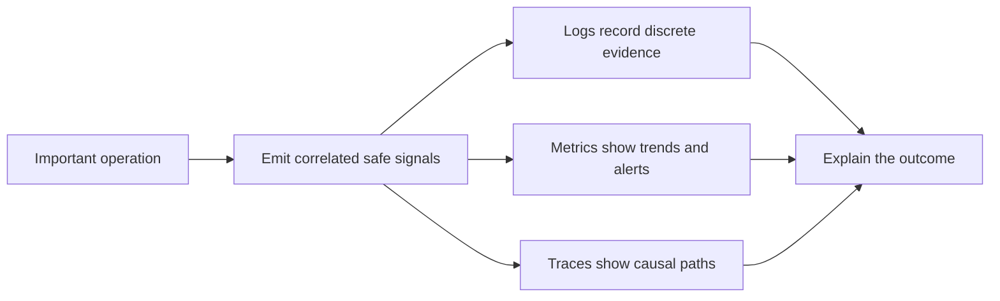

# P047 — Observability Is Part of Correctness

## Definition

Observability lets operators infer system state and explain outcomes from structured logs, metrics,
and traces. It supports correctness when operators need evidence to detect failure, identify partial
success, and restore service safely.

**Aliases:** operational diagnosability, production visibility, telemetry-by-design.

## Provenance

**Classification:** Athena synthesis.

Established observability practice supports this synthesis. Distributed tracing and production
monitoring have long histories. The exact principle is an Athena rule without one original source.

## Decision rule

For important behavior, emit enough correlated and non-sensitive evidence to explain the event,
location, time, operation, and cause. The operational contract is incomplete if operators cannot
detect or diagnose an important failure within the required response period.

## How to apply

- Define signals from user-visible outcomes and operational questions. Do not select signals only
  because data is available.
- Correlate work across boundaries with stable request, trace, or operation identifiers.
- Record structured status, reason, duration, and dependency context at the responsible boundary.
- Use metrics for trends and alerting, traces for causal paths, and logs for discrete evidence.
- Set data retention, sampling, cardinality, access, and redaction policies before production use.
- Test telemetry for important success, failure, cancellation, and partial-progress paths.

## Diagram



## Language examples

The two examples correlate a request with a metric and a structured outcome event.

### Python

```python
def transfer(request_id, amount):
    started = clock.now()
    result = ledger.try_transfer(amount)
    metrics.observe("transfer_ms", clock.now() - started)
    log.info("transfer_complete", request_id=request_id, status=result.status)
    return result
```

### Rust

```rust
fn transfer(request_id: &str, amount: Money) -> Result<Receipt, Error> {
    let started = clock::now();
    let result = ledger::try_transfer(amount);
    let status = match &result {
        Ok(_) => "ok",
        Err(_) => "error",
    };
    metrics::observe("transfer_ms", clock::now() - started);
    log::info("transfer_complete", request_id, status);
    result
}
```

## Boundaries and tensions

Telemetry cannot correct wrong behavior. Signal volume does not equal observability. Excessive or
high-cardinality signals can obscure incidents and exhaust resources.

Logs are a data store and an attack surface. Do not emit secrets for diagnosis. Use safe, opaque
identifiers for correlation instead of raw customer content. Samples must retain evidence for
critical security and failure events.

## Examples

### Positive

A request across multiple services carries one trace ID. Each boundary records a structured outcome
and latency. Dashboards report user-visible errors. Traces identify the failed dependency.

### Misuse

A service writes free-form debug messages that contain access tokens. It has no request correlation,
outcome metric, or alert. Its data remains unsafe and cannot support a clear diagnosis.

### Athena and agent workflows

A delegated task reports its task ID, bounded outcome, validation evidence, and exact failure reason.
It omits credentials and unrelated file content. The coordinator can distinguish completion, timeout,
and partial execution.

## Related principles

- [P046 — Resumability](./p046-resumability.md)
- [P053 — Validate at Trust Boundaries](./p053-validate-at-trust-boundaries.md)
- [P056 — Secrets Stay Out of Code and Context](./p056-secrets-stay-out-of-code-and-context.md)

## References

### Origin and history

- [Google Research: *Dapper, a Large-Scale Distributed Systems Tracing Infrastructure*](https://research.google/pubs/dapper-a-large-scale-distributed-systems-tracing-infrastructure/)
  documents an influential production trace design and its diagnostic goals.

### Current guidance

- [OpenTelemetry observability primer](https://opentelemetry.io/docs/concepts/observability-primer/)
  describes logs, metrics, traces, correlation, and service reliability.
- [OpenTelemetry Specification 1.60.0](https://opentelemetry.io/docs/specs/otel/) defines
  vendor-neutral telemetry and instrumentation contracts.

### Further reading

- [OWASP Logging Cheat Sheet](https://cheatsheetseries.owasp.org/cheatsheets/Logging_Cheat_Sheet.html)
  covers event design, sanitization, sensitive data exclusion, and log protection.

[Back to the principles catalog](../README.md#p047)
