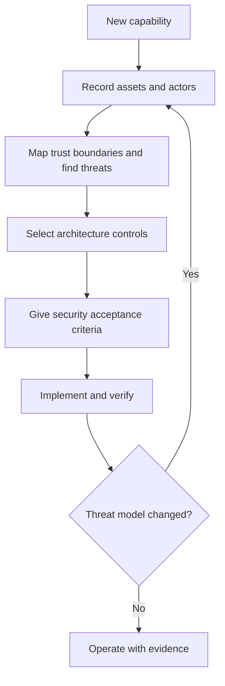

# P048 — Secure by Design

## Definition

Secure by Design makes security a requirement for architecture, implementation, delivery, and
operation from the start. Each design includes controls for threats to trust boundaries, data flows,
privileges, dependencies, and execution capabilities.

**Aliases:** security by design, built-in security, security during the full life cycle.

## Provenance

**Classification:** established principle.

Security design principles have a long history. Standards organizations and public security agencies
give the *Secure by Design* formulation in software life cycle guidance.

## Decision rule

Before a capability changes trust, record the assets, actors, and boundaries. Then find the threats,
failure modes, and necessary controls. Before the cost of changes is high, make the controls part of
the architecture and acceptance criteria.

## How to apply

- Classify protected assets. Map each new or changed trust boundary and data flow.
- Model threats to entry points, identities, privileges, dependencies, and abuse cases.
- Select safe contracts, isolation, validation, and authorization before implementation details.
- Include security tests, evidence, operational data, update paths, and incident response in
  delivery.
- If permissions, integrations, dependencies, or operational assumptions change, do the threat
  model again.
- Give the product owner responsibility for security outcomes. Do not give all risk to users.

## Diagram



## Language examples

The two examples verify a signature for the canonical body and nonce before replay checks,
validation, authorization, and queue insertion.

### Python

```python
def accept_webhook(request):
    signed = canonicalize(request.body, request.nonce)
    sender = verify_signature(request.signature, signed)
    reject_replay(request.nonce)
    event = validate_payload(request.body)
    authorize(sender, event.tenant)
    queue.put(AuthenticatedEvent(sender, event))
```

### Rust

```rust
fn accept_webhook(request: Request) -> Result<(), Error> {
    let signed = canonicalize(&request.body, &request.nonce);
    let sender = verify_signature(&request.signature, &signed)?;
    reject_replay(&request.nonce)?;
    let event = validate_payload(&request.body)?;
    authorize(&sender, &event.tenant)?;
    queue::put(AuthenticatedEvent::new(sender, event))
}
```

## Boundaries and tensions

Secure by Design does not mean that all locations must have maximum controls. Controls must be
correct for the assets, threats, and impact. Controls must not prevent necessary operations.

Compliance evidence cannot replace threat analysis. Penetration tests after implementation can find
security defects. They cannot repair a trust model that is not safe at low cost. This principle
applies to the full life cycle. Secure by Default applies to the initial product configuration.

## Examples

### Positive

Before implementation, a new webhook integration has requirements for authenticated senders,
replay resistance, payload limits, secret rotation, failure control, and audit events.

### Misuse

A team ships an administrative API with more credentials than necessary. After customers start to
use the API, the team plans authorization and audit logs.

### Athena and agent workflows

Before a new tool becomes available, an Athena workflow records the data, calls, authority, output
checks, and failure reports for that tool.

## Related principles

- [P049 — Secure by Default](./p049-secure-by-default.md)
- [P050 — Least Privilege](./p050-least-privilege.md)
- [P053 — Validate at Trust Boundaries](./p053-validate-at-trust-boundaries.md)
- [P054 — Defense in Depth](./p054-defense-in-depth.md)

## References

### Source information

- [Saltzer and Schroeder, *The Protection of Information in Computer Systems*](https://doi.org/10.1109/PROC.1975.9939)
  is a primary source for secure system design principles. It was published before the *Secure by
  Design* term.

### Applicable information

- [CISA, *Shifting the Balance of Cybersecurity Risk*](https://www.cisa.gov/sites/default/files/2023-06/principles_approaches_for_security-by-design-default_508c.pdf)
  gives Secure by Design and Secure by Default expectations for software producers.
- [NIST SP 800-218, SSDF Version 1.1](https://doi.org/10.6028/NIST.SP.800-218) gives secure
  practices during the full life cycle for software development.

### More information

- [CISA Secure by Demand Guide](https://www.cisa.gov/sites/default/files/2024-08/SecureByDemandGuide_080624_508c.pdf)
  gives software customers questions to examine producer security practices.

[Back to the principles catalog](../README.md#p048)
