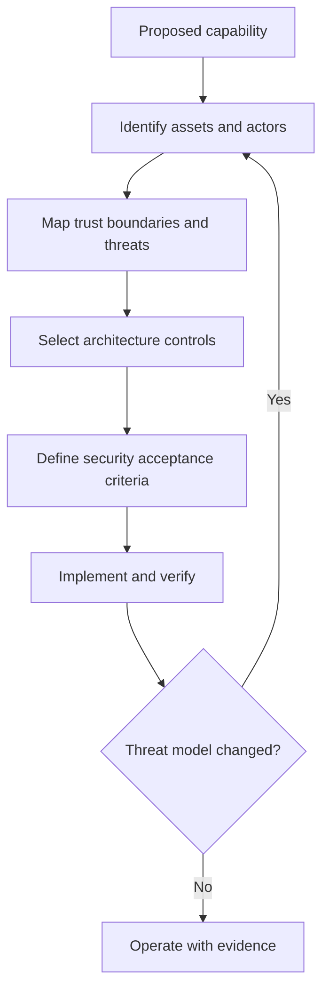

# P048 — Secure by Design

## Definition

Secure by Design makes security a requirement for architecture, implementation, delivery, and
operation from the start. Each design addresses plausible threats to trust boundaries, data flows,
privileges, dependencies, and execution capabilities.

**Aliases:** security by design, built-in security, shift security left and throughout.

## Provenance

**Classification:** established principle.

Security design principles have deep roots. Standards bodies and public security agencies define
the modern *Secure by Design* formulation in software life cycle guidance.

## Decision rule

Before a change to a trust-relevant capability, identify its assets, actors, boundaries, threats,
failure modes, and required controls. Put the controls in the architecture and acceptance criteria
before changes become costly.

## How to apply

- Classify protected assets. Map each new or changed trust boundary and data flow.
- Model threats to entry points, identities, privileges, dependencies, and abuse cases.
- Choose safe contracts, isolation, validation, and authorization before implementation details.
- Include security tests, evidence, operational data, update paths, and incident response in delivery.
- Revisit the model when permissions, integrations, dependencies, or operational assumptions change.
- Give the product owner responsibility for security outcomes. Do not transfer all risk to users.

## Diagram



## Language examples

The two examples verify a signature over the canonical body and nonce before replay checks, validation,
authorization, and queue insertion.

### Python

```python
def accept_webhook(request):
    signed = canonicalize(request.body, request.nonce)
    sender = verify_signature(request.signature, signed)
    reject_replay(request.nonce)
    event = validate_payload(request.body)
    authorize(sender, event.tenant)
    queue.put(AuthenticatedEvent(sender, event))
```

### Rust

```rust
fn accept_webhook(request: Request) -> Result<(), Error> {
    let signed = canonicalize(&request.body, &request.nonce);
    let sender = verify_signature(&request.signature, &signed)?;
    reject_replay(&request.nonce)?;
    let event = validate_payload(&request.body)?;
    authorize(&sender, &event.tenant)?;
    queue::put(AuthenticatedEvent::new(sender, event))
}
```

## Boundaries and tensions

Secure by Design does not require maximum controls in every location. Controls must match the assets,
threats, and impact. Controls must remain usable.

Compliance evidence cannot replace threat analysis. Late penetration tests remain useful, but they
cannot repair an unsafe trust model at low cost. This principle shapes the life cycle. Secure by
Default governs the initial product configuration.

## Examples

### Positive

A new webhook integration defines authenticated senders, replay resistance, payload limits, secret
rotation, failure control, and audit events before implementation.

### Misuse

A team ships an administrative API with broad credentials. The team plans authorization and audit
logs only after customer use starts.

### Athena and agent workflows

Before a new tool becomes available, an Athena workflow defines the data, calls, authority, output
checks, and failure reports for that tool.

## Related principles

- [P049 — Secure by Default](./p049-secure-by-default.md)
- [P050 — Least Privilege](./p050-least-privilege.md)
- [P053 — Validate at Trust Boundaries](./p053-validate-at-trust-boundaries.md)
- [P054 — Defense in Depth](./p054-defense-in-depth.md)

## References

### Origin and history

- [Saltzer and Schroeder, *The Protection of Information in Computer Systems*](https://doi.org/10.1109/PROC.1975.9939)
  is a primary source for secure system design principles. It predates the later *Secure by Design*
  label.

### Current guidance

- [CISA, *Shifting the Balance of Cybersecurity Risk*](https://www.cisa.gov/sites/default/files/2023-06/principles_approaches_for_security-by-design-default_508c.pdf)
  defines Secure by Design and Secure by Default expectations for software producers.
- [NIST SP 800-218, SSDF Version 1.1](https://doi.org/10.6028/NIST.SP.800-218) defines secure
  practices across the software development life cycle.

### Further reading

- [CISA Secure by Demand Guide](https://www.cisa.gov/sites/default/files/2024-08/SecureByDemandGuide_080624_508c.pdf)
  gives software customers questions that assess producer security practices.

[Back to the principles catalog](../README.md#p048)
