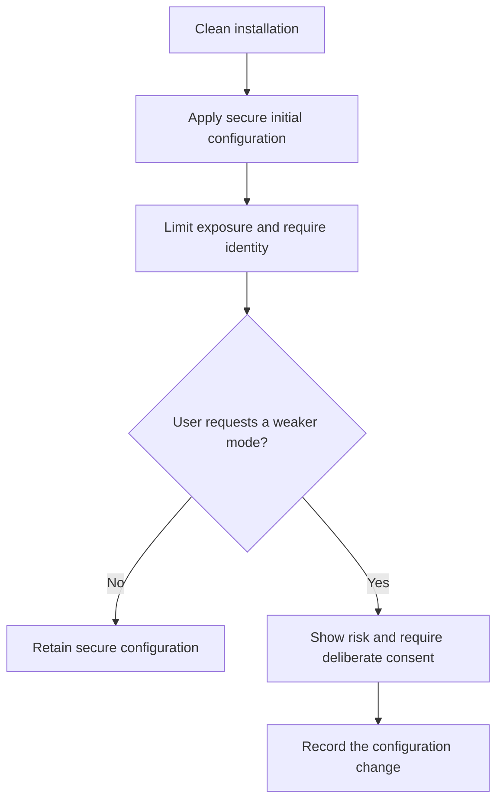

# P049 — Secure by Default

## Definition

Secure by Default means that the initial configuration and easiest supported path provide suitable
protection. Users do not need to find and enable essential controls. A weaker configuration requires
a deliberate, visible choice.

**Aliases:** safe defaults, security out of the box, default-deny configuration.

## Provenance

**Classification:** established principle.

Fail-safe defaults provide historical roots for this principle. CISA guidance defines the broader
product-level formulation. These formulations are related, but they are not identical.

## Decision rule

Choose defaults that minimize likely harm for an ordinary installation. Apply these defaults to
authentication, authorization, network exposure, data protection, and telemetry. Permit an insecure
compatibility mode only when it has justification, a clear label, and deliberate activation.

## How to apply

- Require explicit grants. Do not ship broad access that users must remove.
- Disable unnecessary endpoints, accounts, tools, and network listeners initially.
- Use secure protocol, cryptographic, privacy, and update settings by default.
- Make dangerous configuration changes visible, auditable, and reversible where practical.
- Test a clean installation and the common initial path. Do not test only an expert configuration.
- Provide migration guidance for stronger defaults in existing installations.

## Diagram



## Language examples

The two examples default to local access, required authentication, and no administrative interface.

### Python

```python
@dataclass
class Config:
    bind: str = "127.0.0.1"
    require_auth: bool = True
    admin_enabled: bool = False
```

### Rust

```rust
impl Default for Config {
    fn default() -> Self {
        Self {
            bind: "127.0.0.1".into(),
            require_auth: true,
            admin_enabled: false,
        }
    }
}
```

## Boundaries and tensions

A default must be usable in its intended context. A control that all users disable does not provide
effective security.

Existing deployments can have compatibility constraints. Those constraints do not justify insecure
defaults for new deployments. Secure by Default concerns the initial configuration. Fail Closed
concerns an incomplete runtime security decision.

## Examples

### Positive

A service listens only on loopback and requires authentication. It creates no shared default
password. An operator must deliberately configure administrative access.

### Misuse

A dashboard binds to a public interface with anonymous administrator access. Its guide defers
authentication to a later user action.

### Athena and agent workflows

A new tool starts with read-only repository scope. It gets write access only for a task that grants
that access. Installation alone does not expand agent authority.

## Related principles

- [P048 — Secure by Design](./p048-secure-by-design.md)
- [P050 — Least Privilege](./p050-least-privilege.md)
- [P051 — Complete Mediation](./p051-complete-mediation.md)
- [P054 — Defense in Depth](./p054-defense-in-depth.md)

## References

### Origin and history

- [Saltzer and Schroeder, *The Protection of Information in Computer Systems*](https://doi.org/10.1109/PROC.1975.9939)
  describes access decisions that use permission instead of exclusion. This fail-safe default is an
  ancestor of the modern product-configuration principle.

### Current guidance

- [CISA, *Shifting the Balance of Cybersecurity Risk*](https://www.cisa.gov/sites/default/files/2023-06/principles_approaches_for_security-by-design-default_508c.pdf)
  makes security part of the default product experience and gives producers responsibility.

### Further reading

- [OWASP Authorization Cheat Sheet](https://cheatsheetseries.owasp.org/cheatsheets/Authorization_Cheat_Sheet.html)
  applies denial by default to authorization policy and explains its tests.

[Back to the principles catalog](../README.md#p049)
