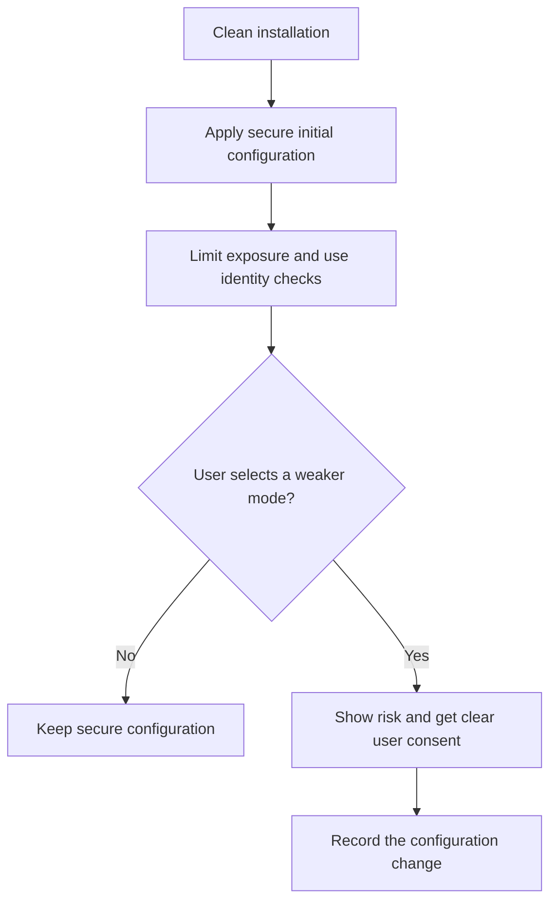

# P049 — Secure by Default

## Definition

Secure by Default means that the initial configuration and easiest supported path give sufficient
protection. Users can use necessary controls without an activation step. A user must make a clear
selection to use a weaker configuration.

**Aliases:** safe defaults, security out of the box, default-deny configuration.

## Provenance

**Classification:** established principle.

Fail-safe defaults came before this principle. CISA guidance gives a product-level formulation. The
two formulations are related, but they are different.

## Decision rule

Select defaults that decrease possible damage for a new installation. Apply these defaults to
authentication, authorization, network exposure, data protection, and telemetry. If an insecure
compatibility mode is necessary, give clear risk information and a different activation step.

## How to apply

- After a user or policy records permissions, grant the permissions. Do not ship access that users
  must remove.
- Disable endpoints, accounts, tools, and network listeners that are not necessary.
- Use secure protocol, cryptographic, privacy, and update settings by default.
- Make high-risk configuration changes clear, auditable, and reversible.
- Do tests with a clean installation and the primary initial path. Do not do tests only with an
  expert configuration.
- Give migration guidance for stronger defaults in installed systems.

## Diagram



## Language examples

The two examples default to local access, authentication on, and no administrative interface.

### Python

```python
@dataclass
class Config:
    bind: str = "127.0.0.1"
    require_auth: bool = True
    admin_enabled: bool = False
```

### Rust

```rust
impl Default for Config {
    fn default() -> Self {
        Self {
            bind: "127.0.0.1".into(),
            require_auth: true,
            admin_enabled: false,
        }
    }
}
```

## Boundaries and tensions

A default must work in its specified context. A control that all users disable does not give
sufficient security.

Deployed systems can have compatibility constraints. Those constraints do not make insecure
defaults correct for new deployments. Secure by Default applies to the initial configuration. Fail
Closed applies to a runtime security decision that is not completed.

## Examples

### Positive

A service listens only on loopback and uses authentication. It creates no shared default
password. An operator must select and configure administrative access.

### Misuse

A dashboard binds to a public interface with anonymous administrator access. The documentation
tells users to add authentication subsequently.

### Athena and agent workflows

A new tool starts with read-only repository scope. It gets write access only for a task that grants
that access. Installation does not expand agent authority.

## Related principles

- [P048 — Secure by Design](./p048-secure-by-design.md)
- [P050 — Least Privilege](./p050-least-privilege.md)
- [P051 — Complete Mediation](./p051-complete-mediation.md)
- [P054 — Defense in Depth](./p054-defense-in-depth.md)

## References

### Source information

- [Saltzer and Schroeder, *The Protection of Information in Computer Systems*](https://doi.org/10.1109/PROC.1975.9939)
  gives information about access decisions that use permission, not exclusion. This fail-safe
  default is a historical source for this product-configuration principle.

### Applicable information

- [CISA, *Shifting the Balance of Cybersecurity Risk*](https://www.cisa.gov/sites/default/files/2023-06/principles_approaches_for_security-by-design-default_508c.pdf)
  makes security part of the default product experience and gives producers responsibility.

### More information

- [OWASP Authorization Cheat Sheet](https://cheatsheetseries.owasp.org/cheatsheets/Authorization_Cheat_Sheet.html)
  applies denial by default to authorization policy and gives authorization-policy tests.

[Back to the principles catalog](../README.md#p049)
