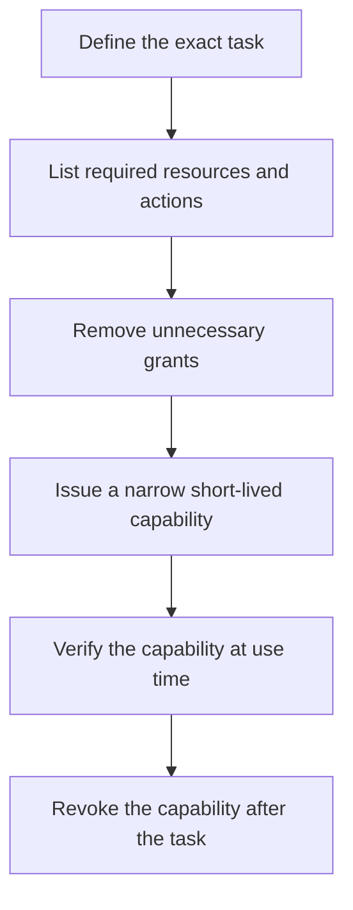

# P050 — Least Privilege

## Definition

Least Privilege gives each actor only the resources and actions that its current task requires. The
grant lasts only for the required period. Scope can cover identities, credentials, files, network
destinations, APIs, commands, data fields, and execution time.

**Aliases:** principle of least privilege, minimal privilege, least authority.

## Provenance

**Classification:** established principle.

Saltzer and Schroeder provide a canonical formulation from 1975. Earlier work contains related
need-to-know and capability concepts.

## Decision rule

For every grant, determine whether a narrower resource, action, identity, or lifetime can support the
task. Grant the narrowest sufficient capability. Verify it at use time. Remove it when the task ends.

## How to apply

- Derive permissions from documented responsibilities and exact operations, not job titles alone.
- Separate read, write, administer, approve, and delegate capabilities.
- Prefer task-scoped, short-lived credentials over shared or long-lived credentials.
- Restrict filesystem roots, network destinations, tool sets, and data fields independently.
- Review effective permissions. Inspect inherited roles and transitive service access.
- Make denial explicit when narrower authority cannot complete the requested operation.

## Diagram



## Language examples

The two examples grant one report task read access to one tenant and no write access.

### Python

```python
grant = Grant(
    tenant="tenant-42",
    actions={Action.READ_REPORT},
    expires_at=task.deadline,
)
authorize(grant, Action.READ_REPORT, "tenant-42")
```

### Rust

```rust
let grant = Grant {
    tenant: "tenant-42",
    actions: HashSet::from([Action::ReadReport]),
    expires_at: task.deadline,
};
authorize(&grant, Action::ReadReport, "tenant-42")?;
```

## Boundaries and tensions

Least Privilege requires sufficient but minimal authority. It does not require zero authority. Excessive
restriction can cause unsafe alternatives. A denial must identify the absent capability.

Least Privilege limits one actor. Separation of Duties limits the actor combinations or conditions
that can authorize a high-impact result. A trusted identity still needs a narrow authorization.

## Examples

### Positive

A report job receives a short-lived credential for one required tenant view. It cannot modify data,
list unrelated tables, or assume an administrator role.

### Misuse

A deployment helper receives permanent organization owner credentials because future commands are
unknown. Its current task only reads release metadata from one repository.

### Athena and agent workflows

A review agent receives a read-only checkout and validation commands. It receives no deployment,
message, credential, or repository write tools because its contract does not require them.

## Related principles

- [P051 — Complete Mediation](./p051-complete-mediation.md)
- [P052 — Separation of Duties](./p052-separation-of-duties.md)
- [P058 — Bounded Agent Authority](./p058-bounded-agent-authority.md)
- [P060 — Constrain Sub-Agents](./p060-constrain-sub-agents.md)

## References

### Origin and history

- [Saltzer and Schroeder, *The Protection of Information in Computer Systems*](https://doi.org/10.1109/PROC.1975.9939)
  states that programs and users need only the least privileges that their tasks require.

### Current guidance

- [NIST SP 800-53 Release 5.2.0, control AC-6](https://csrc.nist.gov/Pubs/sp/800/53/r5/upd1/Final)
  applies least privilege to users, processes, privileged functions, and privileged accounts.

### Further reading

- [OWASP Authorization Cheat Sheet](https://cheatsheetseries.owasp.org/cheatsheets/Authorization_Cheat_Sheet.html)
  gives practical guidance for authorization design and verification.

[Back to the principles catalog](../README.md#p050)
