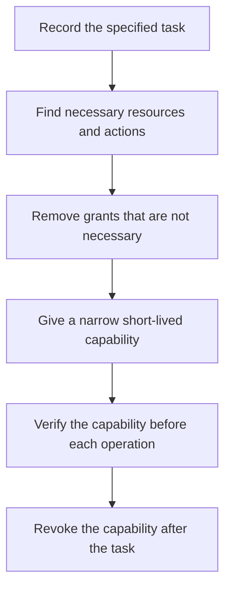

# P050 — Least Privilege

## Definition

Least Privilege gives each actor only the resources and actions that are necessary for the actor's
assigned task. The grant applies only during the specified period. Scope can include identities,
credentials, files, network destinations, APIs, commands, data fields, and execution time.

**Aliases:** principle of least privilege, minimal privilege, least authority.

## Provenance

**Classification:** established principle.

Saltzer and Schroeder give a canonical formulation from 1975. Work before 1975 contains related
need-to-know and capability concepts.

## Decision rule

For each grant, compare its scope with the task. If a narrower resource, action, identity, or
lifetime is sufficient, use the narrower grant. Grant the narrowest sufficient capability. Before
each operation, verify the grant.
When the task ends, remove the grant.

## How to apply

- Select permissions from recorded responsibilities and specified operations. Do not select
  permissions only from role titles.
- Use different read, write, administration, approval, and delegation capabilities.
- If task-scoped, short-lived credentials are sufficient, use them.
- Set independent limits for filesystem roots, network destinations, tool sets, and data fields.
- Examine permissions that are active. Examine inherited roles and transitive service access.
- If narrower authority cannot complete the operation, give an external denial without sensitive
  policy or capability details.

## Diagram



## Language examples

The two examples grant one report task read access to one tenant and no write access.

### Python

```python
grant = Grant(
    tenant="tenant-42",
    actions={Action.READ_REPORT},
    expires_at=task.deadline,
)
authorize(grant, Action.READ_REPORT, "tenant-42")
```

### Rust

```rust
let grant = Grant {
    tenant: "tenant-42",
    actions: HashSet::from([Action::ReadReport]),
    expires_at: task.deadline,
};
authorize(&grant, Action::ReadReport, "tenant-42")?;
```

## Boundaries and tensions

Least Privilege gives sufficient but minimum authority. It does not mean no authority. Too much
restriction can cause alternatives that are not safe. Put missing-capability details only in
protected diagnostics for authorized operators.

Least Privilege limits one actor. Separation of Duties limits the actor combinations or conditions
that can authorize a high-impact result. A trusted identity must also have a narrow authorization.

## Examples

### Positive

A report task receives a short-lived credential for one necessary tenant view. It cannot modify
data, read tables that do not apply to the task, or get an administrator role.

### Misuse

A deployment helper receives permanent organization owner credentials because future commands are
unknown. The assigned task only reads release metadata from one repository.

### Athena and agent workflows

A review agent receives a read-only checkout and validation commands. It receives no deployment,
message, credential, or repository write tools because its contract does not include them.

## Related principles

- [P051 — Complete Mediation](./p051-complete-mediation.md)
- [P052 — Separation of Duties](./p052-separation-of-duties.md)
- [P058 — Bounded Agent Authority](./p058-bounded-agent-authority.md)
- [P060 — Constrain Sub-Agents](./p060-constrain-sub-agents.md)

## References

### Source information

- [Saltzer and Schroeder, *The Protection of Information in Computer Systems*](https://doi.org/10.1109/PROC.1975.9939)
  gives the rule that programs and users must have only privileges necessary for their tasks.

### Applicable information

- [NIST SP 800-53 Release 5.2.0, control AC-6](https://csrc.nist.gov/Pubs/sp/800/53/r5/upd1/Final)
  applies least privilege to users, processes, privileged functions, and privileged accounts.

### More information

- [OWASP Authorization Cheat Sheet](https://cheatsheetseries.owasp.org/cheatsheets/Authorization_Cheat_Sheet.html)
  gives guidance for authorization design and verification.

[Back to the principles catalog](../README.md#p050)
