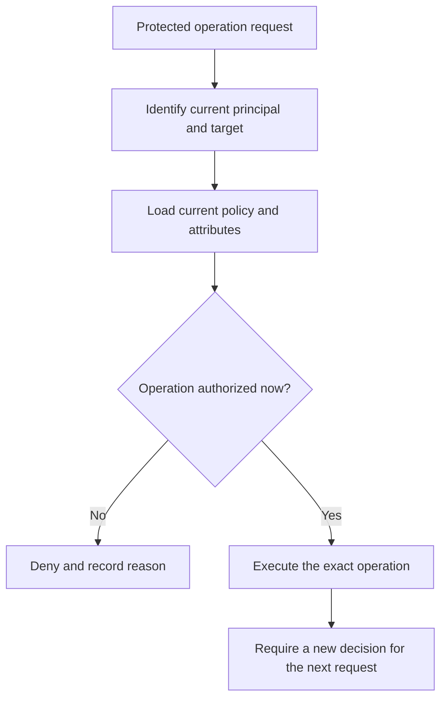

# P051 — Complete Mediation

## Definition

Complete Mediation requires an authorization decision for every protected operation on its specific
target. An earlier login, interface check, network location, or successful request does not establish
permanent authority for later operations.

**Aliases:** authorize every access, per-operation authorization, continuous mediation.

## Provenance

**Classification:** established principle.

Saltzer and Schroeder named Complete Mediation as a secure system design principle. They traced the
concept to earlier work by Roger Needham.

## Decision rule

At each protected boundary, bind the current principal, operation, resource, relevant attributes,
and policy version to an authorization decision. Require the same effective check on every alternate
path to the resource.

## How to apply

- List every path to each protected resource. Include batch, administrative, and recovery paths.
- Centralize policy enforcement where practical and preserve resource-specific decisions.
- Authorize the requested action on the requested object, not merely the route or object type.
- Revalidate when identity, role, tenancy, ownership, policy, or resource state may have changed.
- Give each decision cache an explicit expiration and revocation policy. Never cache authority without
  a limit.
- Test direct-object access, alternate transports, stale sessions, and policy changes.

## Diagram



## Language examples

The two examples authorize the current user, action, and resource before each deletion.

### Python

```python
def delete_document(user, document_id):
    document = documents.get(document_id)
    policy.authorize(user, "delete", document)
    documents.delete(document.id)
    audit.record(user.id, "delete", document.id)
```

### Rust

```rust
fn delete_document(user: &User, id: DocumentId) -> Result<(), Error> {
    let document = documents::get(id)?;
    policy::authorize(user, Action::Delete, &document)?;
    documents::delete(document.id)?;
    audit::record(user.id, Action::Delete, document.id)
}
```

## Boundaries and tensions

Complete Mediation concerns authorization. It does not require repeated authentication at every
function call. A verified session and a bounded decision cache can be valid with effective change
and revocation controls.

Duplicate, ad hoc checks can create gaps. A shared enforcement mechanism is safer when no bypass
path exists. Authentication alone does not authorize every action for an identified caller.

## Examples

### Positive

An API middleware component authenticates a session. The resource service then authorizes the caller, action,
tenant, and object for every request. This rule also covers administrative endpoints.

### Misuse

An interface hides the delete control from ordinary users. The delete endpoint accepts every
authenticated session because login serves as its only authorization check.

### Athena and agent workflows

Before each write-capable tool call, the workflow checks the target and operation against current task
authority. A prior approved read does not authorize a later push or deletion.

## Related principles

- [P049 — Secure by Default](./p049-secure-by-default.md)
- [P050 — Least Privilege](./p050-least-privilege.md)
- [P053 — Validate at Trust Boundaries](./p053-validate-at-trust-boundaries.md)
- [P058 — Bounded Agent Authority](./p058-bounded-agent-authority.md)

## References

### Origin and history

- [Saltzer and Schroeder, *The Protection of Information in Computer Systems*](https://doi.org/10.1109/PROC.1975.9939)
  gives the canonical formulation and explains the risk from stale cached authority decisions.

### Current guidance

- [OWASP Authorization Cheat Sheet](https://cheatsheetseries.owasp.org/cheatsheets/Authorization_Cheat_Sheet.html)
  requires permission checks for every request and tests for authorization logic.

### Further reading

- [NIST SP 800-53 Release 5.2.0, control AC-3](https://csrc.nist.gov/Pubs/sp/800/53/r5/upd1/Final)
  specifies policy controls for approved logical access to information and resources.

[Back to the principles catalog](../README.md#p051)
