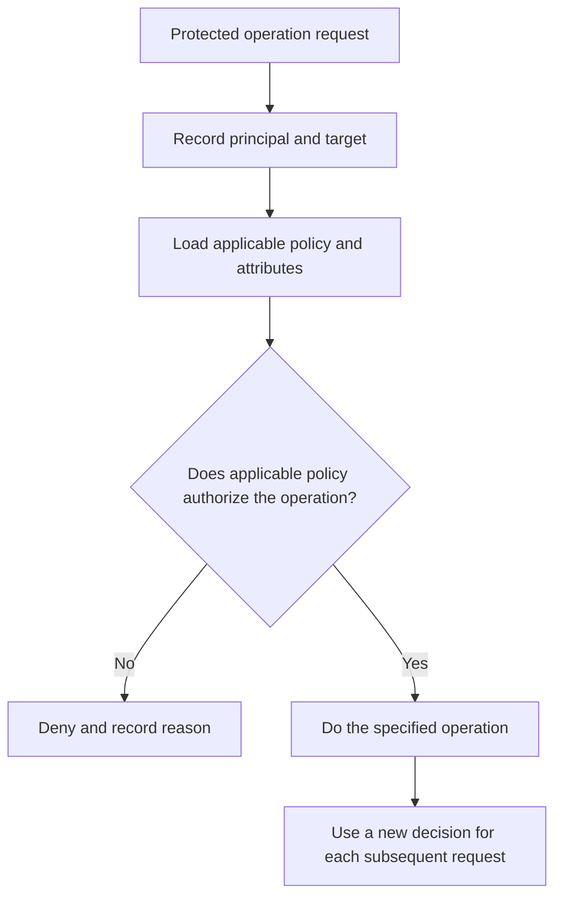

# P051 — Complete Mediation

## Definition

Complete Mediation makes an authorization decision necessary for each protected operation and
specified target. A login, interface check, network location, or completed request does not give
permanent authority for subsequent operations.

**Aliases:** authorization for each access, operation-specific authorization, continuous mediation.

## Provenance

**Classification:** established principle.

Saltzer and Schroeder's paper gives Complete Mediation as a secure system design principle. The
paper gives a reference to earlier work from Roger Needham.

## Decision rule

At each protected boundary, bind the request principal, operation, resource, necessary attributes,
and policy version to an authorization decision. Use the same authorization check on all other paths
to the resource.

## How to apply

- Find all paths to each protected resource. Include batch, administrative, and recovery paths.
- If a central mechanism can enforce all paths, use it. Keep resource-specific decisions.
- Authorize the requested action on the requested object, not only the route or object type.
- If identity, role, tenancy, ownership, policy, or resource state can change, validate again.
- Give each decision cache a specified expiration and revocation policy. Do not cache authority
  without a limit.
- Do tests of direct-object access, other transports, stale sessions, and policy changes.

## Diagram



## Language examples

Before each deletion, the two examples authorize the request user, action, and resource.

### Python

```python
def delete_document(user, document_id):
    document = documents.get(document_id)
    policy.authorize(user, "delete", document)
    documents.delete(document.id)
    audit.record(user.id, "delete", document.id)
```

### Rust

```rust
fn delete_document(user: &User, id: DocumentId) -> Result<(), Error> {
    let document = documents::get(id)?;
    policy::authorize(user, Action::Delete, &document)?;
    documents::delete(document.id)?;
    audit::record(user.id, Action::Delete, document.id)
}
```

## Boundaries and tensions

Complete Mediation applies to authorization. It does not authenticate at each function call. When
change and revocation controls are active, a verified session and a bounded decision cache can be
correct.

Duplicate, ad hoc checks can cause gaps. If one shared enforcement mechanism has no bypass path, use
that mechanism. Authentication does not authorize all actions for an identified caller.

## Examples

### Positive

An API middleware component authenticates a session. The resource service then authorizes the
caller, action, tenant, and object for each request. This rule also includes administrative
endpoints.

### Misuse

An interface does not show the delete control to users without permission. The delete endpoint
accepts all authenticated sessions because login is the only authorization control.

### Athena and agent workflows

Before each write-capable tool call, the workflow compares the target and operation with the task
authority and verifies that the call is authorized. An approved read does not authorize a
subsequent push or deletion.

## Related principles

- [P049 — Secure by Default](./p049-secure-by-default.md)
- [P050 — Least Privilege](./p050-least-privilege.md)
- [P053 — Validate at Trust Boundaries](./p053-validate-at-trust-boundaries.md)
- [P058 — Bounded Agent Authority](./p058-bounded-agent-authority.md)

## References

### Source information

- [Saltzer and Schroeder, *The Protection of Information in Computer Systems*](https://doi.org/10.1109/PROC.1975.9939)
  gives the canonical formulation and information about risk from stale cached authority decisions.

### Applicable information

- [OWASP Authorization Cheat Sheet](https://cheatsheetseries.owasp.org/cheatsheets/Authorization_Cheat_Sheet.html)
  gives the requirement that each request must have a permission check. It gives authorization logic
  tests.

### More information

- [NIST SP 800-53 Release 5.2.0, control AC-3](https://csrc.nist.gov/Pubs/sp/800/53/r5/upd1/Final)
  gives policy controls for approved logical access to information and resources.

[Back to the principles catalog](../README.md#p051)
